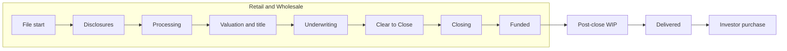
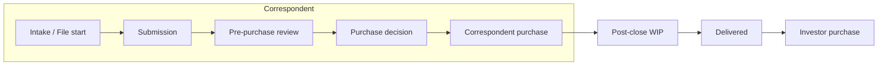
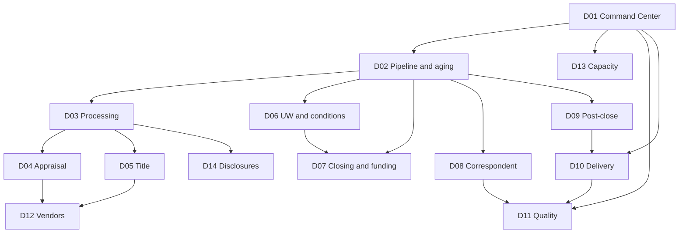

# Operations subject area — enterprise dashboard and reporting requirements

**Document type:** Business requirements (single-file consolidation)  
**Subject area:** Operations (loan manufacturing) at a multi-channel non-bank mortgage company  
**Channels:** Retail, Wholesale, Correspondent  
**Lifecycle:** File start / intake through post-closing, trailing documents, and investor delivery  
**Status:** Working requirements. `ASSUMED SLA` is not company policy.  
**Companion (not inlined):** interactive wireframe kit at `docs/wireframes/index.html`

This file consolidates the Operations reporting blueprint: glossary, scope, operating context, pipeline phases, roles, processes, metrics, dimensions, events, dashboards, stories, phasing, anti-patterns, and research sources.

**Reporting principles (non-negotiable)**

1. Never mix Funded, Correspondent purchase, and Investor purchase in one unlabeled “funded” number.
2. Cycle time is p50 and p90, not average alone.
3. Pull-through is a named cohort (start month, lock month, or submission month).
4. As-of Pipeline and event-dated Funded are different questions; label the time basis.
5. Waiting-on party is a first-class aging slice.
6. Initial Loan Estimate **send** uses TRID **general business days** (creditor-open). Closing Disclosure wait uses TRID **specific business days**.
7. Missing events render **unavailable**, not zero.

## Contents

- 1. Glossary
- 2. Scope and taxonomy
- 3. Operating context
- 4. Pipeline phases, metrics, and dimensions
- 5. Job roles and actions by phase
- 6. Processes by subcategory
- 7. Milestones and reason codes
- 8. Shared dimensions
- 9. Metric catalog
- 10. Event dictionary
- 11. Requirements traceability
- 12. Dashboard inventory
- 13. Dashboard specifications (D01–D14)
- 14. Wireframes by department
- 15. User stories and non-functional requirements
- 16. How to use the numbers
- 17. Anti-patterns, recon, and validation
- 18. Phasing and open questions
- 19. Research sources

---

## 1. Glossary

The Operations context is loan manufacturing at a non-bank mortgage company: the work that takes a file from intake through investor delivery. This glossary is the language for Operations dashboards, reports, and metric definitions.

### Subject area

**Operations**:
The function that manufactures a mortgage from file start (or correspondent intake) through investor delivery.
_Avoid_: Servicing, origination (when that means Sales), fulfillment (when used as a synonym for the whole subject area without naming the channel)

**Channel**:
How the loan entered manufacturing: Retail, Wholesale, or Correspondent.
_Avoid_: Source, lead source, marketing channel

**Retail**:
A Channel in which the company originates with the borrower and manufactures the loan through funding.
_Avoid_: Consumer-direct as a separate Channel; treat consumer-direct as Retail unless leadership splits it

**Wholesale**:
A Channel in which a broker originates with the borrower and the company manufactures and funds the loan.
_Avoid_: TPO for this Channel (TPO is the Correspondent seller; the Wholesale originator is a Broker)

**Correspondent**:
A Channel in which a TPO originates and closes the loan, and the company buys the closed loan.
_Avoid_: Wholesale, brokered, purchased (unqualified)

**Loan file**:
The unit of manufacturing work. One Loan file is one application or one correspondent submission in process.
_Avoid_: Account, deal, loan (when you mean the in-process file rather than the closed instrument)

### Channel counterparties

**Broker**:
The originating company on a Wholesale Loan file.
_Avoid_: TPO, correspondent, LO (the LO is a person; the Broker is the company)

**TPO**:
The originating and closing company that sells a closed loan on the Correspondent Channel.
_Avoid_: Broker, vendor (a TPO is a seller, not an appraisal or title Vendor)

**Loan officer**:
The originating salesperson on a Retail Loan file.
_Avoid_: Broker, processor

### Lifecycle events

**File start**:
The event that opens a Loan file in Operations. Retail: setup complete. Wholesale: registration complete. Correspondent: intake/registration complete.
_Avoid_: Application taken (that is a later or parallel Retail/Wholesale event), lead received

**Application**:
A Retail or Wholesale borrower's application as used for TRID and manufacturing. Correspondent uses Submission, not Application, as the manufacturing start analog.
_Avoid_: Using Application for a Correspondent package

**Submission**:
A TPO's closed-loan package presented for Correspondent purchase review.
_Avoid_: Application, registration (registration is File start; Submission is the package for purchase)

**Clear to Close**:
The underwriting authorization that a Retail or Wholesale Loan file may proceed to closing. Correspondent analog is Purchase decision (approved to purchase).
_Avoid_: Approved (that is an Underwriting decision, which may still have conditions), CTC as a funding event

**Funded**:
The lender has disbursed origination proceeds on a Retail or Wholesale loan.
_Avoid_: Funded for Correspondent purchase or Investor purchase; closed (closing is signing, not disbursement)

**Correspondent purchase**:
The company has bought a closed loan from a TPO.
_Avoid_: Funded, funding, Investor purchase

**Delivered**:
The company has submitted the loan to an investor for purchase.
_Avoid_: Shipped as the metric name (Shipping is the team); Investor purchase; sold (ambiguous)

**Investor purchase**:
The investor has paid the company for a Delivered loan, evidenced by a purchase advice.
_Avoid_: Funded, Correspondent purchase, Delivered

**Fallout**:
A Loan file that started manufacturing and did not reach Funded (Retail/Wholesale) or Correspondent purchase, for a defined reason set (withdrawn, denied, expired, rejected).
_Avoid_: Pull-through inverted without naming the cohort; cancelled as the only reason code

**Pull-through**:
The share of a defined start cohort that reached Funded or Correspondent purchase.
_Avoid_: Conversion (Sales language); close rate (ambiguous between closing and funding)

### Manufacturing states

**Milestone**:
A named manufacturing stage the Loan file is in right now. Canonical IDs are MS-01 through MS-13.
_Avoid_: Status as a synonym when Status also means lock, AUS, or condition status; stage when Milestone is the canonical name; raw LOS status strings on the Command Center

**Pipeline**:
The set of open Loan files not yet Funded (Retail/Wholesale) or not yet Correspondent-purchased.
_Avoid_: Funnel (Sales); booked; volume (volume is dollars)

**Post-close WIP**:
Funded or Correspondent-purchased Loan files not yet Delivered.
_Avoid_: Pipeline (Pipeline ends at Funded or Correspondent purchase)

**Waiting-on party**:
Who the Loan file is blocked on in the current Milestone: borrower, Broker or TPO, Vendor, or internal staff.
_Avoid_: Occupancy (that is a property attribute); owner (ambiguous)

**Condition**:
A requirement that must be satisfied before Clear to Close or funding (Retail/Wholesale) or before Correspondent purchase.
_Avoid_: Stip, task, checklist item as the metric name

**Prior-to-documents condition**:
A Condition that must be cleared before closing documents are drawn.
_Avoid_: PTD as unexplained jargon in executive views; use the full name once, then PTD

**Prior-to-funding condition**:
A Condition that must be cleared before Funded.
_Avoid_: PTF as unexplained jargon in executive views; use the full name once, then PTF

**Suspense**:
An underwriting decision that the file is not decisionable yet, usually because the package is incomplete or inconsistent.
_Avoid_: Denied; suspended lock; investor suspense (that is Kickout-related)

**Rework**:
A return of the Loan file to an earlier Milestone after it had already passed that Milestone.
_Avoid_: Touch; recycle as the metric name

**Kickout**:
An investor rejection or investor suspense of a Delivered loan that prevents Investor purchase until cured.
_Avoid_: Fallout (Fallout is pre-Funded / pre-Correspondent-purchase); defect (a defect may cause a Kickout, but they are not the same)

**Trailing document**:
A document required after Funded or Correspondent purchase to complete the stack for delivery.
_Avoid_: Condition (conditions are pre-close/pre-purchase); trailing as a Milestone name

### Valuation, title, vendors

**Vendor**:
A third party performing an ordered service (appraisal, title, credit, flood, tax, QC vendor). A TPO is not a Vendor; a Broker is not a Vendor.
_Avoid_: Partner, provider (lead provider is Sales)

**Appraisal cycle**:
The ordered valuation work from order (or waiver decision) through report-in and review.
_Avoid_: Appraisal as a synonym for the report only when you mean the whole cycle

**Reconsideration of value**:
A request to the appraiser or AMC to reconsider the appraised value.
_Avoid_: Appeal; ROV as unexplained jargon in executive views

**Title curative**:
Work to clear exceptions on the title commitment so the file can close or be purchased.
_Avoid_: Title as a synonym for curative only

### Quality and time

**Manufacturing quality**:
Defects found in pre-funding QC, Correspondent pre-purchase QC, post-close QC, and Kickouts.
_Avoid_: QC without a qualifier; independent audit QC (that is the Quality subject area)

**Cycle time**:
Elapsed business days between two named events on the same Loan file or order, unless the metric name says calendar days.
_Avoid_: Turn time as a different concept (Turn time is a Cycle time for a desk); average-only reporting (p50 and p90 are required)

**Turn time**:
Cycle time for a single desk or Vendor (for example underwriting Turn time).
_Avoid_: Cycle time when you mean one desk; SLA as the elapsed value (SLA is the target)

**As-of**:
A snapshot of Pipeline, aging, or locks in force at a point in time.
_Avoid_: Mixing As-of counts with event-dated Funded counts in one unlabeled number

**Event-dated**:
A flow metric attributed to the date the event happened (Funded, Delivered, decisioned).
_Avoid_: Booking date, application date, or As-of date as silent substitutes

**Lock status**:
Whether the Loan file currently has a rate lock: locked, expired, not locked, or float. Lock desk work belongs to Capital Markets.
_Avoid_: Lock price, note rate, or pull-through of the lock desk as Operations process metrics

### Decisions, clocks, and stack

**Purchase approved**:
The Correspondent decision that the company will buy the loan, analogous to Clear to Close on Retail/Wholesale.
_Avoid_: CTC, Funded, Underwritten (first decision may still have conditions)

**Ship-ready**:
The Post-close WIP state in which required trailing documents are in and the file may be Delivered.
_Avoid_: Delivered; complete (ambiguous); stacked (team jargon)

**Purchase advice**:
The investor’s notice that it has paid for a Delivered loan. That notice is the Investor purchase event.
_Avoid_: Funding advice (Correspondent purchase wire is a different event)

**Intent to proceed**:
The Retail/Wholesale borrower confirmation used as a gate before most settlement-service orders.
_Avoid_: File start; application taken

**Redisclosure**:
A subsequent Loan Estimate (or CD redisclosure) after the initial LE.
_Avoid_: Counting redisclosure as the initial LE clock

**Automated underwriting system recommendation**:
The AUS finding (Approve/Eligible, Refer, Ineligible, and equivalents). It is a dimension, not the underwriting decision.
_Avoid_: UW decision, CTC

**File-fail**:
A reviewed Loan file with at least one confirmed manufacturing defect at the headline severity.
_Avoid_: Finding count as the headline; mixing independent audit fails

**Productive FTE**:
Staffed manufacturing capacity in role, excluding time the roster treats as not productive when that flag exists.
_Avoid_: Payroll headcount as a silent substitute; using unassigned files as FTE

**Business day**:
A day on the company operations calendar, used for Cycle time unless the metric name says calendar days.
_Avoid_: Using business days for TRID initial LE

**TRID general business day**:
A day the creditor’s offices are open to the public for substantially all business functions. Used to count the three-day initial Loan Estimate **send** clock (§ 1026.19(e)(1)(iii); § 1026.2(a)(6) first sentence).
_Avoid_: Calendar day; assuming Saturday always counts

**TRID specific business day**:
All calendar days except Sundays and the federal holidays in 5 U.S.C. 6103(a). Used for Closing Disclosure waiting period and mailed-LE deemed receipt.
_Avoid_: Using this definition for the initial LE send clock

**Calendar day**:
A consecutive calendar day, including weekends.
_Avoid_: Using calendar days as the initial LE send clock (see TRID general business day)

**ULDD**:
The investor delivery dataset required to Deliver a loan. Incomplete ULDD is a delivery defect, not Fallout.
_Avoid_: Using ULDD as the name of the Delivered event

---

## 2. Scope and taxonomy

### Overview

Operations is loan manufacturing: the work that takes a Loan file from File start through Investor purchase. This subject area is multi-channel. Channel is a required slice on every enterprise dashboard.

This document sets the boundary, the subcategory map, who uses the reporting, and where Operations hands off to other subject areas.

Assumptions used throughout the pack (replace when Operations leadership supplies local names and policy):

- Product set is conventional, FHA, VA, USDA, and jumbo; purchase and refinance. HELOC, construction, and reverse appear only as product-dimension values plus a short “if offered” process note.
- Cycle time is **business days** on the company ops calendar unless the metric names a TRID clock. Initial LE send uses **TRID general business days** (creditor-open days). CD waiting period uses **TRID specific business days** (Saturdays count; Sundays and federal holidays do not). See research sources.
- Primary grain is the Loan file. Orders (appraisal, title, insurance) and QC findings are event/order grain. Capacity is employee-day grain.
- Pipeline and aging are As-of snapshots. Funded, purchased, and delivered counts are Event-dated.
- Targets labeled `ASSUMED SLA` are not company policy.
- LOS is the system of record for the file and Milestone. Vendor portals hold appraisal and title orders. Delivery lives in the LOS investor screen or a shipping system.

Source-system mapping to real tables is a follow-on data discovery job.

### In scope

- Retail, Wholesale, and Correspondent manufacturing.
- File setup and disclosures (Retail/Wholesale) and Correspondent intake.
- Processing, valuation, title/escrow, insurance and MI, underwriting, conditions, Clear to Close, closing and funding (Retail/Wholesale).
- Correspondent pre-purchase review, purchase, and TPO conditions.
- Post-closing, trailing documents, investor delivery, and investor purchase advice.
- Manufacturing quality: pre-funding QC, Correspondent pre-purchase QC, post-close QC, defects, and Kickouts.
- Vendor scorecards, capacity, queues, and pipeline control.

### Out of scope

| Subject area | Why it is out | What Operations still sees |
|--------------|---------------|----------------------------|
| Sales / lead intake | Different funnel, different owners | File start is the handoff, not leads, CPL, or ROM |
| Capital Markets / lock desk | Secondary marketing and lock economics | Lock status, expiration, and lock-before-CTC risk as dimensions and dependencies |
| Servicing | Boarding and after boarding | First-payment date and MERS as post-close completeness, not servicing KPIs |
| Independent audit QC | Separate Quality organization | Manufacturing quality only |
| Finance P&L | Revenue, gain-on-sale, cost to manufacture in dollars | Optional Vendor cost per order if Finance shares it |
| HRIS | People systems | Headcount/FTE as a capacity dimension source |

### Channels

**Retail.** The company originates with the borrower and manufactures through Funded. Operations owns borrower collection, disclosures, appraisal order, title order, underwriting, CTC, closing, and funding.

**Wholesale.** A Broker originates. Operations is lender fulfillment: registration, underwriting, conditions (split with the Broker), valuation and title (broker-ordered or lender-ordered), closing coordination, and funding.

**Correspondent.** A TPO originates *and closes*. Operations is intake → pre-purchase review → Correspondent purchase → trailing documents → Delivered. Appraisal, title, and borrower closing already happened. Do not describe Correspondent as another Retail channel. Do not call Correspondent purchase “funding.”

### Lifecycles

Retail and Wholesale manufacture an open loan. Correspondent buys a closed loan. The two clocks must not be mixed in one unlabeled KPI.





### Subcategories

| ID | Subcategory | Typical owner | Retail / Wholesale | Correspondent |
|----|-------------|----------------|--------------------|---------------|
| P01 | Disclosure and file setup | Disclosure desk / setup | TRID LE, intent to proceed, redisclosure, eSign, file start | Intake of TPO file; eligibility and package completeness — TRID already occurred at the TPO |
| P02 | Processing | Processor / team lead | Document collection, AUS, credit, VOE/VOI/VOA, HOA/condo, milestone chase | Package completeness versus seller; conditions to TPO; not borrower-facing processing |
| P03 | Appraisal and valuation | Appraisal desk | Order, waiver, inspection, report, review, ROV, second appraisal | Review of seller appraisal or transfer; rarely a new order |
| P04 | Title, escrow, and curative | Title desk / closer | Order, commitment, curative, payoffs, CD collaboration, HOA estoppel | Review of existing title/closing package; curative before purchase |
| P05 | Insurance and MI | Processor / MI desk | HOI, flood, master policy, MI order/cert | Confirm coverage and MI on the purchased loan |
| P06 | Underwriting | Underwriter | Initial decision, overlays, exceptions, MI UW, suspense | Pre-purchase UW / eligibility review |
| P07 | Conditions and CTC | Processor + UW | PTD/PTF conditions, CTC, rework | Conditions to purchase |
| P08 | Closing coordination and funding | Closer / funding | Schedule, docs out, signing, funding conditions, wire, fund | Purchase wire lives in P09, not here |
| P09 | Correspondent intake and pre-purchase | Correspondent ops | Not applicable | TPO eligibility, registration, submission, pre-purchase QC, purchase decision |
| P10 | Post-closing and trailing documents | Post-close | Original note, recorded security instrument, final title, trailing conditions | Trailing documents from the TPO after purchase |
| P11 | Investor delivery | Shipping / delivery | Stack, ULDD, deliver, purchase advice, investor suspense | Same after purchase; may aggregate |
| P12 | Manufacturing quality | QC (ops) | Pre-fund QC, post-close QC, defects | Pre-purchase QC, post-purchase QC, TPO defect scoring |
| P13 | Vendor management | Ops vendor management | AMC, appraisers, title, credit, flood, tax | TPO scorecard is counterpart quality, not Vendor; third-party re-orders use Vendor metrics |
| P14 | Capacity, productivity, and queues | Ops leadership | Staffing, units per FTE, queue depth | Same, plus TPO/submission queue |
| P15 | Pipeline control | Ops leadership | Cross-cutting WIP, aging, stuck, fund forecast | Purchase forecast and delivery forecast |

Channel is a required dimension on every enterprise view. Define each metric once; slice by Channel. Do not maintain separate Retail-only and Wholesale-only formulas for the same idea.

### Personas

| Persona | Primary decision | Home dashboard |
|---------|------------------|----------------|
| COO / Ops VP | Are cycle time, pull-through, and delivery healthy versus last week and versus SLA? | D01 Ops Command Center |
| Processing, UW, closing, post-close managers | Where is my queue, who is waiting, which teams are off SLA? | D03, D06, D07, D09 |
| Appraisal / title desks | Which vendors and states are slow or high-revision? | D04, D05, D12 |
| Correspondent ops | Which TPOs are high-defect or slow to clear purchase conditions? | D08 |
| Capacity planner | Do we have enough processors, underwriters, and closers for this week’s arrivals? | D13 |
| Delivery / shipping | What is not sold, aging in suspense, or kicked out? | D10 |
| BI / analytics | What is the canonical metric name, grain, and direction? | Metric catalog |

The LOS remains the system of action for loan-level worklists. This pack may specify a stuck-file export; it does not specify a servicing-style queue application.

### Dashboard family

D01 is the only enterprise home. D02 is the default drill from any volume or aging KPI. Channel is a global filter.

| ID | Dashboard | Genre |
|----|-----------|-------|
| D01 | Ops Command Center | static |
| D02 | Pipeline and aging | analytic |
| D03 | Processing | analytic |
| D04 | Appraisal and valuation | analytic |
| D05 | Title, escrow, and closing coordination | analytic |
| D06 | Underwriting and conditions | analytic |
| D07 | Closing and funding | analytic |
| D08 | Correspondent operations | analytic |
| D09 | Post-closing and trailing documents | analytic |
| D10 | Investor delivery | analytic |
| D11 | Manufacturing quality | analytic |
| D12 | Vendor performance | analytic |
| D13 | Capacity and productivity | analytic |
| D14 | Disclosures and setup | analytic |

### Adjacent subject areas and handoffs

- **Sales → Operations** at File start (application taken or Wholesale registration). Lead, spend, and ROM stay in Sales.
- **Operations ↔ Capital Markets** on lock, extension, and investor commitment. Operations consumes Lock status; it does not own lock desk turn time or secondary economics.
- **Operations → Servicing** at boarding after Funded or Correspondent purchase, once the servicing package is complete. Boarding SLAs that servicing owns are not Operations metrics.
- **Operations → independent Quality** when a file is sampled for audit QC. Audit defect rates are not Manufacturing quality unless leadership explicitly dual-reports them with a qualifier.

### Reporting principles

1. Never mix Funded, Correspondent purchase, and Investor purchase in one unlabeled “funded” number. Command Center may show **Funded + Correspondent purchased units** as a named combined manufacturing-complete KPI.
2. Report Cycle time as p50 and p90, not average alone.
3. Cohort Pull-through by start month (or lock month, or submission month). Rolling 30/90 is allowed only when the dashboard names the window.
4. As-of Pipeline and event-dated Funded are different questions; label the time basis on every KPI.
5. Waiting-on party is a first-class slice for aging. A file that is “old” because the borrower has not sent documents is not the same as an internal queue problem.

---

## 3. Operating context

### Overview

The rest of this pack says *what* to measure. This document is the *situation* those measures sit in: how a non-bank mortgage Operations group typically runs, which systems stamp which events, how a file is counted on each Channel, and which neighboring teams hand work in or out.

Company-specific names (LOS, fulfillment center, SLA policy) are still unknown. Where this file states a default, it is labeled **ASSUMED**. Replace those with local fact; do not silently invent a different operating model in a dashboard.

Related: glossary, scope, events, open questions.

### Why this context is required

Without it, BI will ship a “funded” tile that mixes three different cash events, a cycle time that averages unlike clocks, and a Correspondent team staring at Retail closing funnels.

The reporting product exists because Operations currently answers “are we on time?” from **ASSUMED** current state:

- A LOS pipeline screen that does not match Finance’s funded count.
- A huddle spreadsheet with aging but no Waiting-on party.
- Correspondent purchases labeled funded.
- Cycle time as an average of completed files only, hiding the stuck tail.
- Vendor portals that do not join cleanly to the Loan file.

If leadership says that current state is wrong, update this section first; the metric catalog stays.

### Operating model (ASSUMED)

- **Creditor:** The company is the creditor on Retail and Wholesale. On Correspondent, the TPO was the creditor; the company becomes investor/aggregator after Correspondent purchase.
- **Fulfillment:** Centralized manufacturing (pods/teams), not in-branch processing. Branch and LO are dimensions, not the queue owner.
- **Lock desk:** Capital Markets. Operations consumes Lock status and lock-expiration risk.
- **Secondary:** Capital Markets assigns investor/commitment. Operations executes delivery.
- **Quality:** Manufacturing QC sits in Operations. Independent audit QC is a different subject area.
- **Servicing:** In-house or subservicer — unknown. Operations ends at Investor purchase plus a complete boarding package; it does not own delinquency.

Channel mix, unit volume, and whether Wholesale is a large share are unknown. **Channel remains a required filter** even if one channel is 90% of units.

### Decision cadence

| Cadence | Owner | Wireframe | Question |
|---------|-------|-----------|----------|
| Daily huddle (morning, after 6:00 a.m. As-of) | Desk leads | P15, then the desk | What is stuck, who are we waiting on, what must move today? |
| Weekly Ops | COO / Ops VP | EXE (D01) | Did we convert, did cycle/SLA/kickouts move, is capacity matching arrivals? |
| Weekly channel | Correspondent ops; Retail/Wholesale ops | P09 vs P08 | Purchase vs Funded — never one unlabeled number |
| Monthly | Vendor mgmt, QC, workforce | P13, P12, P14 | Panel, defect themes, FTE vs queue |

The LOS is the system of action in every meeting. Dashboards select; they do not replace the queue.

### Systems landscape (generic)

No table names. This is which **system class** is the system of record for which events. Map to real products in a later data-discovery job.

| System class | Owns | Events (examples) | Used on |
|--------------|------|-------------------|---------|
| LOS | Loan file, Milestone, conditions, CTC, Funded, assignments | E-START, E-UW-FIRST, E-CTC, E-FUNDED, E-WAIT | Almost every metric |
| eSign / disclosure | LE/CD send and sign | E-LE-INIT, E-LE-SIGN, E-REDISC | P01 |
| AUS (DU/LP or equivalent) | Recommendation, not the UW decision | E-AUS | Dimension on P06 |
| AMC / appraisal portal | Orders, report in, ROV | E-APPR-ORD, E-APPR-RCV, E-ROV | P03, P13 |
| Title / closing platform | Commitment, CD figures, docs out, signed | E-TTL-*, E-DOCS-OUT, E-SIGNED | P04, P08 |
| Flood / credit / tax vendors | Order cycle | E-FLOOD, credit orders | P05, P13 |
| MI portal | Apply and cert | E-MI-APP, E-MI-CERT | P05, P06 |
| TPO portal | Registration, Submission, TPO conditions | E-SUB, Corr File start | P09 |
| Wire / treasury | Wire success/fail | E-FUND-ATT, E-FUND-FAIL, Corr purchase wire | P08, P09 |
| Imaging | Trailing document in | E-TRAIL-IN | P10 |
| Shipping / investor portal | Delivered, suspense, purchase advice, Kickout | E-DELIVERED, E-KICKOUT, E-INV-PURCH | P11 |
| QC module | Reviews and defects | E-QC-*, E-DEFECT | P12 |
| Roster / HRIS | Productive FTE | Daily FTE | P14 |
| Capital Markets (lock/commitment) | Lock and investor assignment | Lock status at As-of | Dimension only |

If a class has no feed, the KPIs that need its events render **unavailable**, not zero.

### Worked files (how counting actually works)

Sample IDs. Not company data. Use these when arguing a metric definition.

#### Retail — purchase, conventional

1. Application taken **Tue** → File start **Tue** (E-START, E-APP). M-VOL-01 and M-VOL-02 +1.
2. Initial LE sent **Thu** (2 general business days after a Tuesday application, if Wed–Thu are open). Counts toward M-CYC-04; not an M-REG-01 miss.
3. Intent to proceed **Fri**. Appraisal ordered next business day.
4. Submitted to UW day 6. First decision **approve with conditions** same day. M-VOL-04 +1; not Suspense.
5. CTC day 18. M-VOL-05 +1. Start-to-CTC clock stops (M-CYC-01).
6. Funded day 22. M-VOL-06 +1, M-VOL-16 +1. **Leaves Pipeline.** Enters Post-close WIP.
7. Delivered day 30. M-VOL-11 +1. Leaves Post-close WIP.
8. Investor purchase day 34. M-VOL-12 +1.

This file **never** increments M-VOL-08/09 or M-FAL-03.

#### Wholesale — rate/term refinance, Broker-ordered appraisal

1. File start = **registration complete**, not “application taken by the company.” M-VOL-01 +1. M-VOL-02 +1 only if an application event exists on the file.
2. LE: company issues if it is the creditor (usual). Clock is TRID general business days (P01).
3. Appraisal path = Broker-ordered. **No E-APPR-ORD.** M-CYC-08 uses received-in → report, labeled received-to-report. Do not drop the file from Vendor on-time if there is no company SLA clock — exclude or label.
4. Waiting-on party is often **Broker**, not borrower. Aging without that slice will blame Processing.
5. Funded is still company Funded (M-VOL-06). Closing may occur at the Broker’s title company; the Funded event is still the company’s wire.

#### Correspondent — FHA, TPO already closed

1. Intake Monday = File start. **Not** an Application. M-VOL-01 +1. M-VOL-02 **does not** increment.
2. Submission complete Wednesday. M-VOL-08 +1. Purchase cycle starts (M-CYC-11).
3. Pre-purchase QC fail → conditions to TPO. Waiting-on = TPO. Not Suspense in the Retail sense if the decision was “conditions to purchase.”
4. Purchase approved Friday (M-VOL-05C). **Not** CTC (M-VOL-05).
5. Wire Monday = Correspondent purchase. M-VOL-09 +1, M-VOL-16 +1. **Not** M-VOL-06 Funded.
6. Trailing docs from TPO (P10). Then Delivered and Investor purchase (P11) like any other channel.

If this file appears in a Funded tile, the dashboard is wrong.

### Handoff contracts

Minimum fields the other subject area must supply or consume. Not a schema.

**Sales → Operations (at File start)**  
Loan file ID, Channel, product, purpose, property state, LO or Broker, application datetime (R/W). Not lead source, not CPL.

**Operations ↔ Capital Markets**  
Ops reads: Lock status, lock expiration, investor/commitment when assigned.  
Ops does not write: lock price, note rate, gain-on-sale.  
Ops writes: CTC/Funded/purchase dates that CM uses for pull-through — those remain Operations metrics.

**Operations → Servicing**  
After Funded or Correspondent purchase: first-payment date, MERS MIN if used, completed trailing stack or a documented exception. Servicing boarding SLA is not an Operations headline.

**Operations → Finance**  
Event-dated Funded units/volume (R/W) and Correspondent purchased units/volume, separately and as M-VOL-16 with that exact label. Finance P&L is out of scope; unit recon is in scope.

**Operations → independent Quality**  
Sample frame and file IDs. Audit defect rates do not land on P12 unless dual-tagged.

### Regulatory and investor context that changes clocks

| Rule | Effect on this pack |
|------|---------------------|
| TRID initial LE (3 general business days) | P01 / M-CYC-04 / M-REG-01. Creditor-open days. Saturday counts only if offices are open. CD wait uses specific business days. |
| TRID CD timing | Operational on P08; not a second compliance system of record in v1. |
| Appraisal independence / HPML second appraisal | Second appraisal is an exception path on P03, not a separate dashboard. |
| AUS is not an UW decision | E-AUS is a dimension; E-UW-FIRST is the measure. |
| ULDD / investor delivery | P11. Kickout reasons should be mapped to a short list, not free text only. |
| MERS | Stack completeness on P10, not a servicing KPI. |
| MI required by product/LTV | M-CYC-16A denominator is MI-required files only. |

### Who owns a number

| Role | Owns definition | Consumes |
|------|-----------------|----------|
| Ops VP | EXE headlines, pull-through, SLA-breach | Weekly Ops |
| Desk manager (P01–P11) | That desk’s turn times and queues | Daily huddle |
| Correspondent ops | M-VOL-08/09/10, M-FAL-03, TPO scorecard | P09 |
| Manufacturing QC | File-fail rates, severity taxonomy | P12 |
| Vendor management | On-time %, concentration | P13 |
| Workforce planner | FTE productive definition | P14 |
| BI | Event mapping, grain integrity | Catalog |
| Capital Markets | Lock and commitment dimensions | Not lock-desk KPIs |
| Finance | Optional M-VEN-05; recon to M-VOL-06/09 | Not P&L tiles |

If two owners disagree, the catalog wins until an ADR changes it. Do not “fix” a tile in the dashboard SQL.

### What “healthy” looks like (qualitative)

Until Q1 replaces ASSUMED SLA:

- Pipeline is not growing while SLA-breach % and p90 rise together (capacity).
- Pull-through is stable by cohort month, not juiced by counting only easy files.
- Correspondent purchase cycle and Retail start-to-fund are both in view, never averaged.
- Kickouts are explained by a reason mix that QC already saw internally — or QC sampling is too light (coverage tile).
- Waiting-on internal is the minority of aged files. If it is the majority, the desk owns the miss.

### Context still missing from the company

Do not block the MVP on these, but do not pretend they are known:

1. Real LOS, AMC, title, TPO portal, and shipping product names (systems table above).
2. Official File start milestone per Channel (Q3).
3. Whether fulfillment is truly centralized (changes team dimension).
4. Typical Channel mix and whether Correspondent is material.
5. In-house vs subservicer (boarding handoff).
6. Investor mix (GSE vs whole loan vs private) — Kickout reason lists differ.
7. Productive FTE source (Q9).

Workshop those with the five questions already listed in the phasing doc (Q1, Q3, Q4, Q6, Q9).

---

## 4. Pipeline phases, metrics, and dimensions

### Overview

This is the manufacturing pipeline, phase by phase. Each phase lists **what happens**, **who owns it**, **which Channel uses it**, then the **metrics** and **dimensions** that belong there.

Two factories share post-close and delivery:

```text
Retail / Wholesale
  MS-01 Setup → MS-02 Disclosures → MS-03 Processing
       ↳ parallel: appraisal (P03), title (P04), insurance/MI (P05)
  → MS-06 UW → MS-07 Conditions → MS-08 CTC / close / Funded
  → MS-11 Post-close → MS-12 Ship-ready → Delivered → MS-13 Investor purchase

Correspondent
  MS-01 Intake → MS-09 Submission → pre-purchase UW/QC
  → MS-10 Purchase approved → Correspondent purchase
  → MS-11 Post-close → MS-12 Ship-ready → Delivered → MS-13 Investor purchase
```

A file has **one current milestone**. Appraisal and title are usually **orders on a file still in processing or conditions**. Use Waiting-on = Vendor unless the LOS actually parks the file in MS-04 / MS-05.

**Always-on dimensions** (every phase, every enterprise view): Channel, product program, loan purpose, occupancy, property type, state, fulfillment team, Event date or As-of date (never mix unlabeled).

**Always-on aging set** when the file is still in Pipeline or Post-close WIP: M-AGE-01, M-AGE-02, M-AGE-03, M-AGE-04, M-AGE-05 (Waiting-on: WAIT-BOR / WAIT-TPO / WAIT-VEN / WAIT-INT).

IDs: milestones, catalog, dimensions, events.

---

### Phase 0 — Cross-cutting control (not a stage)

These run the whole time. They are not a milestone the file “enters.”

| Control | Process | Metrics | Extra dimensions | Wireframe |
|---------|---------|---------|------------------|-----------|
| Pipeline huddle | P15 | M-VOL-13, M-VOL-03, M-AGE-01–07, M-FAL-01–05, M-FST-01–03 | Current milestone, Waiting-on, Lock status | P15 / D02 |
| Capacity | P14 | M-CAP-01–06, M-CYC-15 | Role, team, productive FTE | P14 / D13 |
| Manufacturing QC | P12 | M-QLT-07–13 | QC type, severity, Channel | P12 / D11 |
| Vendor panel | P13 | M-VEN-01–06 | Vendor type, Vendor name, state | P13 / D12 |
| Command Center | EXE | M-VOL-16, M-CYC-03 + M-CYC-11, M-AGE-03, M-FAL-01 + M-FAL-03, M-QLT-10, M-CAP-05 | Channel only on the eight tiles | EXE / D01 |

---

### Phase 1 — File start / setup / intake

**Milestone:** MS-01  
**Process:** P01 (R/W setup), P09 (Corr intake)  
**Owner:** Disclosure / setup desk; Correspondent ops for intake  
**In:** Application received (R/W), registration (Wholesale), TPO intake (Corr)  
**Out:** File start complete; file is in Pipeline (M-VOL-13)

| Channel | What happens |
|---------|----------------|
| Retail | Create Loan file; stamp File start when setup complete. |
| Wholesale | File start = **registration complete**, not “we took the application.” |
| Correspondent | File start = intake complete. **Not** an Application. No company LE. |

**Events:** E-START, E-APP (R/W only), E-INTAKE-REJ (Corr)

| Kind | Metrics |
|------|---------|
| Flow | M-VOL-01 Files started. M-VOL-02 Applications taken (**R/W only**). |
| Cycle | Setup lag: application/registration received → E-START (ASSUMED 1 bd). |
| Aging | M-AGE-01/02/03/04 in MS-01. |
| Quality / fallout | FAL-REJ at intake (Corr). FAL-DUP if combined. |

**Phase dimensions:** Channel, product, team, LO (Retail), Broker (Wholesale), TPO (Corr).  
**Do not:** increment M-VOL-02 for Correspondent. Do not call intake “funded.”

**Wireframe:** P01 (R/W), P09 (Corr intake funnel first step)

---

### Phase 2 — Disclosures (Retail / Wholesale only)

**Milestone:** MS-02  
**Process:** P01  
**Owner:** Disclosure desk  
**In:** TRID application (six pieces: name, income, SSN, property address, estimate of value, loan amount)  
**Out:** Initial LE sent; intent to proceed; file can order most settlement services

| Channel | What happens |
|---------|----------------|
| Retail / Wholesale | Send initial LE within **3 TRID general business days** (creditor-open days). Capture intent to proceed. Redisclose on changed circumstance. |
| Correspondent | **Skip.** TPO already disclosed. |

**Events:** E-TRID-APP, E-LE-INIT, E-LE-SIGN, E-ITP, E-REDISC

| Kind | Metrics |
|------|---------|
| Cycle | M-CYC-04 Disclosure turn (general business days). |
| Quality | M-REG-01 LE miss rate. M-QLT-04 Redisclosure rate. |
| Aging | eSign incomplete = Waiting-on WAIT-BOR or WAIT-TPO. |

**Phase dimensions:** Channel (R/W), product, team, LO/Broker.  
**Clock note:** CD waiting period is a **different** TRID clock (specific business days) and lives in Phase 8, not here.

**Wireframe:** P01 / D14

---

### Phase 3 — Processing (package to decisionable)

**Milestone:** MS-03  
**Process:** P02  
**Owner:** Processor / team lead  
**In:** File start (and ITP on R/W)  
**Out:** Submitted to UW (R/W) or package-complete to pre-purchase (Corr if processors own it)

Work: credit, AUS, income/assets (VOE/VOI/VOA), HOA/condo, chase, third-party orders (Phases 4–6 run in parallel).

| Channel | What happens |
|---------|----------------|
| Retail | Processor collects from borrower and LO; company orders third parties. |
| Wholesale | Split with Broker. Waiting-on is often WAIT-TPO. |
| Correspondent | Not borrower-facing. Package completeness vs TPO; otherwise this work sits on P09. |

**Events:** E-PROC-ASGN, E-WAIT, E-UW-SUBMIT, E-AUS, E-PKG-COMPLETE (Corr)

| Kind | Metrics |
|------|---------|
| Cycle | M-CYC-05 File start → UW submit. M-CYC-15 queue time (WAIT-INT). |
| Aging | M-AGE-01–05 in processing. Waiting-on mix is the huddle slice. |
| Capacity | M-CAP-01/02 processor. M-CAP-05 arrivals = starts, completions = UW submits. |
| Quality | M-QLT-03 rework back into processing after Suspense. |

**Phase dimensions:** Channel, team, processor, Waiting-on, income type (W2 vs self-employed), AUS recommendation, Broker.  
**Wireframe:** P02 / D03

---

### Phase 4 — Appraisal and valuation (parallel order)

**Milestone:** MS-04 only if LOS parks the file here; else order on MS-03/MS-07  
**Process:** P03  
**Owner:** Appraisal desk  
**Grain:** Order (and file for waiver rate)

| Channel | What happens |
|---------|----------------|
| Retail | Waiver test (Value Acceptance / ACE) or order after ITP. Inspection → report → review. ROV if needed. |
| Wholesale | Company-ordered **or** Broker-ordered / transfer. Broker-ordered clock starts at **received-in** if no company order date. |
| Correspondent | Seller appraisal already exists. Review / transfer. Rarely a new order — **exclude from M-CYC-08**. |

**Events:** E-APPR-WAIVE, E-APPR-ORD, E-APPR-RCV, E-APPR-REV, E-ROV

| Kind | Metrics |
|------|---------|
| Flow | M-VOL-15 Waiver rate. M-VEN-01 orders. |
| Cycle | M-CYC-08 order → report (**exclude waivers**). M-CYC-08A report → review. |
| Quality | M-QLT-05 ROV / revision rate. |
| Vendor | M-VEN-02/03/04 by AMC, state. |

**Phase dimensions:** Channel, Vendor name/type, state, property type, **appraisal path** (company-ordered, Broker-ordered, transferred, waived, seller).  
**AIR:** production staff (Restricted Parties) do not pick the appraiser. Desk/AMC independence is a process constraint, not a metric.  
**Wireframe:** P03 / D04 → P13

---

### Phase 5 — Title, escrow, curative (parallel order)

**Milestone:** MS-05 only if LOS parks here  
**Process:** P04  
**Owner:** Title desk / closer  
**Grain:** Order / file

| Channel | What happens |
|---------|----------------|
| Retail | Order title; commitment; curative; payoffs, taxes, HOA; CD figures. |
| Wholesale | Often Broker/borrower already opened title; company reviews. |
| Correspondent | Review existing package; curative before purchase. |

**Events:** E-TTL-ORD, E-TTL-CMT, E-TTL-CUR-OPEN, E-TTL-CUR-CLR

| Kind | Metrics |
|------|---------|
| Cycle | M-CYC-09 order → commitment. M-CYC-09A commitment → curative clear. |
| Quality | M-QLT-06 curative rate (context — ALTA: ~36% of files are “difficult”). |
| Aging | CTC blocked on title/HOA/payoff → M-AGE-05 WAIT-VEN. M-AGE-07 if CTC with no schedule (handoff to Phase 8). |
| Vendor | M-VEN-* by title company, **state** (county recording is the tail). |

**Phase dimensions:** Channel, Vendor, state, closing type (wet / hybrid / eClose).  
**Do not:** treat 5-bd commitment SLA as “title is done.” Curative and recording are longer clocks.  
**Wireframe:** P04 / D05

---

### Phase 6 — Insurance and MI (parallel; no own milestone)

**Process:** P05  
**Owner:** Processor / MI desk  
**Ships as:** tiles on P02, P04, P06 — no D15

| Channel | What happens |
|---------|----------------|
| Retail / Wholesale | Flood determination, HOI accept, MI apply/cert if product/LTV requires. |
| Correspondent | Confirm coverage and transferable MI. |

**Events:** E-HOI-REQ, E-HOI-OK, E-FLOOD, E-MI-APP, E-MI-CERT

| Kind | Metrics |
|------|---------|
| Cycle | M-CYC-16 HOI accept. M-CYC-16A MI cert (**MI-required files only**). Flood order cycle on P13. |
| Aging | CTC-blocked on HOI or MI = M-AGE-05 WAIT-VEN (or WAIT-BOR if borrower has not sent binder). |

**Phase dimensions:** Channel, product (MI vs not), MI company.  
**Wireframe:** P05

---

### Phase 7 — Underwriting (first decision)

**Milestone:** MS-06  
**Process:** P06  
**Owner:** Underwriter  
**In:** E-UW-SUBMIT (R/W) or Submission complete (Corr)  
**Out:** First decision: approve-with-conditions, Suspense, or deny / Corr reject

| Channel | What happens |
|---------|----------------|
| Retail / Wholesale | AUS + overlays + collateral/title status → first credit decision. |
| Correspondent | Eligibility / pre-purchase UW. Outcome is purchase-eligible, conditions-to-TPO, or **reject** (FAL-REJ, not FAL-DEN). |

**Events:** E-UW-ASGN, E-UW-FIRST (immutable), E-UW-LATER

| Kind | Metrics |
|------|---------|
| Flow | M-VOL-04 first decisions. |
| Cycle | M-CYC-06 submit → first decision. M-CYC-15 UW queue time. |
| Quality | M-QLT-02 Suspense rate. M-FAL-06 deny / withdraw / suspend. |
| Capacity | M-CAP-01/02 UW. Completions = first decisions. |

**Phase dimensions:** Channel, UW team, AUS recommendation, product, TPO (Corr).  
**Do not:** overwrite E-UW-FIRST. Do not count AUS as the UW decision.  
**Wireframe:** P06 / D06 UW slice

---

### Phase 8 — Conditions and Clear to Close

**Milestone:** MS-07 then MS-08 (R/W)  
**Process:** P07  
**Owner:** Processor + UW  
**In:** Conditions issued  
**Out:** CTC (R/W) or purchase-approved (Corr analog is Phase 9)

| Channel | What happens |
|---------|----------------|
| Retail | Collect PTD/PTF; UW clears; CTC. |
| Wholesale | Many conditions wait on Broker (WAIT-TPO). |
| Correspondent | Conditions to TPO; **do not stamp M-VOL-05**. Use M-VOL-05C. |

**Events:** E-COND-ISS, E-COND-CLR, E-CTC, E-CTC-REV, E-PUR-APPR (Corr)

| Kind | Metrics |
|------|---------|
| Flow | M-VOL-05 CTC (**R/W only**). |
| Cycle | M-CYC-01 start → CTC. M-CYC-07 condition grain. M-CYC-07F file grain. |
| Quality | M-QLT-01 conditions/file (PTD vs PTF vs PTP). M-QLT-03 rework. M-QLT-14 CTC revoke. |
| Aging | M-AGE-06 lock expiring before CTC. M-AGE-07 CTC not scheduled. |

**Phase dimensions:** Channel, team, PTD vs PTF, Waiting-on, Lock status.  
**Wireframe:** P07 / D06 conditions slice

---

### Phase 9 — Closing and funding (Retail / Wholesale only)

**Milestone:** MS-08  
**Process:** P08  
**Owner:** Closer / funding  
**In:** CTC  
**Out:** Funded → **leaves Pipeline**, enters Post-close WIP  
**Correspondent: skip. Purchase wire is Phase 10.**

**Events:** E-SCHED, E-CD-SENT, E-DOCS-OUT, E-SIGNED, E-FUND-ATT, E-FUND-FAIL, E-FUNDED

| Kind | Metrics |
|------|---------|
| Flow | M-VOL-06 Funded units. M-VOL-07 Funded volume. M-VOL-16 includes these. |
| Cycle | M-CYC-02 / M-CYC-10 CTC → Funded. M-CYC-03 start → Funded. M-CYC-17 docs out → signed. M-CYC-18 signed → Funded. |
| Quality | M-QLT-15 funding fail rate. CD wait = TRID **specific business days**. |
| Aging | M-AGE-07. |
| Capacity | M-CAP-01 closer. Completions = Funded. |
| Pull-through | Cohort that reaches E-FUNDED counts in M-FAL-01 / M-FAL-02. |

**Phase dimensions:** Channel **Retail + Wholesale only**, closer, closing type, state.  
**Do not:** put Correspondent in M-VOL-06.  
**Wireframe:** P08 / D07

---

### Phase 10 — Correspondent submission, pre-purchase, purchase

**Milestones:** MS-09 → MS-10 → purchased  
**Process:** P09  
**Owner:** Correspondent ops  
**In:** TPO registration / Submission  
**Out:** Correspondent purchase → **leaves Pipeline**, enters Post-close WIP  
**Retail/Wholesale: skip.**

**Events:** E-SUB, E-PUR-APPR, E-PURCHASED, E-FALLOUT (FAL-REJ)

| Kind | Metrics |
|------|---------|
| Flow | M-VOL-08 Submissions. M-VOL-05C Purchase approved. M-VOL-09/10 Purchased units/volume. M-VOL-16 includes M-VOL-09. |
| Cycle | M-CYC-11 Submission → purchased. M-CYC-11A Submission → decision. |
| Pull-through | M-FAL-03, M-FAL-05, M-FAL-07 by TPO. |
| Quality | M-QLT-09 pre-purchase defect. M-QLT-13 TPO scorecard. |
| Aging | Approved-not-purchased. Waiting-on WAIT-TPO. M-FST-02. |
| Optional dimension | **Delegated vs non-delegated** (who underwrote at the TPO). Add when the company has both. |

**Phase dimensions:** TPO, product, Channel locked Correspondent.  
**Do not:** say Funded. Registration ≠ Submission.  
**Wireframe:** P09 / D08

---

### Phase 11 — Post-closing and trailing documents

**Milestone:** MS-11  
**Process:** P10  
**Owner:** Post-closer  
**In:** E-FUNDED or E-PURCHASED  
**Out:** E-SHIP-RDY (stack complete)

Work: original note, recorded security instrument, final title, other investor trailers, MERS MIN completeness.

| Channel | What happens |
|---------|----------------|
| Retail / Wholesale | Chase title for recording and final policy. County recording delay = WAIT-VEN, not internal. |
| Correspondent | Many trailers from TPO (WAIT-TPO). |

**Events:** E-TRAIL-IN (per TRL-NOTE / TRL-SEC / TRL-TTL / TRL-MI / TRL-OTH), E-SHIP-RDY

| Kind | Metrics |
|------|---------|
| Flow / WIP | M-VOL-14 Post-close WIP. |
| Cycle | M-CYC-12 Funded/purchased → ship-ready. |
| Aging | M-AGE-08. M-QLT-12 missing at day 10 and 15. |
| Capacity | M-CAP-01 post-closer. Completions = ship-ready. |

**Phase dimensions:** Channel, TPO, investor, document type, state (recording).  
**Clock note:** Ginnie **final certification** (12 months after issue) is **not** this 15-bd ship-ready clock. Do not mix them.  
**Wireframe:** P10 / D09

---

### Phase 12 — Investor delivery

**Milestone:** MS-12 then MS-13  
**Process:** P11  
**Owner:** Shipping / delivery  
**In:** Ship-ready  
**Out:** E-DELIVERED then E-INV-PURCH (or Kickout / suspense)

Same process after Funded or Correspondent purchase. Slice by Channel; do not rename purchase events.

**Events:** E-DELIVERED, E-INV-SUSP, E-KICKOUT, E-REDELIVER, E-INV-PURCH

| Kind | Metrics |
|------|---------|
| Flow | M-VOL-11 Delivered. M-VOL-12 Investor purchased. |
| Cycle | M-CYC-13 Funded/purchased → Delivered. M-CYC-14 Delivered → investor purchase. |
| Aging | M-AGE-09 Delivered not purchased. |
| Quality | M-QLT-10 Kickout rate. M-QLT-11 reason mix (KIK-*). |

**Phase dimensions:** Channel, investor, commitment, Kickout reason.  
**Do not:** call this Funded. Fannie “Purchased and Funded” is **investor** purchase = M-VOL-12.  
**Wireframe:** P11 / D10

---

### Fallout vs Kickout (where they attach)

| When | Code family | Metrics | Not |
|------|-------------|---------|-----|
| Before Funded (R/W) or before Corr purchase | FAL-* | M-FAL-04/05/06 | Kickout |
| After Delivered | KIK-* | M-QLT-10/11 | Fallout |

Phase 1–10 can emit Fallout. Phase 12 emits Kickout. Phase 11 missing trailers often **cause** later KIK-TRL.

---

### Dimension cheat sheet by phase

| Phase | Required extra slices (beyond always-on) |
|-------|------------------------------------------|
| 1 Setup / intake | LO, Broker, TPO |
| 2 Disclosures | LO/Broker; TRID app date |
| 3 Processing | Processor, Waiting-on, income type, AUS |
| 4 Appraisal | Vendor, appraisal path, state |
| 5 Title | Vendor, state, closing type |
| 6 Insurance / MI | MI company, product (MI-required flag) |
| 7 UW | UW team, AUS, first-decision outcome |
| 8 Conditions / CTC | PTD vs PTF, Waiting-on, Lock status |
| 9 Closing / Funded | Closer, closing type; Channel R/W only |
| 10 Corr purchase | TPO, delegated vs non-del if used |
| 11 Post-close | Document type, TPO, state |
| 12 Delivery | Investor, commitment, Kickout reason |
| Control P12 QC | QC type, severity |
| Control P13 Vendor | Vendor type/name |
| Control P14 Capacity | Role, productive FTE |

---

### One-page metric map (phase → headline IDs)

| Phase | Flow | Cycle | Aging / quality |
|-------|------|-------|-----------------|
| 1 Start | M-VOL-01, M-VOL-02 | setup 1 bd | MS-01 aging |
| 2 Disclosures | — | M-CYC-04, M-REG-01 | M-QLT-04 |
| 3 Processing | — | M-CYC-05 | M-AGE-05, M-CAP-01/02 |
| 4 Appraisal | M-VOL-15 | M-CYC-08/08A | M-QLT-05, M-VEN-03 |
| 5 Title | — | M-CYC-09/09A | M-QLT-06, M-AGE-07 |
| 6 Insurance | — | M-CYC-16/16A | WAIT-VEN on HOI/MI |
| 7 UW | M-VOL-04 | M-CYC-06 | M-QLT-02, M-FAL-06 |
| 8 Conditions | M-VOL-05 | M-CYC-01, M-CYC-07 | M-QLT-01/14, M-AGE-06 |
| 9 Funded (R/W) | M-VOL-06/07/16 | M-CYC-02/03/17/18 | M-QLT-15, M-FAL-01 |
| 10 Corr purchase | M-VOL-08/05C/09/10/16 | M-CYC-11/11A | M-FAL-03, M-QLT-09 |
| 11 Post-close | M-VOL-14 | M-CYC-12 | M-QLT-12, M-AGE-08 |
| 12 Delivery | M-VOL-11/12 | M-CYC-13/14 | M-QLT-10/11, M-AGE-09 |

---

## 5. Job roles and actions by phase

### Overview

Who does what, in order, on a Loan file. **Ops roles** manufacture the file. **Counterparties** (borrower, LO, Broker, TPO) and **Vendors** act on the file but are not Ops employees. **Adjacent** (Capital Markets lock desk, Finance wire, Servicing) touch the file at named handoffs only.

Channel changes *who* performs an action, not the name of the action. Correspondent does not close with the borrower; it **purchases** a closed loan.

Companion: pipeline phases (metrics/dimensions), processes.

### Role roster

#### Operations (internal)

| Role | Typical home phase | Job in one sentence |
|------|--------------------|---------------------|
| Setup / registration specialist | 1 | Opens the Loan file in the LOS and stamps File start. |
| Disclosure specialist | 2 | Issues and rediscloses TRID LE; captures intent to proceed and eSign. |
| Processor | 3, 6, 8 | Collects a decisionable package, chases Waiting-on, orders/tracks third parties, works conditions. |
| Processing team lead | 3, 0 | Assigns queue, runs huddle for processing, escalates stuck files. |
| Appraisal desk specialist | 4 | Decides waiver vs order, places AMC order, tracks report, routes review and ROV. **Not** production staff picking an appraiser (AIR). |
| Title desk / escrow coordinator | 5 | Orders or confirms title, tracks commitment and curative, feeds CD figures. |
| MI desk / specialist | 6 | Applies for MI, clears MI UW, confirms cert. Often a processor with MI queue. |
| Underwriter | 7, 8 | First credit (or Corr eligibility) decision; clears or issues conditions; exceptions. |
| UW team lead | 7 | Assigns UW queue, Suspense policy, overlay questions. |
| Conditions clerk / processor (conditions) | 8 | Publishes PTD/PTF list, collects evidence, resubmits to UW. |
| Closer | 9 | Schedules, draws docs, CD, signing coordination. |
| Funder | 9, 10 | Clears PTF, wires, stamps Funded (R/W) or purchase wire (Corr). |
| Correspondent ops analyst | 1, 10 | Intake, Submission completeness, TPO conditions, purchase decision routing. |
| Pre-purchase underwriter / QC reviewer | 7, 10, QC | Corr eligibility and manufacturing QC before purchase. |
| Post-closer | 11 | Trailing checklist, note, recording, final policy, MERS, ship-ready. |
| Delivery / shipping specialist | 12 | ULDD, stack, deliver, suspense, Kickout cure, investor purchase advice. |
| Manufacturing QC reviewer | QC overlay | Prefund / pre-purchase / post-close sample; defects; not independent audit. |
| Vendor manager | Vendor overlay | Panel, SLAs, concentration; does not order the individual appraisal (AIR). |
| Ops manager / huddle lead | Overlay | Daily P15 stuck list; does not work the file in the LOS for the desk. |

#### Counterparties (not Ops, but they act)

| Role | Who they are | Typical actions |
|------|----------------|-----------------|
| Borrower | Retail (and sometimes Wholesale via Broker) | Apply, eSign, send docs, HOI, attend signing. |
| Loan officer (LO) | Retail salesperson | Takes application, helps collect, does **not** order appraisals (AIR Restricted Party). |
| Broker / Broker processor | Wholesale originating company | Takes application, often orders appraisal/title, clears Broker-side conditions. |
| TPO | Correspondent seller | Originated and closed the loan; submits package; clears purchase conditions; sends trailers. |
| Appraiser / AMC | Vendor | Accept order, inspect, report, respond to ROV. |
| Title / escrow / closing attorney | Vendor | Search, commitment, curative, closing table, recording, final policy. |
| Flood / credit / tax / HOA | Vendor | Determinations, reports, estoppels. |
| MI company | Vendor | MI UW and cert. |
| Investor / custodian | Secondary | Edits, certify, purchase advice, Kickout. |

#### Adjacent (handoff only)

| Role | When they act | Ops does not own |
|------|----------------|------------------|
| Capital Markets lock desk | Lock, extension, commitment assignment | Lock price, note rate, gain-on-sale. |
| Treasury / warehouse | Wire at Funded or Corr purchase | Warehouse P&L; Ops owns the Funded/purchase **event**. |
| Servicing | After boarding package | Delinquency, escrow after boarding. |
| Independent audit QC | Sample after the fact | P12 manufacturing QC. |

**AIR (Appraiser Independence):** LO, Broker LO, and anyone paid on closing (**Restricted Parties**) must not select, retain, or substantively communicate with the appraiser/AMC on value. Processors/UWs may order if they are not Restricted Parties and do not report into production. Appraisal desk / AMC selects the appraiser.

---

### Phase 1 — File start / setup / intake (MS-01)

**Ops owner:** Setup specialist (R/W) or Correspondent ops analyst (Corr).

#### Retail

| Role | Actions |
|------|---------|
| LO | Collects six TRID pieces (name, income, SSN, property address, estimate of value, loan amount). Submits application to Ops. Does not open manufacturing File start. |
| Setup specialist | Creates Loan file in LOS. Validates product/program. Stamps **E-APP** and **E-START** when setup is complete (not when the lead arrived). Assigns fulfillment team. Hands to disclosure. |
| Borrower | Signs application / eConsent as required. |

#### Wholesale

| Role | Actions |
|------|---------|
| Broker | Takes borrower application; submits **registration** package to the company. |
| Setup / registration specialist | Registers the file. File start = **registration complete**, not “we took the application.” Stamps **E-START**. Does not count this as company-originated Application unless an application event exists. |

#### Correspondent

| Role | Actions |
|------|---------|
| TPO | Sends intake / registration of a **closed** (or about-to-close) loan. |
| Corr ops analyst | Checks TPO eligibility, commitment/lock status (reads CM), package completeness. Stamps **E-START** (intake). **Rejects** incomplete/ineligible packages (**E-INTAKE-REJ**, FAL-REJ — not credit deny). Hands complete files toward Submission (Phase 10). |

**Handoff out:** R/W → Phase 2 disclosures. Corr → Phase 10 (skip disclosures).

---

### Phase 2 — Disclosures (MS-02) — Retail / Wholesale only

**Ops owner:** Disclosure specialist.

| Role | Actions |
|------|---------|
| Disclosure specialist | Sets **E-TRID-APP**. Builds fee worksheet. Issues initial **LE** within 3 **general business days** (creditor-open). Sends via eSign (**E-LE-INIT**). Tracks **E-LE-SIGN**. Issues redisclosure on changed circumstance (**E-REDISC**). Does **not** issue CD (that is the closer in Phase 9). |
| Borrower (Retail) or Broker (Wholesale) | eSigns LE. Indicates **intent to proceed** (**E-ITP**). Without ITP, processor must not order most settlement services. |
| Compliance (policy) | Owns LE content rules; not the send timestamp. |
| Processor | May not proceed to third-party orders until ITP (except credit report). |

Correspondent: **no action**. TPO already disclosed.

**Handoff out:** ITP + File start → processor (Phase 3).

---

### Phase 3 — Processing (MS-03)

**Ops owner:** Processor. Team lead owns the queue.

| Role | Actions |
|------|---------|
| Processing team lead | Assigns processor (**E-PROC-ASGN**). Watches queue depth. Sets Waiting-on if the processor left it blank. Escalates stuck files in the huddle. |
| Processor (Retail) | Pulls/refreshes credit. Runs or refreshes AUS (**E-AUS**). Collects income, assets, VOE/VOI/VOA, tax transcripts. Orders or confirms appraisal, title, flood (Phases 4–6). Requests HOA/condo docs. Updates **Waiting-on** every time the blocker changes. When the package is decisionable, stamps **E-UW-SUBMIT**. |
| Processor (Wholesale) | Same checklist, but **chases the Broker** first. Confirms whether appraisal/title are Broker-ordered. Does not re-order blindly. Waiting-on = WAIT-TPO when the Broker holds the ball. |
| Processor / Corr analyst | If Corr files sit on processing: completeness vs seller checklist, not borrower chase. Prefer P09. |
| LO (Retail) | Helps borrower send missing docs. Does not change UW decision. Does not pick the appraiser. |
| Broker processor | Sends documents and Broker-ordered reports. |
| Borrower | Sends docs; signs authorizations. |

**Handoff out:** E-UW-SUBMIT → underwriter (Phase 7). Third-party orders continue in parallel (Phases 4–6).

---

### Phase 4 — Appraisal and valuation (parallel)

**Ops owner:** Appraisal desk. Underwriter reviews value. AMC/appraiser executes.

| Role | Actions |
|------|---------|
| Processor | After ITP, requests valuation. Does **not** select the appraiser if Restricted Party rules apply. |
| Appraisal desk | Tests **waiver** (Value Acceptance / ACE). If waived, stamps **E-APPR-WAIVE** — no order. If not, places order with AMC (**E-APPR-ORD**). Tracks assignment, inspection, **E-APPR-RCV**. Routes to review. Opens **ROV** with a defined turn-time message; does not coach value. |
| AMC | Selects appraiser (AIR). Manages panel, fee, rush. Returns report and revisions. |
| Appraiser | Inspects, reports, responds to ROV with a revised report. |
| Underwriter | Completes **appraisal review** (**E-APPR-REV**). Accepts value or requests ROV / second appraisal. Cannot CTC without an accepted value or valid waiver. |
| Broker (Wholesale) | May have already ordered. Appraisal desk records **received-in**, not a fake company order date. |
| Corr analyst / UW | Reviews seller appraisal / transfer eligibility. Rarely a new order. |
| LO / Broker LO | **Forbidden:** selecting, retaining, or value-influencing communication with appraiser/AMC. May request factual correction through the desk. |

**Handoff out:** Value accepted or waived → UW/conditions can CTC on collateral.

---

### Phase 5 — Title, escrow, curative (parallel)

**Ops owner:** Title desk; closer uses the output.

| Role | Actions |
|------|---------|
| Processor or title desk | Orders title/escrow after ITP, or confirms Broker-opened order. |
| Title desk | Tracks **commitment in** (**E-TTL-CMT**). Inventories exceptions. Opens **curative** (**E-TTL-CUR-OPEN**): liens, judgments, vesting, survey. Collects payoffs, taxes, HOA estoppel. Clears (**E-TTL-CUR-CLR**). Delivers figures for CD. Sets closing type (wet / hybrid / eClose). |
| Title/escrow company | Search, commitment, curative work, closing table, later recording and final policy (Phase 11). |
| Closer | Uses commitment and figures; cannot schedule a clean CD without them. |
| HOA | Returns estoppel (WAIT-VEN). |
| Corr analyst | Reviews existing title/closing package; curative **before purchase**, not a new borrower close. |

**Handoff out:** Clear-to-close from title → conditions/CTC and closer.

---

### Phase 6 — Insurance and MI (parallel)

**Ops owner:** Processor; MI desk if specialized.

| Role | Actions |
|------|---------|
| Processor | Orders **flood determination**. Requests HOI binder with mortgagee clause (or condo master). Distinguishes HOI **received** vs **accepted**. If MI required, applies (**E-MI-APP**) and tracks cert (**E-MI-CERT**). |
| Borrower / Broker | Provides HOI. WAIT-BOR or WAIT-TPO until binder is acceptable. |
| Flood vendor | Returns determination. |
| MI company | MI UW; extra conditions may return to Phase 8. Issues cert. |
| Underwriter | Cannot CTC without HOI accepted and MI cert if required. |
| Corr analyst | Confirms coverage and transferable MI on the purchased loan. |

**Handoff out:** Insurance/MI complete flag for CTC.

---

### Phase 7 — Underwriting, first decision (MS-06)

**Ops owner:** Underwriter. Team lead owns the queue.

| Role | Actions |
|------|---------|
| UW team lead | Assigns file (**E-UW-ASGN**). Watches Suspense rate and queue/FTE. |
| Underwriter (Retail/Wholesale) | Reads package + AUS + overlays. Checks appraisal/title/MI status. Issues **first decision** (**E-UW-FIRST** — never overwrite): approve with conditions, **Suspense**, or **deny**. Writes PTD/PTF conditions. Requests exceptions through designated authority. |
| Underwriter (Correspondent) | Eligibility / pre-purchase. Approve to purchase, conditions to TPO, or **reject** (FAL-REJ). |
| Processor | On Suspense: returns to Phase 3, collects the missing piece, resubmits. Waiting-on updated. |
| Exception authority | Grants or denies overlay exceptions. |
| MI underwriter | Concurrent MI decision when needed. |
| Manufacturing QC (prefund sample) | May review before CTC; critical defect can stop the file. Independent of this UW if practical (GSE). |

**Handoff out:** Approve-with-conditions → Phase 8. Deny → Fallout. Corr reject → Fallout, not “credit deny” on Retail reports.

---

### Phase 8 — Conditions and CTC (MS-07 / MS-08)

**Ops owner:** Processor (collect) + underwriter (clear / CTC).

| Role | Actions |
|------|---------|
| Processor | Publishes condition list. Collects evidence. Updates Waiting-on (borrower vs Broker vs Vendor vs internal). Resubmits each item. |
| Underwriter | Accepts or rejects each condition (**E-COND-CLR**). When PTD + valuation + title + insurance gates are green, stamps **CTC** (**E-CTC**). Revokes CTC if something breaks (**E-CTC-REV**). |
| Broker / TPO | Clears their conditions. Dominant Waiting-on on Wholesale/Corr. |
| Borrower | Sends remaining docs (Retail). |
| Closer | May not draw docs until CTC (PTD). Sees PTF still open. |
| Capital Markets | Does not stamp CTC. Ops watches lock expiration (**M-AGE-06**) and asks CM for extension if Ops can still CTC. |
| Corr ops / UW | Stamps **purchase approved** (**E-PUR-APPR**), not CTC. |

**Handoff out:** CTC → closer (Phase 9). Purchase approved → funder/Corr ops (Phase 10).

---

### Phase 9 — Closing and funding (MS-08) — Retail / Wholesale only

**Ops owner:** Closer then funder.

| Role | Actions |
|------|---------|
| Closer | Schedules closing (**E-SCHED**). Issues **CD** on TRID **specific business days** (Sat counts; Sun/federal holiday do not). Draws and sends docs (**E-DOCS-OUT**). Coordinates wet / hybrid / eClose. Confirms vesting and figures with title. |
| Title/escrow / signing agent | Hosts signing (**E-SIGNED**). Returns executed package. |
| Borrower | Signs. |
| Broker (Wholesale) | Often coordinates the table; company still must accept CD and receive signed package. |
| Funder | Clears **PTF**. Initiates wire (**E-FUND-ATT**). On success stamps **Funded** (**E-FUNDED**). On fail stamps **E-FUND-FAIL** and reasons (wire, vesting, expired payoff). |
| Treasury / warehouse | Moves money; Ops owns the Funded **event**. |
| Processor / UW | Last-minute conditions; CTC revoke returns file to Phase 8. |

**Correspondent does not perform this phase** (borrower already closed at TPO).

**Handoff out:** Funded → post-closer (Phase 11). File **leaves Pipeline**.

---

### Phase 10 — Correspondent submission, pre-purchase, purchase

**Ops owner:** Correspondent ops analyst + pre-purchase UW/QC + funder.

| Role | Actions |
|------|---------|
| TPO | Completes **Submission** (closed-loan package). Clears conditions to purchase. Sends trailing docs later (Phase 11). |
| Corr ops analyst | Confirms Submission complete (**E-SUB**). Routes to pre-purchase review. Tracks TPO conditions. Coordinates purchase advice to TPO. |
| Pre-purchase UW | Eligibility decision (Phase 7 analog). |
| Pre-purchase QC | Manufacturing review before acquisition (GSE “prior to acquisition”). Defects → TPO conditions or reject. |
| Funder | Wires purchase proceeds to TPO. Stamps **Correspondent purchase** (**E-PURCHASED**). **Never** M-VOL-06 Funded. |
| Capital Markets | Lock/commitment on the acquired loan (dimension). |

**Delegated TPO:** TPO already underwrote; company still reviews eligibility/QC. **Non-delegated:** company UW is the credit decision.

**Handoff out:** Purchased → post-closer (Phase 11). File **leaves Pipeline**.

---

### Phase 11 — Post-closing and trailing documents (MS-11)

**Ops owner:** Post-closer.

| Role | Actions |
|------|---------|
| Post-closer | Opens trailing checklist from product × investor (TRL-NOTE, TRL-SEC, TRL-TTL, TRL-MI, TRL-OTH). Receives original note. Tracks recorded security instrument. Requests final title policy. Completes MERS registration / MIN (MOM often within **7 calendar days** of note/funding per investor guides). Stamps **ship-ready** (**E-SHIP-RDY**) when the stack can be delivered. |
| Title company | Records mortgage; issues final policy. County delay = WAIT-VEN, not a post-closer miss. |
| TPO (Corr) | Sends missing trailers. WAIT-TPO. |
| Delivery specialist | Will not Deliver a file that is not ship-ready unless policy allows early delivery (must be labeled). |
| MERS | System of record for MIN; post-closer executes registration/transfer. |

**Handoff out:** Ship-ready → delivery (Phase 12). Still **Post-close WIP**, not Pipeline.

---

### Phase 12 — Investor delivery (MS-12 / MS-13)

**Ops owner:** Delivery / shipping specialist. Capital Markets assigns investor; Ops executes.

| Role | Actions |
|------|---------|
| Capital Markets | Assigns investor / commitment (adjacent). |
| Delivery specialist | Builds ULDD/stack. Submits to Loan Delivery / investor portal (**E-DELIVERED**). Watches edits. Works **investor suspense** (**E-INV-SUSP**). On Kickout (**E-KICKOUT**) codes KIK-* and routes cure to the owning desk (trailing → post-close, collateral → appraisal, TPO package → Corr ops). Redelivers (**E-REDELIVER**). Captures **purchase advice** (**E-INV-PURCH**). |
| Document custodian | Certifies note package (GSE whole loan: often next-morning after clean data). |
| Investor | Purchase advice or Kickout/suspense reasons. |
| Post-closer / UW / Corr ops | Cure the Kickout reason; they do not “re-fund.” |
| Manufacturing QC | Kickout is an external defect signal on P12. |

**Handoff out:** Investor purchase → Servicing boarding (out of Operations headlines). Warehouse line releases (Treasury).

---

### Overlay roles (every phase)

| Role | Recurring actions |
|------|-------------------|
| Processing / UW / closing **team lead** | Assignment, huddle, SLA-breach, stuck export — work remains in the LOS. |
| Manufacturing QC reviewer | Prefund sample before CTC; Corr pre-purchase before acquisition; post-close sample after Funded/purchase. Same defect taxonomy. Critical stop. |
| Vendor manager | Monthly on-time / p90 / revision / concentration. Does not pick the appraiser for a file. |
| Ops manager | Daily P15: who are we waiting on, which milestone moved. Weekly EXE only. |
| BI / reporting | Does not change Waiting-on or milestones; maps LOS statuses to MS-* / WAIT-*. |

---

### Who may change Waiting-on

The **current manufacturing owner** (usually processor pre-CTC, closer post-CTC, post-closer after Funded, Corr analyst on P09) must set WAIT-BOR / WAIT-TPO / WAIT-VEN / WAIT-INT whenever the blocker changes. Blank is a data-quality fail, not “internal.”

### Who may stamp the money events

| Event | Who stamps | Who must not |
|-------|------------|--------------|
| E-FUNDED | Funder (R/W) | Corr ops, delivery, LO |
| E-PURCHASED | Funder / Corr ops | Closer (no borrower close) |
| E-INV-PURCH | Delivery (from purchase advice) | Funder |

---

### Swimlane (happy path, one line each)

**Retail:** LO takes app → setup opens file → disclosure sends LE → borrower ITP → processor builds package and orders third parties → appraisal desk/AMC values → title desk clears title → processor/MI certifies insurance → UW decision → processor+UW clear conditions → CTC → closer schedules/docs → parties sign → funder wires **Funded** → post-closer trailers → delivery **Delivers** → investor **purchases**.

**Wholesale:** Broker takes app and often orders appraisal/title → registration starts file → company LE if creditor → processor chases **Broker** → same UW/CTC/fund as Retail.

**Correspondent:** TPO already closed → Corr analyst intake → TPO Submission → pre-purchase UW/QC → purchase approved → funder **purchases from TPO** → post-closer trailers from TPO → same delivery.

---

## 6. Processes by subcategory

### Overview

Each subcategory below is a manufacturing process (or a control process) inside Operations. Metrics IDs refer to the metric catalog. Dashboard IDs refer to the inventory.

Channel variants are required on P01–P11. Correspondent does not “skip” manufacturing; it manufactures a **purchase**, not an origination closing.

`ASSUMED SLA` values are industry-typical placeholders, not company policy. TRID initial LE **send** timing is regulatory (**general business days**, creditor-open), not assumed. CD waiting period uses TRID **specific business days**.

---

### P01 Disclosure and file setup

#### Purpose

Open a Loan file in Operations and, for Retail and Wholesale, issue the initial Loan Estimate and capture intent to proceed. This process creates the File start event every volume and pull-through metric depends on.

#### In / out of scope

In: file creation, TRID application date, initial LE, redisclosure, intent to proceed, eSign of origination disclosures, Wholesale registration, Correspondent intake completeness.

Out: lock desk pricing, Sales lead capture, Closing Disclosure timing (P08), TPO’s own TRID (already occurred).

#### Channel variants

| Channel | What changes |
|---------|----------------|
| Retail | Company takes the application (six RESPA pieces), sets TRID application date, issues LE within 3 general business days, captures intent to proceed, starts the file. |
| Wholesale | Broker takes the application. If the company is the creditor, the company issues the LE. File start is registration complete, not “application taken” by the company. Redisclosure is coordinated with the Broker. |
| Correspondent | No company LE. File start is intake/registration. Work is eligibility and closed-loan package completeness, not borrower disclosure. |

#### Actors

Disclosure specialist, setup processor, Broker (Wholesale), TPO ops contact (Correspondent), compliance support (policy, not the dashboard owner).

#### Trigger, inputs, outputs

Trigger: Retail application received; Wholesale registration package received; Correspondent intake request.

Inputs: application or registration data, AUS if run at origination, fee worksheet, product/program.

Outputs: Loan file ID, File start timestamp, initial LE sent timestamp (R/W), intent-to-proceed timestamp (R/W), intake-complete timestamp (Corr).

#### Happy path

1. Receive application (Retail), registration (Wholesale), or intake (Correspondent).
2. Create the Loan file in the LOS; stamp File start when setup/registration/intake is complete.
3. Retail/Wholesale: determine TRID application date (six pieces); issue initial LE within 3 general business days; send for eSign.
4. Retail/Wholesale: capture intent to proceed before ordering most settlement services.
5. Hand the file to Processing (P02) or, for Correspondent, to pre-purchase review (P09).

#### Exception paths

- Redisclosure on fee, rate, product, or settlement-service change (M-QLT-04).
- eSign incomplete; waiting-on party = borrower or Broker.
- Changed circumstance vs. tolerance cure.
- Correspondent package rejected at intake (Fallout reason: rejected) — never labeled “denied credit.”

#### Systems of record

LOS (file, milestones, disclosure events); eSign vendor; fee engine. Correspondent TPO portal for intake.

#### Timestamps / events

File start; TRID application date; initial LE sent; LE signed; intent to proceed; redisclosure issued; intake complete; intake rejected.

#### ASSUMED SLA

| Clock | Target | Basis |
|-------|--------|-------|
| Application (TRID six pieces) to initial LE sent | 3 general business days (creditor-open) | Regulatory, not assumed |
| File start (setup complete) from application/registration received | 1 business day | ASSUMED SLA |
| Correspondent intake complete from package received | 1 business day | ASSUMED SLA |

#### Metrics produced

M-VOL-01, M-VOL-02, M-CYC-04, M-REG-01, M-QLT-04, M-AGE-01 (setup milestone).

#### Reporting questions

- What share of Retail/Wholesale files missed the 3-general-business-day LE send clock this week?
- How many files are waiting on eSign, by Channel?
- What is File start volume versus last week, by Channel and product?

#### Data-quality risks

Backdated File start; TRID application date not equal to LOS application date; Wholesale files counted as Applications taken by the company; Correspondent intake counted as Applications taken; redisclosure events not distinguished from initial LE.

**Dashboards:** D14, D01 (starts), D02.

---

### P02 Processing

#### Purpose

Collect a decisionable package: credit, income, assets, third-party orders, AUS, HOA/condo, and a complete submission to underwriting. Processing is the primary owner of Waiting-on party while the file is pre-UW and again while conditions are outstanding (shared with P07).

#### In / out of scope

In: document collection, credit pull, VOE/VOI/VOA, tax transcripts, AUS runs, HOA/condo, fraud/SSA alerts routing, package-to-UW, chase.

Out: the underwriting decision (P06), appraisal review decision (P03), CTC (P07).

#### Channel variants

| Channel | What changes |
|---------|----------------|
| Retail | Processor collects from the borrower and LO; company orders most third parties after intent to proceed. |
| Wholesale | Split collection with the Broker. Processor may chase the Broker rather than the borrower. Appraisal/title may already be ordered by the Broker. |
| Correspondent | Not borrower-facing. Processor/analyst checks seller package completeness and issues conditions to the TPO (P09). |

#### Actors

Processor, processing team lead, LO (Retail), Broker processor (Wholesale), TPO (Correspondent).

#### Trigger, inputs, outputs

Trigger: File start complete (or Correspondent intake complete).

Inputs: application/package, credit, AUS, third-party order status.

Outputs: submitted-to-UW timestamp (R/W); package-complete timestamp; Waiting-on party current value.

#### Happy path

1. Assign processor and team.
2. Run or refresh credit and AUS.
3. Order or confirm appraisal, title, flood, insurance (P03–P05).
4. Collect income, assets, HOA/condo, and program-specific docs.
5. Mark processing complete and submit to underwriting (R/W) or to pre-purchase review (Corr).

#### Exception paths

- Waiting-on borrower, Broker/TPO, Vendor, or internal — must be stamped, not inferred only from milestone age.
- Self-employed / tax-transcript delay.
- Condo/project ineligible; HOA questionnaire late.
- File returned from UW as Suspense (Rework into processing).

#### Systems of record

LOS; credit vendor; AUS; HOA/condo tools; document imaging.

#### Timestamps / events

Processor assigned; processing complete / submitted to UW; each Waiting-on party change; document received; AUS run.

#### ASSUMED SLA

| Clock | Target | Basis |
|-------|--------|-------|
| File start to submitted to UW (complete package) | 5 business days | ASSUMED SLA |
| Waiting-on borrower/Broker chase cycle | 2 business days between touches | ASSUMED SLA |

#### Metrics produced

M-CYC-05, M-AGE-01–05, M-CAP-01 (processor), M-QLT-03 (rework into processing).

#### Reporting questions

- How many files are in processing, by age band and Waiting-on party?
- What is p50/p90 File start to UW submit, by Channel and team?
- Which processors are above queue-depth per FTE?

#### Data-quality risks

Milestone left in processing after UW submit; Waiting-on party blank; Wholesale waiting-on Broker coded as borrower; Correspondent package review mixed into Retail processing queues.

**Dashboards:** D03, D02, D13.

---

### P03 Appraisal and valuation

#### Purpose

Establish a supportable value, or a valid waiver, in time for underwriting and CTC. This is an order-grain process that rolls up to the Loan file.

#### In / out of scope

In: waiver decision (PIW/ACE or equivalent), order, assignment, inspection, report in, appraisal review, ROV, second appraisal, transfer of appraisal (Wholesale/Correspondent).

Out: AMC contracting (P13), CU/LCA risk as Capital Markets/credit policy except as a review flag.

#### Channel variants

| Channel | What changes |
|---------|----------------|
| Retail | Company orders after intent to proceed unless waived. |
| Wholesale | Broker-ordered or lender-ordered. Transfer of appraisal is common. Both paths must be visible. |
| Correspondent | Seller appraisal already exists. Work is review, transfer eligibility, and defect — rarely a new order. |

#### Actors

Appraisal desk, AMC, appraiser, underwriter (review), processor.

#### Trigger, inputs, outputs

Trigger: intent to proceed (R/W) or package in (Corr); or waiver eligible.

Inputs: property data, product, AUS waiver eligibility, prior appraisal if transfer.

Outputs: waiver used (yes/no); order placed; report in; reviewed; value accepted; ROV opened/closed.

#### Happy path

1. Test waiver eligibility; if waived, stamp waiver and skip order.
2. Place order with AMC or staff appraiser; capture order datetime.
3. Inspection scheduled and completed.
4. Report in; desk or UW review.
5. Accept value; file can CTC from a valuation standpoint.

#### Exception paths

- ROV (M-QLT-05).
- Second appraisal (jumbo, ROV unresolved, or program rule).
- Transfer rejected; new order.
- Appraiser revision without formal ROV (count as revision in Vendor metrics).
- Rural assignment delay; dual-track with UW on other conditions.

#### Systems of record

AMC portal; LOS appraisal fields; CU/collateral tools as supporting.

#### Timestamps / events

Waiver decision; order placed; accepted by appraiser; inspection; report in; review complete; ROV submitted; ROV resolved; second order.

#### ASSUMED SLA

| Clock | Target | Basis |
|-------|--------|-------|
| Order to report in | 7 business days | ASSUMED SLA |
| Report in to review complete | 1 business day | ASSUMED SLA |
| ROV open to resolved | 5 business days | ASSUMED SLA |
| Correspondent appraisal review | 1 business day from package in | ASSUMED SLA |

#### Metrics produced

M-CYC-08, M-CYC-08A (order to reviewed), M-VOL-15 (waiver rate), M-QLT-05, M-VEN-01–04 (AMC).

#### Reporting questions

- What is p50/p90 order-to-report by AMC, state, and property type?
- What share of files used a waiver, by Channel and product?
- Which AMCs have high revision or ROV rates?

#### Data-quality risks

Order date missing when ordered outside LOS; Broker-ordered appraisals with no company order timestamp (use received-in date and label it); waiver files included in order-to-report (exclude); Correspondent reviews counted as new orders.

**Dashboards:** D04, D12.

---

### P04 Title, escrow, and curative

#### Purpose

Produce a clear title path to close (Retail/Wholesale) or a purchasable title package (Correspondent), including payoffs, taxes, HOA, and Closing Disclosure figures.

#### In / out of scope

In: title order, search, commitment, curative, payoffs, tax/HOA, CD number collaboration, wet vs hybrid vs eClose coordination.

Out: recording after funding (P10), independent legal opinions except as curative.

#### Channel variants

| Channel | What changes |
|---------|----------------|
| Retail | Company (or its closer) orders title/escrow. |
| Wholesale | Often title/escrow already opened by Broker or borrower; company reviews and coordinates CD. |
| Correspondent | Title and closing already happened. Review commitment, policy, and curative before purchase. |

#### Actors

Title desk, closer, title/escrow company, HOA, processor.

#### Trigger, inputs, outputs

Trigger: intent to proceed (R/W) or package in (Corr).

Outputs: order placed; commitment in; curative cleared; CD figures ready; clear-to-close from title.

#### Happy path

1. Order or confirm title/escrow.
2. Receive commitment; inventory exceptions.
3. Curative: liens, judgments, name/vesting, survey if required.
4. Collect payoffs, taxes, HOA estoppel.
5. Deliver figures for CD; confirm closing type (wet/hybrid/eClose).

#### Exception paths

- Curative that threatens CTC (M-QLT-06).
- Late HOA estoppel.
- Payoff expirations requiring redisclosure (feeds P01/P08).
- eClose not eligible; fall back to wet.

#### Systems of record

Title portal; LOS; closing platform.

#### Timestamps / events

Order; commitment in; curative opened/cleared; payoff received; HOA received; CD figures delivered; closing type selected.

#### ASSUMED SLA

| Clock | Target | Basis |
|-------|--------|-------|
| Order to commitment in | 5 business days | ASSUMED SLA |
| Commitment in to curative clear (no exceptional liens) | 5 business days | ASSUMED SLA |
| Correspondent title-package review | 1 business day | ASSUMED SLA |

#### Metrics produced

M-CYC-09, M-CYC-09A (commitment to clear), M-QLT-06, M-VEN-* (title).

#### Reporting questions

- Which title companies miss commitment SLA by state?
- What share of files have open curative past SLA?
- How many CTCs are blocked on title versus appraisal versus UW conditions?

#### Data-quality risks

No order date on Broker-opened title; curative never closed in LOS; CD timing attributed to title when the delay is UW.

**Dashboards:** D05, D12.

---

### P05 Insurance and MI

#### Purpose

Confirm hazard (and flood) coverage acceptable to the investor, and obtain mortgage insurance when the product requires it. This process has no dedicated dashboard; its KPIs sit on D03, D05, and D06.

#### In / out of scope

In: HOI binder, mortgagee clause, flood determination, flood insurance, condo master policy, MI application and certificate, MI UW conditions.

Out: Force-placed insurance after boarding (Servicing); MI pricing as a Capital Markets/product topic except as “MI cert in.”

#### Channel variants

| Channel | What changes |
|---------|----------------|
| Retail | Processor orders flood, collects HOI, applies for MI. |
| Wholesale | Broker often collects HOI; company still must accept it and obtain MI if needed. |
| Correspondent | Confirm coverage and transferable MI on the closed loan. |

#### Actors

Processor, MI desk/underwriter, flood vendor, insurance carriers.

#### Trigger, inputs, outputs

Trigger: intent to proceed or UW requires MI; Correspondent package in.

Outputs: flood determination; HOI accepted; MI cert in.

#### Happy path

1. Flood determination.
2. Collect and accept HOI (or master policy).
3. If MI required: apply, satisfy MI UW, receive cert.
4. Stamp insurance/MI complete for CTC.

#### Exception paths

- High-cost flood; insufficient coverage; condo master gaps.
- MI refer/ineligible; extra conditions (feeds P07).
- Correspondent MI not transferable.

#### Systems of record

Flood vendor; LOS insurance screens; MI portal.

#### Timestamps / events

Flood ordered/received; HOI received/accepted; MI applied; MI cert in.

#### ASSUMED SLA

| Clock | Target | Basis |
|-------|--------|-------|
| Flood determination | 1 business day | ASSUMED SLA |
| HOI accepted from first request | 5 business days | ASSUMED SLA |
| MI apply to cert (standard) | 3 business days | ASSUMED SLA |

#### Metrics produced

M-CYC-16 (HOI accept), M-CYC-16A (MI cert), M-AGE-05 when waiting-on is insurance.

#### Reporting questions

- How many files are CTC-blocked on HOI or MI cert?
- What is MI cert turn by MI company?

#### Data-quality risks

Flood determination not stored as an order; HOI “received” vs “accepted”; Correspondent confirmations mixed with new MI applications.

**Dashboards:** D03, D05, D06 (no D15). Department wireframe: P05 (see `docs/wireframes/index.html`).

---

### P06 Underwriting

#### Purpose

Issue the first credit decision on a Retail/Wholesale file, or an eligibility/pre-purchase decision on a Correspondent file. Decision includes approve-with-conditions, Suspense, or deny.

#### In / out of scope

In: AUS plus overlays, manual UW, exceptions, MI UW coordination, first decision, subsequent decisions after Suspense.

Out: CTC stamp (P07), lock exceptions (Capital Markets), independent audit QC (Quality).

#### Channel variants

| Channel | What changes |
|---------|----------------|
| Retail | Full origination UW. |
| Wholesale | Same credit decision; overlays may treat Broker-originated files differently — still one metric, sliced by Channel. |
| Correspondent | Eligibility and pre-purchase UW, not origination CTC. Outcome is purchase-eligible, conditions-to-TPO, or reject. |

#### Actors

Underwriter, UW manager, MI underwriter, exception authority.

#### Trigger, inputs, outputs

Trigger: submitted to UW (R/W) or Submission complete (Corr).

Outputs: first decision timestamp and outcome; exception flag.

#### Happy path

1. Queue assignment (auto or manager).
2. AUS plus overlay review; collateral and title status checked.
3. Decision: approve with conditions, or deny.
4. Issue conditions into P07 (R/W) or TPO conditions (Corr).

#### Exception paths

- Suspense (M-QLT-02) — file returns toward processing completeness.
- Exception/overlay grant or deny.
- CTC later revoked (M-QLT-14) — counted in P07 but caused here or in P08.

#### Systems of record

LOS UW screens; AUS; exception log.

#### Timestamps / events

Submitted to UW; UW assigned; first decision; subsequent decision; exception requested/granted.

#### ASSUMED SLA

| Clock | Target | Basis |
|-------|--------|-------|
| Submitted to first decision | 1 business day (p50), 2 business days (p90) | ASSUMED SLA |
| Correspondent pre-purchase decision | 2 business days from Submission | ASSUMED SLA |

#### Metrics produced

M-VOL-04, M-CYC-06, M-QLT-02, M-CAP-01 (underwriter).

#### Reporting questions

- What is UW turn p50/p90 by team and Channel?
- What is first-decision Suspense rate, and is it rising for a product or TPO?
- Units decisioned per UW FTE versus arrivals?

#### Data-quality risks

First decision overwritten by later decision (need first-decision event); auto-AUS counted as UW decision; Correspondent reject counted as credit deny in Retail fallout.

**Dashboards:** D06, D13, D08 for Corr.

---

### P07 Conditions and Clear to Close

#### Purpose

Clear PTD and PTF conditions and stamp Clear to Close (Retail/Wholesale) or approved-to-purchase (Correspondent). This is the control point between credit approval and closing or purchase.

#### In / out of scope

In: condition inventory, condition Turn time, CTC, CTC revoke, rework loops.

Out: drawing docs (P08), purchase wire (P09).

#### Channel variants

| Channel | What changes |
|---------|----------------|
| Retail | Processor collects; UW clears; CTC. |
| Wholesale | Many conditions wait on the Broker. Waiting-on party is critical. |
| Correspondent | Conditions to TPO; no CTC. Analog event is Purchase decision approved. |

#### Actors

Processor, underwriter, Broker/TPO, closer (PTF).

#### Trigger, inputs, outputs

Trigger: UW issues conditions.

Outputs: each condition cleared; CTC timestamp; purchase-approved timestamp (Corr).

#### Happy path

1. Publish condition list (PTD vs PTF).
2. Collect evidence; UW (or designated clearer) accepts.
3. When PTD and valuation/title/insurance gates are green, stamp CTC (R/W) or purchase-approved (Corr).
4. PTF conditions continue into P08/P09.

#### Exception paths

- Rework: new conditions after CTC (M-QLT-03, M-QLT-14).
- CTC revoke.
- Lock expiring before CTC (M-AGE-06) — operations risk, lock desk is Capital Markets.

#### Systems of record

LOS condition records (one row per condition, with issue/clear timestamps).

#### Timestamps / events

Condition issued; condition cleared; CTC; CTC revoke; purchase approved (Corr).

#### ASSUMED SLA

| Clock | Target | Basis |
|-------|--------|-------|
| Condition issued to cleared | 2 business days | ASSUMED SLA |
| Last PTD clear to CTC stamp | 0–1 business day | ASSUMED SLA |

#### Metrics produced

M-VOL-05, M-CYC-01, M-CYC-07, M-CYC-07F, M-QLT-01, M-QLT-03, M-QLT-14, M-AGE-06, M-AGE-07. Correspondent analog of CTC volume is M-VOL-05C (owned by P09).

#### Reporting questions

- Conditions per file (PTD vs PTF) by Channel and UW team?
- What share of CTCs were revoked?
- How many files are CTC but not scheduled (M-AGE-07)?

#### Data-quality risks

Conditions without issue timestamps; PTD/PTF mis-tagged; CTC without a timestamp; multiple CTC stamps without revoke events; Correspondent purchase-approved labeled CTC.

**Dashboards:** D06, D02.

---

### P08 Closing coordination and funding

#### Purpose

For Retail and Wholesale only: schedule the closing, draw documents, sign, clear PTF, wire, and reach Funded. Correspondent purchase wire is P09, not this process.

#### In / out of scope

In: CD timing, calendar, docs out, signing, funding conditions, wire, Funded event.

Out: lock desk, servicing boarding KPIs, Correspondent purchase.

#### Channel variants

| Channel | What changes |
|---------|----------------|
| Retail | Company closer owns calendar, CD, docs, funding. |
| Wholesale | Closing often at Broker’s title/attorney; company still must accept CD, receive signed package, and fund. |
| Correspondent | Out of this process. |

#### Actors

Closer, funding desk, title/escrow, borrower, Broker (Wholesale).

#### Trigger, inputs, outputs

Trigger: CTC.

Outputs: scheduled; CD sent; docs out; signed; Funded; funding failed.

#### Happy path

1. Schedule closing; confirm CD timing (TRID specific business days — Saturdays count, Sundays and federal holidays do not).
2. Draw and send docs.
3. Signing (wet/hybrid/eClose).
4. Clear PTF; wire; stamp Funded.
5. Hand to post-close (P10).

#### Exception paths

- Funding fail / delayed funding (M-QLT-15): wire, vesting, last-minute curative, expired payoff.
- Reschedule; CD redisclosure.
- CTC revoke returns file to P07.

#### Systems of record

LOS; closing platform; wire system (event only: success/fail time).

#### Timestamps / events

Scheduled; CD sent; docs out; signed; funding initiated; Funded; funding failed.

#### ASSUMED SLA

| Clock | Target | Basis |
|-------|--------|-------|
| CTC to scheduled | 1 business day | ASSUMED SLA |
| CTC to Funded | 5 business days | ASSUMED SLA |
| Docs out to signed | 2 business days | ASSUMED SLA |
| Signed to Funded | 1 business day | ASSUMED SLA |

#### Metrics produced

M-VOL-06, M-VOL-07, M-CYC-02, M-CYC-03, M-CYC-10, M-CYC-17, M-CYC-18, M-QLT-15, M-CAP-01 (closer).

#### Reporting questions

- CTC-to-fund p50/p90 by Channel (Retail vs Wholesale only)?
- Funding fail rate and top reasons?
- Closings scheduled versus funded this week?

#### Data-quality risks

Funded date vs disbursement date; Wholesale table-funded vs lender-funded confusion (metric is company Funded); Correspondent purchases in the funded count; CD sent used as docs out.

**Dashboards:** D07. Default Channel filter excludes Correspondent.

---

### P09 Correspondent intake and pre-purchase

#### Purpose

Take in a TPO closed loan, decide whether to buy it, and complete Correspondent purchase. This is the Correspondent manufacturing spine.

#### In / out of scope

In: TPO eligibility, registration, Submission, pre-purchase QC/UW, conditions to TPO, purchase decision, purchase advice to TPO, wire to TPO.

Out: TPO’s origination and borrower closing; lock desk pricing; investor delivery (P11).

#### Channel variants

Correspondent only. Retail and Wholesale files must not appear on D08 except as a company-wide comparison explicitly labeled.

#### Actors

Correspondent ops analyst, pre-purchase underwriter, QC reviewer, TPO, funding/wire.

#### Trigger, inputs, outputs

Trigger: TPO registration or Submission.

Outputs: File start (intake); Submission complete; purchase decision; Correspondent purchase.

#### Happy path

1. Confirm TPO eligibility and commitment/lock (Lock status from Capital Markets).
2. Intake File start; receive Submission.
3. Pre-purchase QC and eligibility UW.
4. Conditions to TPO; TPO clears.
5. Purchase decision approved; wire; Correspondent purchase stamp.
6. Hand to P10 and P11.

#### Exception paths

- Rejected at intake or after review (Fallout, not credit deny).
- High-defect TPO; suspend TPO (counterparty action, not a loan Milestone).
- Purchase delayed on trailing docs that should have been in the stack.

#### Systems of record

TPO portal; LOS Correspondent screens; QC checklist; wire.

#### Timestamps / events

Intake; Submission; QC complete; conditions issued/cleared; purchase decision; purchased; rejected.

#### ASSUMED SLA

| Clock | Target | Basis |
|-------|--------|-------|
| Intake to Submission-complete (package) | TPO-owned; monitor only | Not an internal SLA |
| Submission to purchase decision | 2 business days | ASSUMED SLA |
| Purchase decision to purchased (wire) | 1 business day | ASSUMED SLA |

#### Metrics produced

M-VOL-08, M-VOL-05C, M-VOL-09, M-VOL-10, M-CYC-11, M-CYC-11A, M-FAL-03, M-FAL-07, M-QLT-09, M-QLT-13.

#### Reporting questions

- Submission-to-purchase p50/p90 and pull-through by TPO?
- Which TPOs drive pre-purchase defects and rejects?
- Purchase forecast next 7/14 days from approved-not-purchased?

#### Data-quality risks

Registration counted as Submission; purchased labeled Funded; lock expiration treated as Fallout without a reason code; TPO name not conformed.

**Dashboards:** D08, D11.

---

### P10 Post-closing and trailing documents

#### Purpose

Complete the stack after Funded or Correspondent purchase so the loan can be Delivered. Original note, recorded security instrument, final title policy, and trailing conditions.

#### In / out of scope

In: trailing inventory by document type, aging, MERS/MIN completeness as stack items, trailing from TPO.

Out: investor delivery decision (P11), servicing customer contact.

#### Channel variants

| Channel | What changes |
|---------|----------------|
| Retail / Wholesale | Company closing package; chase title for recording and final policy. |
| Correspondent | Many trailers come from the TPO; Waiting-on party = TPO is common. |

#### Actors

Post-closer, title/escrow, TPO, MERS ops.

#### Trigger, inputs, outputs

Trigger: Funded or Correspondent purchase.

Outputs: each required trailer in; stack-complete / ship-ready.

#### Happy path

1. Open trailing checklist from product/investor.
2. Receive original note, recorded instrument, final policy, remaining trailers.
3. Stamp ship-ready; hand to P11.

#### Exception paths

- Recording delay by jurisdiction (age is real; blame is not internal).
- Lost original note; reconstruction.
- TPO unresponsive (M-QLT-12).

#### Systems of record

LOS post-close; imaging; MERS.

#### Timestamps / events

Funded/purchased; each trailer received; ship-ready.

#### ASSUMED SLA

| Clock | Target | Basis |
|-------|--------|-------|
| Funded/purchased to ship-ready (no long-record states) | 15 business days | ASSUMED SLA |
| Critical trailers (note, mortgage) | 10 business days | ASSUMED SLA |

#### Metrics produced

M-CYC-12, M-AGE-08, M-QLT-12, M-VOL-14, M-CAP-01 (post-closer).

#### Reporting questions

- Trailing WIP by document type and age?
- Missing-trailer rate at 10 and 15 business days, by Channel and TPO?
- Ship-ready versus Delivered gap (handoff to P11)?

#### Data-quality risks

Checklist not product-specific (false missing); recording states mixed into “internal delay”; ship-ready not stamped so delivery cycle looks worse than post-close.

**Dashboards:** D09.

---

### P11 Investor delivery

#### Purpose

Deliver the loan to the committed investor and reach Investor purchase. Suspense and Kickout live here.

#### In / out of scope

In: commitment/eligible investor, ULDD, stack, Delivered event, investor suspense, purchase advice, Kickout, resubmit.

Out: gain-on-sale, pool formation economics (Capital Markets); servicing.

#### Channel variants

Same delivery process after Funded or Correspondent purchase. Correspondent may aggregate. Slice by Channel; do not use different metric names.

#### Actors

Shipping/delivery, Capital Markets (commitment assignment — adjacent), post-close.

#### Trigger, inputs, outputs

Trigger: ship-ready (or parallel if policy allows early delivery).

Outputs: Delivered; Investor purchase; Kickout opened/cured.

#### Happy path

1. Assign investor/commitment (Capital Markets may own assignment; Operations owns execution).
2. Build ULDD/stack; deliver.
3. Receive purchase advice; stamp Investor purchase.

#### Exception paths

- Investor suspense (M-AGE-09).
- Kickout (M-QLT-10, M-QLT-11); cure and resubmit.
- Commitment mismatch; redelivery.

#### Systems of record

LOS investor screens or shipping system; investor portals.

#### Timestamps / events

Delivered; suspense; Kickout; resubmitted; Investor purchase.

#### ASSUMED SLA

| Clock | Target | Basis |
|-------|--------|-------|
| Ship-ready to Delivered | 2 business days | ASSUMED SLA |
| Delivered to Investor purchase (no suspense) | 5 business days | ASSUMED SLA |

#### Metrics produced

M-VOL-11, M-VOL-12, M-CYC-13, M-CYC-14, M-AGE-09, M-QLT-10, M-QLT-11.

#### Reporting questions

- What is not Delivered, and what is Delivered but not Investor-purchased?
- Kickout rate and reason mix by investor and Channel?
- Delivery cycle p50/p90 from Funded or Correspondent purchase?

#### Data-quality risks

Delivered = Investor purchase in the LOS; Kickout overwritten; Channel lost at delivery; early delivery before ship-ready unlabeled.

**Dashboards:** D10, D11 for Kickouts.

---

### P12 Manufacturing quality

#### Purpose

Find and score defects during manufacturing: pre-fund QC, Correspondent pre-purchase QC, post-close QC, and Kickouts. This is not independent audit QC.

#### In / out of scope

In: sample selection for manufacturing QC, defect taxonomy (critical/major/minor), TPO scorecard defects, Kickout as an external defect signal.

Out: independent Quality audit, compliance testing programs unless dual-tagged.

#### Channel variants

Retail/Wholesale: pre-fund and post-close samples. Correspondent: pre-purchase (often 100% or high-touch) and post-purchase.

#### Actors

QC reviewer (ops), UW (dispute), TPO (Corr), delivery (Kickout).

#### Trigger, inputs, outputs

Trigger: policy sample at UW/CTC, at purchase, after Funded, or Kickout received.

Outputs: defect findings with severity; pass/fail; TPO rolling score.

#### Happy path

1. Select sample (or 100% pre-purchase).
2. Review against taxonomy.
3. Record defects; feed rework (P07) or TPO conditions (P09).
4. Roll defects to scorecards (P13 counterpart for TPO; Vendor for AMC/title).

#### Exception paths

- Critical defect stops CTC or purchase.
- Dispute/overturn — catalog should count net confirmed defects; show overturn rate as a data-quality metric if captured.

#### Systems of record

QC module or checklist in LOS; Kickout reasons from investor.

#### Timestamps / events

QC started/completed; defect logged; severity; Kickout reason.

#### ASSUMED SLA

| Clock | Target | Basis |
|-------|--------|-------|
| Pre-fund QC complete before CTC | Same day as assignment | ASSUMED SLA |
| Pre-purchase QC inside purchase-decision SLA | See P09 | ASSUMED SLA |
| Post-close QC | 5 business days from Funded/purchased | ASSUMED SLA |

#### Metrics produced

M-QLT-07 through M-QLT-13, M-QLT-10/11 (Kickout).

#### Reporting questions

- Defect rate by severity, Channel, team, and TPO?
- Do Kickout reasons match internal defect themes?
- Is pre-purchase defect rate improving for a TPO?

#### Data-quality risks

Audit QC mixed into manufacturing sample; severity not standardized; multiple findings on one file double-counted in file-level rates (catalog defines both finding-count and file-fail rate).

**Dashboards:** D11.

---

### P13 Vendor management

#### Purpose

Measure third-party order performance (AMC, appraiser, title, credit, flood, tax, QC vendor). TPO performance is a counterpart scorecard on D08/D11, not a Vendor metric.

#### In / out of scope

In: on-time, cycle, revisions, concentration, optional cost per order.

Out: TPO as Vendor; Broker as Vendor; employee appraisers as FTE (capacity), though staff-appraiser turn can sit next to AMC for comparison if labeled.

#### Channel variants

Same Vendor types. Correspondent rarely new-orders; when it does, use the same metrics.

#### Actors

Vendor manager, desks in P03–P05, procurement/finance for cost.

#### Trigger, inputs, outputs

Trigger: order placed.

Outputs: completed order; on-time flag vs ASSUMED SLA; revision count.

#### Happy path

1. Route order to panel Vendor.
2. Track cycle versus SLA.
3. Score monthly; manage concentration and poor performers.

#### Exception paths

- Reassignment after Vendor decline.
- Revision/ROV.
- Cost data unavailable — omit M-VEN-05 until Finance shares it.

#### Systems of record

AMC/title/credit/flood portals; LOS order records.

#### Timestamps / events

Order placed, accepted, completed, revised.

#### ASSUMED SLA

Use P03–P05 clocks. Credit: 1 business day. Tax: 2 business days.

#### Metrics produced

M-VEN-01 through M-VEN-06.

#### Reporting questions

- On-time % and p90 by Vendor and state?
- Is order share too concentrated in one AMC or title company?
- Revision rate outliers?

#### Data-quality risks

Vendor names not conformed; Broker-ordered work without company SLA clock; cost from AP not joinable to orders.

**Dashboards:** D12.

---

### P14 Capacity, productivity, and queues

#### Purpose

Match staffed FTE to arrivals and WIP so queues do not age. Employee-day grain, rolled to role and team.

#### In / out of scope

In: units completed per FTE, queue depth per FTE, utilization versus plan, arrivals versus completions, new vs WIP mix.

Out: HR performance management, compensation, overtime dollars unless an hours feed exists (M-CAP-06 only if captured).

#### Channel variants

Queues are Channel-aware. Correspondent analysts are not “processors” unless the company truly uses that role title — keep role names honest.

#### Actors

Ops leadership, team managers, workforce planner.

#### Trigger, inputs, outputs

Trigger: daily. Inputs: roster FTE, files assigned, completions. Outputs: capacity vs arrival.

#### Happy path

1. Snapshot FTE by role (productive FTE, not just on payroll).
2. Snapshot queue depth and completions.
3. Compare arrivals (File starts, UW submits, CTCs, Submissions) to completions.

#### Exception paths

- Surge in one Channel with staff still aligned to another.
- Hidden WIP in “unassigned.”

#### Systems of record

LOS assignment; HRIS or roster for FTE (dimension source only).

#### Timestamps / events

Daily roster; assignment changes; completion events (already defined in P02–P11).

#### ASSUMED SLA

| Signal | Target | Basis |
|--------|--------|-------|
| Queue depth per processor FTE | Company-set; placeholder 15–25 files | ASSUMED SLA |
| Queue depth per UW FTE | Placeholder 8–12 files | ASSUMED SLA |

#### Metrics produced

M-CAP-01 through M-CAP-06.

#### Reporting questions

- Are UW completions keeping up with UW arrivals this week?
- Which teams are above queue-depth SLA?
- Units per FTE trending down while WIP ages up?

#### Data-quality risks

FTE includes PTO as productive; dual-assigned files double-count; completions credited to current assignee not the person who did the work (state the rule: completing assignee).

**Dashboards:** D13.

---

### P15 Pipeline control

#### Purpose

Enterprise view of WIP, aging, stuck files, and 7/14/30-day Funded and Correspondent-purchase forecast. Not a team; a control process for huddles.

#### In / out of scope

In: Pipeline units, milestone mix, aging bands, stuck definition, waiting-on mix, CTC not scheduled, lock expiring before CTC, fund/purchase forecast.

Out: Sales funnel, lock desk P&L.

#### Channel variants

Retail/Wholesale Pipeline ends at Funded. Correspondent Pipeline ends at Correspondent purchase. Post-close WIP is a separate bucket (M-VOL-14).

#### Actors

Ops VP, desk managers (daily huddle).

#### Trigger, inputs, outputs

Trigger: As-of snapshot (recommend 6:00 a.m. local ops calendar).

Outputs: huddle pack; stuck-file export.

#### Happy path

1. Snapshot open files by Channel and Milestone.
2. Band age; flag SLA-breach and stuck.
3. Forecast next 7/14/30 from CTC, scheduled, purchase-approved.
4. Drill to desk dashboards.

#### Exception paths

- Forecast misses because CTC revoke or funding fail — track as forecast quality later if leadership asks; not in v1 catalog.

#### Systems of record

LOS As-of. No separate system.

#### Timestamps / events

Uses everyone else’s timestamps. Stuck = no Milestone change in N business days (table below).

#### ASSUMED SLA (stuck and aging)

| Milestone | Age SLA | Stuck if no change |
|-----------|---------|--------------------|
| Setup / intake | 1 business day | 2 business days |
| Processing | 5 business days | 3 business days |
| UW | 2 business days | 2 business days |
| Conditions | 5 business days | 3 business days |
| CTC / scheduled | 5 business days to Funded | 2 business days |
| Corr purchase-approved | 1 business day to purchased | 2 business days |
| Post-close | 15 business days to ship-ready | 5 business days |
| Delivered not purchased | 5 business days | 3 business days |

#### Metrics produced

M-VOL-13, M-VOL-14, M-AGE-01 through M-AGE-09, M-FAL-* (cohort, not As-of).

#### Reporting questions

- Where is the Pipeline, how old, who are we waiting on?
- What is expected to Fund or Correspondent-purchase in 7/14/30 days?
- Which stuck files are internal versus Vendor versus borrower/Broker/TPO?

#### Data-quality risks

As-of mixed with Event-dated on D01 without labels; Correspondent open files in “not funded” Pipeline; Milestone backdating clears stuck flags.

**Dashboards:** D02, D01.

---

### If offered: construction draws, HELOC, reverse

These are product-dimension values, not additional Operations subcategories in this pack. If the company originates them:

- Construction: draw desk Cycle time and inspection Vendor metrics can be added later as P03-like orders.
- HELOC: often shorter CTC clock; still use the same metric IDs.
- Reverse: appraisal and title still P03/P04; UW overlays differ.

Do not build separate dashboards until volume justifies them.

---

## 7. Milestones and reason codes

### Overview

Aging, stuck files, Fallout, Kickouts, and Waiting-on party only work if codes are **conformed**. This is the canonical list for Operations reporting. Map LOS values here; do not display raw LOS status strings on EXE or P15.

Local LOS names go in the synonym column when discovered. Until then, use these IDs.

### Canonical milestones

Pipeline (M-VOL-13) is files in MS-01 through MS-08 (R/W) or MS-01, MS-09, MS-10 (Corr) that are not yet Funded or Correspondent-purchased. Post-close WIP (M-VOL-14) is MS-11 and MS-12 before Delivered. Delivered-not-purchased is MS-13 (not Pipeline).

| ID | Milestone | Channel | Pipeline? | Desk (wireframe) | ASSUMED age SLA | Stuck after |
|----|-----------|---------|-----------|------------------|-----------------|-------------|
| MS-01 | Setup / intake | All | Yes | P01 / P09 | 1 bd | 2 bd |
| MS-02 | Disclosures | R/W | Yes | P01 | 3 TRID general business days to LE send | 2 bd no LE send |
| MS-03 | Processing | R/W (Corr only if assigned to processors) | Yes | P02 | 5 bd | 3 bd |
| MS-04 | Appraisal outstanding | R/W; Corr if new order | Yes | P03 | 7 bd order-to-report | n/a (order grain) |
| MS-05 | Title outstanding | R/W; Corr if curative | Yes | P04 | 5 bd to commitment | n/a |
| MS-06 | Underwriting | All | Yes | P06 | 2 bd to first decision | 2 bd |
| MS-07 | Conditions | All | Yes | P07 | 5 bd | 3 bd |
| MS-08 | CTC / scheduled | R/W | Yes | P08 | 5 bd to Funded | 2 bd |
| MS-09 | Corr submitted | Corr | Yes | P09 | 2 bd to decision | 2 bd |
| MS-10 | Purchase approved | Corr | Yes | P09 | 1 bd to purchased | 2 bd |
| MS-11 | Post-close / trailing | All after Funded or Corr purchase | No (Post-close WIP) | P10 | 15 bd to ship-ready | 5 bd |
| MS-12 | Ship-ready | All | No (Post-close WIP) | P11 | 2 bd to Delivered | n/a |
| MS-13 | Delivered not investor-purchased | All | No | P11 | 5 bd | 3 bd |

A file has **one** current milestone. Appraisal outstanding and title outstanding are allowed as current only if the LOS uses them as the file’s stage; otherwise they are order states on a file that is still MS-03 or MS-07. **Prefer file milestone = processing/conditions and show third-party blocks via Waiting-on = Vendor.** Use MS-04/MS-05 only if the LOS truly parks the file there.

Do not invent “closing” as separate from MS-08 if CTC and scheduled are the same LOS bucket — split only when E-SCHED exists.

### Waiting-on party codes

Exactly four headline values. Map everything else into these.

| Code | Meaning | Typical examples | Who acts |
|------|---------|------------------|----------|
| WAIT-BOR | Borrower | Docs, eSign, HOI binder, intent to proceed | LO / processor chase |
| WAIT-TPO | Broker or TPO | Wholesale Broker conditions; Correspondent seller conditions or trailers | Channel ops |
| WAIT-VEN | Vendor | AMC, appraiser, title, flood, HOA, MI company | Desk + vendor mgmt |
| WAIT-INT | Internal | Unassigned, UW queue, closer not scheduled, QC hold, funding desk | That desk |

Blank waiting-on is a **data-quality fail**, not a fifth code. P15 should show % blank. If blank > 20%, banner the dashboard.

HOA is Vendor, not borrower. County recording is Vendor (title/jurisdiction), not internal.

### Fallout reason codes

Fallout is **before** Funded (R/W) or Correspondent purchase. Kickout is not Fallout.

| Code | Name | Channel | Counts in M-FAL-04 |
|------|------|---------|-------------------|
| FAL-WDN | Withdrawn | All | Yes |
| FAL-DEN | Denied (credit) | R/W | Yes |
| FAL-REJ | Rejected (package / eligibility) | Corr, intake | Yes — **not** FAL-DEN |
| FAL-EXP | Expired (file or lock with no continuation) | All | Yes |
| FAL-DUP | Duplicate / combined file | All | Yes, but exclude from pull-through denominator if the surviving file continues |
| FAL-INC | Incomplete / unable to contact | R/W | Yes |

Do not add “cancelled” as a code. Map it to withdrawn or expired.

### Kickout / investor suspense reasons

Short list for M-QLT-11. Map investor free text here.

| Code | Name | Usual desk to cure |
|------|------|--------------------|
| KIK-TRL | Trailing / stack / recorded instrument | P10 |
| KIK-COL | Collateral / appraisal / property | P03, P12 |
| KIK-CRD | Credit / income / AUS | P06, P09 |
| KIK-TTL | Title / vesting / lien | P04 |
| KIK-DAT | Data / ULDD / MISMO | P11 |
| KIK-TPO | TPO package (Corr) | P09 |
| KIK-MI | MI / insurance | P05 |
| KIK-OTH | Other | P11 until recoded |

Investor suspense that clears in 1 business day without a Kickout stamp: age on M-AGE-09, do not increment M-QLT-10.

### Manufacturing defect severity

| Severity | Meaning | Stops CTC or purchase? |
|----------|---------|------------------------|
| Critical | Investor-purchasable or compliance-breaking if uncorrected | Yes |
| Major | Likely Kickout or redisclosure if uncorrected | Usually |
| Minor | Process miss, not likely investor-visible | No |

Headline file-fail on P12 = critical (show major/minor in the menu). Finding count is detail.

### Condition class

| Class | When it must clear | Metric split |
|-------|-------------------|--------------|
| PTD | Before docs drawn / before CTC | M-QLT-01 PTD |
| PTF | Before Funded | M-QLT-01 PTF |
| PTP | Before Correspondent purchase | Same catalog, Channel = Corr |

### Trailing document types (P10 heatmap)

| Code | Document |
|------|----------|
| TRL-NOTE | Original note |
| TRL-SEC | Recorded security instrument |
| TRL-TTL | Final title policy |
| TRL-MI | Final MI cert if required |
| TRL-OTH | Other investor-required trailer |

Required set is product × investor. A generic checklist inflates M-QLT-12 — if the feed is generic, footnote it.

---

## 8. Shared dimensions

### Overview

These dimensions are conformed across Operations. Every enterprise dashboard must offer **Channel**. Do not create Channel-siloed copies of the same metric.

Grain notes tell you what a row in the dimension means. “Do not confuse with” stops the usual collisions (marketing channel vs Channel, occupancy of property vs Waiting-on party, funding vs purchase).

Time zone for Event date and As-of is the **company operations calendar**. Until leadership names it, treat that as the LOS business timezone and label it on every dashboard. Do not silently mix application date, lock date, and Funded date.

### Enterprise filters (always available)

| Dimension | Definition | Grain | Do not confuse with |
|-----------|------------|-------|---------------------|
| Channel | Retail, Wholesale, or Correspondent | Loan file | Marketing channel, lead source |
| Correspondent authority | Delegated vs non-delegated (who underwrote at the TPO). Use on P09 when the company has both. | Loan file (Corr) | Channel; TPO name |
| Loan purpose | Purchase, rate/term refinance, cash-out refinance, streamline/IRRRL | Loan file | Product program |
| Product program | Conventional, FHA, VA, USDA, jumbo, non-QM, other | Loan file | Investor (a conventional loan can deliver to more than one investor) |
| Occupancy | Primary, second home, investment | Loan file | Waiting-on party |
| Property type | Site-built, condo, PUD, manufactured, 2–4 unit, other | Loan file | |
| State | Property state | Loan file | Fulfillment center location |
| Investor | Committed or likely investor | Loan file | Product program; Channel |
| Commitment | Specific investor commitment or pool when assigned | Loan file | Lock |
| Current milestone | Manufacturing stage the file is in at As-of | Loan file As-of | Lock status, AUS recommendation, condition status |
| Fulfillment center / pod / team | Internal manufacturing team | Loan file | Branch (Retail sales org) |
| Lock status | Locked, expired, not locked, float | Loan file As-of | Lock price, note rate (Capital Markets) |
| Event date | Date the measured event occurred | Event | As-of date; application date used as a silent substitute |
| As-of date | Snapshot date for Pipeline, aging, locks in force | Snapshot | Event date |

### People and organization

| Dimension | Definition | Grain | Do not confuse with |
|-----------|------------|-------|---------------------|
| Loan officer | Retail originating salesperson | Loan file | Processor; Broker |
| Branch | Retail sales branch | Loan file | Fulfillment center |
| Broker | Wholesale originating company | Loan file | TPO; Vendor |
| TPO | Correspondent seller company | Loan file | Broker; Vendor |
| Processor | Assigned processor (current, and originating if different) | Loan file | Underwriter |
| Underwriter | Assigned UW (current, and decisioning UW) | Loan file | QC reviewer |
| Closer | Assigned closer | Loan file | Post-closer |
| Post-closer | Assigned post-close owner | Loan file | Closer |
| Manager / team | Roll-up of the role above | Team | Fulfillment center when they differ |

**Rule:** Productivity metrics credit the **completing assignee** on the event date. Aging metrics use the **current assignee** at As-of.

### File characteristics (bands, not raw PII)

| Dimension | Definition | Notes |
|-----------|------------|-------|
| Loan amount band | Company bands on note amount (or purchase amount for Correspondent) | Use the same bands on Funded and Correspondent purchase |
| LTV / CLTV band | Combined LTV bands | |
| FICO band | Representative credit score bands | |
| Units | 1 unit vs 2–4 | |
| Income type | W2 vs self-employed vs other | Drives processing Cycle time |
| AUS recommendation | Approve/Eligible, Refer, Ineligible, Out of Scope, other | Not an UW decision |
| Waiting-on party | Borrower, Broker/TPO, Vendor, internal | First-class aging slice |
| Occupancy of milestone | Same as Waiting-on party; do not add a second name | Canonical name is Waiting-on party |

### Vendor and order

| Dimension | Definition | Grain |
|-----------|------------|-------|
| Vendor type | AMC, appraiser, title, closing attorney, credit, flood, tax, QC vendor | Order |
| Vendor name | Conformed panel name | Order |
| Order type | Appraisal, title, flood, credit, tax, MI, other | Order |
| Appraisal path | Company-ordered, Broker-ordered, transferred, waived, seller (Correspondent) | Loan file / order |

TPO and Broker are **not** Vendor names. TPO scorecards live on D08/D11.

### Time

| Dimension | Definition |
|-----------|------------|
| Event date | Date of Funded, decision, Delivered, etc. |
| As-of datetime | Pipeline snapshot; recommend 6:00 a.m. ops-calendar |
| Business-day calendar | Company holidays for Cycle time |
| Calendar day | TRID clocks only (D14 and CD timing notes on D07) |
| Cohort month | Start month, lock month, or submission month for Pull-through — the metric name says which |

### Explicit non-dimensions (do not add to Operations views)

| Field | Belongs in |
|-------|------------|
| Marketing channel, lead provider, CPL, ROM, lead spend | Sales |
| Note rate, lock price, gain-on-sale, hedge | Capital Markets |
| Delinquency, escrow shortage, call-center reason | Servicing |
| Independent audit QC sample flag (unless dual-tagged) | Quality |

### Filter defaults

| Dashboard class | Default Channel | Default date |
|-----------------|-----------------|--------------|
| D01 Command Center | All channels | Last complete week plus MTD, both labeled |
| D07 Closing and funding | Retail + Wholesale (Correspondent off) | Event date = Funded date |
| D08 Correspondent operations | Correspondent only | Event date = Submission or purchase date, labeled |
| D14 Disclosures | Retail + Wholesale | Calendar days; Event date = LE sent |
| All others | All channels | Ops calendar; Event vs As-of labeled on each KPI |

---

## 9. Metric catalog

### Overview

Governed Operations measures. Formulas are business language, not SQL. IDs are stable; names are the words that appear on dashboards.

**Direction:** up good / up bad / context (read with another metric).

**Time basis:** Event-dated (flow) vs As-of (snapshot). Never mix in one unlabeled KPI.

**Cycle time:** Always publish p50 and p90 in business days. Average is optional and never the only number.

**Cohorts:** Pull-through defaults to cohort by File start month (M-FAL-01), lock month (M-FAL-02), or Submission month (M-FAL-03). Rolling 30/90 is allowed only when the dashboard names the window.

**Combined manufacturing-complete units (D01 only):** Funded units (Retail/Wholesale) + Correspondent purchased units. The label must say **Funded + purchased units**. Do not call it Funded.

Source-system mapping is a follow-on job.

### ASSUMED SLA (not company policy)

Regulatory exception: initial LE is 3 **calendar** days.

| Milestone / clock | ASSUMED SLA | Stuck if no milestone change |
|-------------------|-------------|------------------------------|
| Setup / intake | 1 business day | 2 business days |
| Initial LE send | 3 TRID general business days (creditor-open) | n/a |
| Processing to UW submit | 5 business days | 3 business days |
| UW first decision | 1 business day p50 / 2 p90 | 2 business days |
| Condition turn | 2 business days | 3 business days |
| Appraisal order to report | 7 business days | n/a (order grain) |
| Title order to commitment | 5 business days | n/a |
| CTC to Funded | 5 business days | 2 business days |
| Submission to purchase decision | 2 business days | 2 business days |
| Post-close to ship-ready | 15 business days | 5 business days |
| Ship-ready to Delivered | 2 business days | n/a |
| Delivered to Investor purchase | 5 business days | 3 business days |

---

### Volume and flow

| ID | Name | Subcategory | What it measures | Business formula | Grain | Unit | Direction | Time basis | Required dimensions | Owner | Dashboards |
|----|------|-------------|------------------|------------------|-------|------|-----------|------------|---------------------|-------|------------|
| M-VOL-01 | Files started | P01 | New Loan files that completed setup/registration/intake | Count of File start events | Loan file | files | context | Event | Channel, product, team | Setup / Corr ops | D01, D02, D14, D08 |
| M-VOL-02 | Applications taken | P01 | Retail/Wholesale applications | Count of application events. **Exclude Correspondent.** | Loan file | files | context | Event | Channel (R/W only), product | Disclosure desk | D14 |
| M-VOL-03 | Locks in force | P15 | Files currently locked | Count of open files with Lock status = locked | Loan file | files | context | As-of | Channel, product | Ops (dimension from CM) | D01, D02 |
| M-VOL-04 | Underwritten (decisioned) | P06 | First UW decisions | Count of first UW decision events (approve, suspend, deny / Corr reject) | Loan file | files | context | Event | Channel, team, product | UW manager | D06, D13 |
| M-VOL-05 | Clear to close | P07 | CTC stamps | Count of CTC events. Correspondent uses purchase-approved (M-VOL-05C), not this ID. | Loan file | files | up good | Event | Channel (R/W), team | UW / conditions | D01, D06, D07 |
| M-VOL-05C | Purchase approved | P09 | Correspondent approved-to-purchase | Count of purchase-decision approved events | Loan file | files | up good | Event | TPO, product | Correspondent ops | D08 |
| M-VOL-06 | Funded units | P08 | Lender-funded originations | Count of Funded events. **Exclude Correspondent.** | Loan file | units | up good | Event | Channel (R/W), product, team | Closing/funding | D01, D07 |
| M-VOL-07 | Funded volume | P08 | Dollar funded | Sum of funded loan amounts. **Exclude Correspondent.** | Loan file | $ | up good | Event | Channel (R/W), product | Closing/funding | D01, D07 |
| M-VOL-08 | Correspondent submissions | P09 | TPO packages submitted for purchase | Count of Submission-complete events | Loan file | files | context | Event | TPO, product | Correspondent ops | D08, D01 |
| M-VOL-09 | Correspondent purchased units | P09 | Closed loans bought from TPOs | Count of Correspondent purchase events | Loan file | units | up good | Event | TPO, product | Correspondent ops | D01, D08 |
| M-VOL-10 | Correspondent purchased volume | P09 | Dollar purchased | Sum of purchase amounts | Loan file | $ | up good | Event | TPO, product | Correspondent ops | D01, D08 |
| M-VOL-11 | Delivered units | P11 | Loans submitted to an investor | Count of Delivered events | Loan file | units | up good | Event | Channel, investor | Delivery | D01, D10 |
| M-VOL-12 | Investor purchased units | P11 | Loans paid for by the investor | Count of Investor purchase (purchase advice) events | Loan file | units | up good | Event | Channel, investor | Delivery | D01, D10 |
| M-VOL-13 | Pipeline units | P15 | Open files not yet Funded (R/W) or Correspondent-purchased | Count of open Loan files at As-of, Channel-specific end event | Loan file | files | context | As-of | Channel, milestone, team | Ops leadership | D01, D02 |
| M-VOL-14 | Post-close WIP | P10 | Funded or purchased, not yet Delivered | Count of files after Funded/Corr purchase and before Delivered | Loan file | files | context | As-of | Channel, investor | Post-close | D01, D09, D10 |
| M-VOL-15 | Appraisal waiver rate | P03 | Files that used a valuation waiver | Waived files / files that reached a valuation decision | Loan file | % | context | Event | Channel, product | Appraisal desk | D04 |
| M-VOL-16 | Funded + purchased units | P08+P09 | Manufacturing-complete units for D01 | M-VOL-06 + M-VOL-09 | Loan file | units | up good | Event | Channel | Ops VP | D01 only |

---

### Cycle time

All IDs below are the clock. Display as **Name p50** and **Name p90**. Exclude files that have not reached the stop event. Do not treat in-flight age as Cycle time (that is M-AGE-02).

| ID | Name | Subcategory | Clock start → stop | Grain | Unit | Direction | Time basis | Required dimensions | Owner | Dashboards |
|----|------|-------------|--------------------|-------|------|-----------|------------|---------------------|-------|------------|
| M-CYC-01 | Start to CTC | P07 | File start → first CTC | Loan file | business days | up bad | Event (CTC date) | Channel, product, team | Ops leadership | D01, D06 |
| M-CYC-02 | CTC to fund | P08 | First CTC → Funded | Loan file | business days | up bad | Event (Funded date) | Channel (R/W) | Closing | D07, D01 |
| M-CYC-03 | Start to fund | P08 | File start → Funded | Loan file | business days | up bad | Event (Funded date) | Channel (R/W), product | Ops leadership | D01, D07 |
| M-CYC-04 | Disclosure turn | P01 | TRID application date (six pieces) → initial LE sent | Loan file | **TRID general business days** | up bad | Event (LE sent) | Channel (R/W) | Disclosure desk | D14 |
| M-CYC-05 | Processing file-complete | P02 | File start → submitted to UW | Loan file | business days | up bad | Event (submit date) | Channel, team | Processing | D03 |
| M-CYC-06 | UW turn (initial) | P06 | Submitted to UW → first decision | Loan file | business days | up bad | Event (decision date) | Channel, UW team | UW manager | D06, D13 |
| M-CYC-07 | Condition turn | P07 | Condition issued → that condition cleared | Condition | business days | up bad | Event (clear date) | Channel, PTD vs PTF, team | Conditions | D06 |
| M-CYC-07F | Condition turn (file) | P07 | First condition issued → last PTD cleared | Loan file | business days | up bad | Event | Channel, team | Conditions | D06 |
| M-CYC-08 | Appraisal cycle | P03 | Order placed → report in. **Exclude waivers and Correspondent reviews without a new order.** | Order | business days | up bad | Event (report in) | Vendor, state, Channel | Appraisal desk | D04, D12 |
| M-CYC-08A | Appraisal review cycle | P03 | Report in (or package in if no company order) → review complete | Order / file | business days | up bad | Event | Channel, Vendor | Appraisal desk | D04 |
| M-CYC-09 | Title cycle | P04 | Order placed → commitment in | Order | business days | up bad | Event | Vendor, state, Channel | Title desk | D05, D12 |
| M-CYC-09A | Title curative cycle | P04 | Commitment in → curative clear | Order / file | business days | up bad | Event | Vendor, state | Title desk | D05 |
| M-CYC-10 | Closing cycle | P08 | CTC → Funded (same as M-CYC-02; keep M-CYC-10 as the named “closing cycle” on D07) | Loan file | business days | up bad | Event | Channel (R/W) | Closing | D07 |
| M-CYC-11 | Correspondent purchase cycle | P09 | Submission complete → Correspondent purchase | Loan file | business days | up bad | Event (purchase date) | TPO, product | Correspondent ops | D01, D08 |
| M-CYC-11A | Submission to purchase decision | P09 | Submission complete → purchase decision | Loan file | business days | up bad | Event | TPO | Correspondent ops | D08 |
| M-CYC-12 | Trailing-doc cycle | P10 | Funded or Correspondent purchase → ship-ready | Loan file | business days | up bad | Event (ship-ready) | Channel, TPO | Post-close | D09 |
| M-CYC-13 | Delivery cycle | P11 | Funded or Correspondent purchase → Delivered | Loan file | business days | up bad | Event (Delivered) | Channel, investor | Delivery | D10 |
| M-CYC-14 | Investor purchase cycle | P11 | Delivered → Investor purchase | Loan file | business days | up bad | Event (investor purchase) | Investor, Channel | Delivery | D10 |
| M-CYC-15 | Queue time | P02/P06 | Time in milestone with Waiting-on party = internal, until the desk completes. Touch time is the complement when captured. | Loan file | business days | up bad | Event or As-of (label) | Role, team | Ops leadership | D03, D06, D13 |
| M-CYC-16 | HOI accept cycle | P05 | First HOI request → HOI accepted | Loan file | business days | up bad | Event | Channel | Processing | D03, D05 |
| M-CYC-16A | MI cert cycle | P05 | MI apply → MI cert in. Files that do not require MI are out. | Loan file | business days | up bad | Event | Product, MI company | MI desk | D06 |
| M-CYC-17 | Docs out to signed | P08 | Docs out → signed | Loan file | business days | up bad | Event | Channel (R/W) | Closing | D07 |
| M-CYC-18 | Signed to funded | P08 | Signed → Funded | Loan file | business days | up bad | Event | Channel (R/W) | Funding | D07 |

---

### Aging and WIP (As-of)

| ID | Name | Subcategory | What it measures | Business formula | Grain | Unit | Direction | Time basis | Required dimensions | Owner | Dashboards |
|----|------|-------------|------------------|------------------|-------|------|-----------|------------|---------------------|-------|------------|
| M-AGE-01 | Units in milestone | P15 | WIP by milestone | Count of open files in each Current milestone | Loan file | files | context | As-of | Channel, milestone, team | Ops leadership | D02, D01 |
| M-AGE-02 | Age in current milestone | P15 | How long the file has sat here | Business days since milestone entered; show p50/p90 and bands 0–2, 3–5, 6–10, 11+ | Loan file | business days | up bad | As-of | Channel, milestone, Waiting-on party | Desk managers | D02, D03, D06 |
| M-AGE-03 | SLA-breach units | P15 | Files older than ASSUMED SLA for that milestone | Count where M-AGE-02 > SLA | Loan file | files / % | up bad | As-of | Channel, milestone, team | Ops leadership | D01, D02 |
| M-AGE-04 | Stuck files | P15 | No milestone change for N days (see SLA table) | Count of files with no milestone change ≥ stuck threshold | Loan file | files | up bad | As-of | Channel, milestone, Waiting-on party | Desk managers | D02 |
| M-AGE-05 | Waiting-on party mix | P15 | Who WIP is blocked on | Count / % of Pipeline by Waiting-on party | Loan file | files / % | context | As-of | Channel, milestone | Desk managers | D02, D03, D06, D08 |
| M-AGE-06 | Lock expiring before CTC | P15 | Locked files whose lock end is before likely CTC | Count of Pipeline files locked, not CTC, lock end ≤ As-of + remaining expected cycle | Loan file | files | up bad | As-of | Channel, product | Ops + CM | D02, D06 |
| M-AGE-07 | CTC but not scheduled | P07 | CTC without a closing date | Count of files with CTC and no schedule | Loan file | files | up bad | As-of | Channel (R/W), closer | Closing | D02, D07 |
| M-AGE-08 | Funded/purchased not delivered | P10 | Post-close aging | Age in business days since Funded or Correspondent purchase for M-VOL-14 files | Loan file | files / days | up bad | As-of | Channel, TPO, investor | Post-close | D09, D10 |
| M-AGE-09 | Delivered not investor-purchased | P11 | Investor suspense aging | Age since Delivered for files without Investor purchase | Loan file | files / days | up bad | As-of | Investor, Channel, Kickout flag | Delivery | D10 |

---

### Pull-through and fallout

Fallout reason set: withdrawn, denied, expired (lock or file), rejected (Correspondent/intake). Do not put Kickout in Fallout.

| ID | Name | Subcategory | Business formula | Grain | Unit | Direction | Time basis | Cohort default | Owner | Dashboards |
|----|------|-------------|------------------|-------|------|-----------|------------|----------------|-------|------------|
| M-FAL-01 | Pull-through start-to-fund | P15 | Funded / Files started for the same start-month cohort. **Retail/Wholesale only.** | Cohort | % | up good | Event (cohort) | File start month | Ops VP | D01, D02 |
| M-FAL-02 | Lock-to-fund pull-through | P15 | Funded / files that locked, cohort by lock month. **Retail/Wholesale only.** | Cohort | % | up good | Event (cohort) | Lock month | Ops VP | D01 |
| M-FAL-03 | Submission-to-purchase | P09 | Correspondent purchased / Submissions, cohort by Submission month | Cohort | % | up good | Event (cohort) | Submission month | Correspondent ops | D01, D08 |
| M-FAL-04 | Fallout units | P15 | Count of files in the cohort with a Fallout reason | Loan file | files | up bad | Event | Matches the paired pull-through | Ops VP | D02 |
| M-FAL-05 | Fallout rate | P15 | Fallout units / starts (R/W) or / Submissions (Corr) | Cohort | % | up bad | Event (cohort) | Same as M-FAL-01 or 03 | Ops VP | D01, D02, D08 |
| M-FAL-06 | Denial / withdraw / suspend rates | P06 | Denied / starts; withdrawn / starts; first-decision Suspense / decisioned | Cohort or Event | % | up bad | Event | Named on the visual | UW | D06, D02 |
| M-FAL-07 | Broker/TPO pull-through | P09/P15 | M-FAL-01 by Broker or M-FAL-03 by TPO | Cohort | % | up good | Event (cohort) | Same as parent | Channel ops | D08, D03 |

---

### Quality

File-fail rate = files with ≥1 confirmed defect / files reviewed. Finding rate = findings / files reviewed. Dashboards show **file-fail** as the headline; finding rate is a detail.

| ID | Name | Subcategory | Business formula | Grain | Unit | Direction | Time basis | Owner | Dashboards |
|----|------|-------------|------------------|-------|------|-----------|------------|-------|------------|
| M-QLT-01 | Conditions per file | P07 | Count of conditions issued / files decisioned (split PTD, PTF, total) | Loan file | count | up bad | Event | UW / conditions | D06 |
| M-QLT-02 | Suspense rate | P06 | First decision = Suspense / first decisions | Loan file | % | up bad | Event | UW | D06, D02 |
| M-QLT-03 | Rework rate | P07 | Files that return to an earlier Milestone / files that had reached the later Milestone | Loan file | % | up bad | Event | Ops leadership | D06, D11 |
| M-QLT-04 | Redisclosure rate | P01 | Files with ≥1 redisclosure / Files started (R/W) | Loan file | % | up bad | Event | Disclosure | D14 |
| M-QLT-05 | Appraisal revision / ROV rate | P03 | Orders with revision or ROV / appraisal orders | Order | % | up bad | Event | Appraisal desk | D04, D12 |
| M-QLT-06 | Title curative rate | P04 | Files with curative opened / files with commitment | Loan file | % | context | Event | Title desk | D05 |
| M-QLT-07 | Pre-fund QC defect rate | P12 | File-fail among pre-fund QC reviews, split critical/major/minor | Review | % | up bad | Event | Manufacturing QC | D11 |
| M-QLT-08 | Post-close QC defect rate | P12 | File-fail among post-close QC reviews, by severity | Review | % | up bad | Event | Manufacturing QC | D11 |
| M-QLT-09 | Correspondent pre-purchase defect rate | P12 | File-fail among pre-purchase reviews, by severity | Review | % | up bad | Event | Correspondent QC | D08, D11 |
| M-QLT-10 | Investor kickout / suspense rate | P11 | Kickouts (plus investor suspense if not cured in 1 day) / Delivered | Loan file | % | up bad | Event | Delivery / QC | D10, D11, D01 |
| M-QLT-11 | Kickout reason mix | P11 | % of Kickouts by reason code | Kickout | % | context | Event | Delivery | D10, D11 |
| M-QLT-12 | Trailing-doc missing rate | P10 | Files missing any required trailer at N business days after Funded/purchase / files aged ≥ N. Publish N=10 and N=15. | Loan file | % | up bad | As-of | Post-close | D09 |
| M-QLT-13 | TPO scorecard defects | P12 | Rolling 90-day M-QLT-09 and Kickouts attributable to TPO package | TPO | % / index | up bad | Rolling event | Correspondent ops | D08, D11 |
| M-QLT-14 | CTC revoke rate | P07 | CTC revokes / CTC events | Loan file | % | up bad | Event | UW / closing | D06, D07 |
| M-QLT-15 | Funding fail rate | P08 | Funding-fail events / attempted fundings | Loan file | % | up bad | Event | Funding | D07 |

---

### Capacity and productivity

| ID | Name | Subcategory | Business formula | Grain | Unit | Direction | Time basis | Owner | Dashboards |
|----|------|-------------|------------------|-------|------|-----------|------------|-------|------------|
| M-CAP-01 | Units completed per FTE | P14 | Completions in period / productive FTE (role: processor, UW, closer, post-closer, Corr analyst) | Role-day rolled to week | units/FTE | up good | Event / roster | Workforce | D13 |
| M-CAP-02 | Queue depth per FTE | P14 | Assigned open files / productive FTE at As-of | Role As-of | files/FTE | up bad if above SLA | As-of | Workforce | D13, D03, D06 |
| M-CAP-03 | Utilization | P14 | Files touched / capacity plan (plan = company roster target). If no plan, omit and show M-CAP-01/02 only. | Role-day | % | context | As-of + event | Workforce | D13 |
| M-CAP-04 | New vs WIP mix | P14 | New assignments in period vs already-in-queue completions | Role | % | context | Event | Desk managers | D13 |
| M-CAP-05 | Capacity vs arrival | P14 | Completions minus arrivals (starts, UW submits, CTCs, Submissions — named per role) | Role-week | units | up good if ≥ 0 | Event | Ops leadership | D01, D13 |
| M-CAP-06 | After-hours completions | P14 | Completions outside staffed hours / all completions. **Omit if timestamps lack time of day.** | Role | % | context | Event | Workforce | D13 |

---

### Vendor

| ID | Name | Subcategory | Business formula | Grain | Unit | Direction | Time basis | Owner | Dashboards |
|----|------|-------------|------------------|-------|------|-----------|------------|-------|------------|
| M-VEN-01 | Orders placed / completed | P13 | Count of orders placed; count completed | Order | orders | context | Event | Vendor mgmt | D12, D04, D05 |
| M-VEN-02 | Vendor cycle p50/p90 | P13 | Same clocks as M-CYC-08/09 (and credit/flood) by Vendor | Order | business days | up bad | Event | Vendor mgmt | D12 |
| M-VEN-03 | On-time % | P13 | Completed orders with cycle ≤ ASSUMED SLA / completed orders | Order | % | up good | Event | Vendor mgmt | D12 |
| M-VEN-04 | Revision rate | P13 | Orders with ≥1 revision / completed orders | Order | % | up bad | Event | Vendor mgmt | D12, D04 |
| M-VEN-05 | Cost per order | P13 | Sum of AP cost / completed orders. **Omit until Finance shares a joinable feed.** | Order | $ | up bad | Event | Vendor mgmt / Finance | D12 (optional) |
| M-VEN-06 | Concentration | P13 | Orders with Vendor / all orders of that type | Vendor | % | context | Event | Vendor mgmt | D12 |

---

### Forecast (As-of, expected conversions)

Not pull-through. These count files that **already** passed a gate and have not yet Funded or Correspondent-purchased. Label **expected if they all convert** until Q15 says otherwise.

| ID | Name | Business formula | Grain | Unit | Direction | Time basis | Owner | Dashboards |
|----|------|------------------|-------|------|-----------|------------|-------|------------|
| M-FST-01 | Expected funded next 7/14/30 | Count of Retail/Wholesale files with CTC or schedule date in the window, not yet Funded | Loan file | units | context | As-of | Ops leadership | D02, D01 (drill) |
| M-FST-02 | Expected correspondent purchase next 7/14/30 | Count of Correspondent files purchase-approved, not yet purchased, in the window | Loan file | units | context | As-of | Correspondent ops | D02, D08 |
| M-FST-03 | Expected funded + purchased next 7 | M-FST-01 + M-FST-02 for the 7-day window | Loan file | units | context | As-of | Ops VP | D02 |

### Regulatory display (TRID)

| ID | Name | Business formula | Grain | Unit | Direction | Time basis | Owner | Dashboards |
|----|------|------------------|-------|------|-----------|------------|-------|------------|
| M-REG-01 | Initial LE miss rate | Files with E-LE-INIT after E-TRID-APP + 3 **TRID general business days** / files with E-LE-INIT in period. Saturday counts only if the creditor is open. | Loan file | % | up bad | Event | Disclosure | D14 |

---

### D01 headline set (eight KPIs)

Use only these on the Command Center headline row:

1. M-VOL-13 Pipeline units  
2. M-VOL-16 Funded + purchased units  
3. M-CYC-03 p50 (Retail/Wholesale) and M-CYC-11 p50 (Correspondent) — two numbers, labeled  
4. M-VOL-05 CTC count (R/W) + M-VOL-05C (Corr) labeled  
5. M-AGE-03 SLA-breach % of Pipeline  
6. M-FAL-01 and M-FAL-03 pull-through, labeled by Channel  
7. M-QLT-10 Kickout rate  
8. M-CAP-05 Capacity vs arrival (processors + UW combined, with a drill)

---

### Counting rules

- One Loan file counts once in a flow metric for a given event. A second Funded event on the same file is a data-quality incident, not two units.
- Waivers are not appraisal orders.
- Correspondent files never increment M-VOL-06/07 or M-FAL-01/02.
- Retail/Wholesale files never increment M-VOL-08/09/10 or M-FAL-03.
- Kickout is not Fallout.
- Independent audit QC is not M-QLT-07/08/09.

---

## 10. Event dictionary

### Overview

Every Operations metric is a count, sum, rate, or clock on **named events**. This dictionary is the data contract for a later source-system map. It does not name LOS tables.

**Rule:** If an event is not stamped, the metric that needs it is unavailable — show it as unavailable, not zero.

Canonical **milestones** and **reason codes** (waiting-on, Fallout, Kickout, defects): 11-milestones-and-reason-codes.md.

Grain: Loan file unless noted. Channel tells you which events apply.

### File start and disclosure

| Event ID | Name | When it fires | Channel | Used by |
|----------|------|---------------|---------|---------|
| E-START | File start | Setup/registration/intake complete; Loan file is open in Operations | All | M-VOL-01, M-CYC-01/03/05, M-FAL-01, Pipeline membership |
| E-APP | Application taken | Borrower application recorded (TRID application date may differ — store both) | R/W | M-VOL-02, M-CYC-04 start |
| E-TRID-APP | TRID application date | Regulatory application date | R/W | M-CYC-04 start |
| E-LE-INIT | Initial LE sent | First Loan Estimate transmitted | R/W | M-CYC-04 stop, LE miss rate |
| E-LE-SIGN | LE signed / eSign complete | Borrower (or Broker path) completed disclosure eSign | R/W | D14 eSign WIP |
| E-ITP | Intent to proceed | Borrower intends to proceed | R/W | Gate for most settlement-service orders |
| E-REDISC | Redisclosure issued | Subsequent LE (or CD redisclosure if captured here) | R/W | M-QLT-04 |
| E-INTAKE-REJ | Intake rejected | Correspondent package rejected before Submission | Corr | Fallout reason: rejected |

### Processing and third parties

| Event ID | Name | When it fires | Grain | Used by |
|----------|------|---------------|-------|---------|
| E-PROC-ASGN | Processor assigned | Current processor set | File | Capacity queue |
| E-WAIT | Waiting-on party changed | Borrower / Broker-TPO / Vendor / internal | File | M-AGE-05, M-CYC-15 |
| E-UW-SUBMIT | Submitted to UW | Processing complete; file in UW queue | File (R/W) | M-CYC-05 stop, M-CYC-06 start, M-CAP-05 |
| E-PKG-COMPLETE | Package complete | Correspondent analog of UW submit | File (Corr) | D08 funnel |
| E-AUS | AUS run | AUS recommendation stamped | File | Dimension, not a volume metric |
| E-APPR-WAIVE | Valuation waiver | Waiver used; no order | File | M-VOL-15; exclude from M-CYC-08 |
| E-APPR-ORD | Appraisal ordered | Company order placed | Order | M-CYC-08 start, M-VEN-01 |
| E-APPR-RCV | Appraisal received in | Report in (or Broker-ordered received) | Order | M-CYC-08 stop; Broker path may start here |
| E-APPR-REV | Appraisal review complete | Value accepted or rejected | Order/file | M-CYC-08A |
| E-ROV | ROV opened / resolved | Reconsideration of value | Order | M-QLT-05 |
| E-TTL-ORD | Title ordered | Company title order | Order | M-CYC-09 start |
| E-TTL-CMT | Title commitment in | Commitment received | Order | M-CYC-09 stop |
| E-TTL-CUR-OPEN | Curative opened | Exception work started | File | M-QLT-06 |
| E-TTL-CUR-CLR | Curative cleared | Exceptions resolved | File | M-CYC-09A |
| E-HOI-REQ | HOI first requested | | File | M-CYC-16 start |
| E-HOI-OK | HOI accepted | | File | M-CYC-16 stop |
| E-FLOOD | Flood determination in | | Order | Vendor credit/flood |
| E-MI-APP | MI applied | Product requires MI | File | M-CYC-16A start |
| E-MI-CERT | MI certificate in | | File | M-CYC-16A stop |

### Underwriting, conditions, CTC

| Event ID | Name | When it fires | Used by |
|----------|------|---------------|---------|
| E-UW-ASGN | UW assigned | | Queue / M-CAP-02 |
| E-UW-FIRST | First UW decision | First approve / Suspense / deny (R/W) or eligible / conditions / reject (Corr) | M-VOL-04, M-CYC-06, M-QLT-02 |
| E-UW-LATER | Subsequent UW decision | After Suspense or new conditions | Do not overwrite E-UW-FIRST |
| E-COND-ISS | Condition issued | One row per condition, PTD or PTF | M-QLT-01, M-CYC-07 start |
| E-COND-CLR | Condition cleared | That condition accepted | M-CYC-07 stop |
| E-CTC | Clear to Close | First CTC stamp | M-VOL-05, M-CYC-01 stop, M-CYC-02 start |
| E-CTC-REV | CTC revoked | | M-QLT-14 |
| E-PUR-APPR | Purchase approved | Correspondent analog of CTC | M-VOL-05C, D08 forecast |

### Closing, funding, Correspondent purchase

| Event ID | Name | Channel | Used by |
|----------|------|---------|---------|
| E-SCHED | Closing scheduled | R/W | M-AGE-07 inverse |
| E-CD-SENT | Closing Disclosure sent | R/W | D07 / TRID CD (operational, not D14 headline) |
| E-DOCS-OUT | Closing docs out | R/W | M-CYC-17 start |
| E-SIGNED | Signed | R/W | M-CYC-17 stop, M-CYC-18 start |
| E-FUND-ATT | Funding attempted | R/W | M-QLT-15 denominator |
| E-FUND-FAIL | Funding failed | R/W | M-QLT-15 |
| E-FUNDED | Funded | R/W only | M-VOL-06/07, M-CYC-02/03/18 stop, Pipeline end |
| E-SUB | Submission complete | Corr | M-VOL-08, M-CYC-11 start, M-FAL-03 |
| E-PURCHASED | Correspondent purchase | Corr only | M-VOL-09/10, M-CYC-11 stop, Pipeline end |
| E-FALLOUT | Fallout | All | Reason required: withdrawn, denied, expired, rejected. M-FAL-04/05 |

### Post-close and delivery

| Event ID | Name | Used by |
|----------|------|---------|
| E-TRAIL-IN | Trailing document received | Per document type. M-QLT-12, M-CYC-12 |
| E-SHIP-RDY | Ship-ready | Stack complete. M-CYC-12 stop, M-CYC-13 start preferred |
| E-DELIVERED | Delivered | M-VOL-11, M-CYC-13 stop, M-CYC-14 start |
| E-INV-SUSP | Investor suspense | M-AGE-09 |
| E-KICKOUT | Kickout | M-QLT-10/11. Not Fallout |
| E-REDELIVER | Redelivered after Kickout | Footnote on M-QLT-10: file-level ≥1 Kickout |
| E-INV-PURCH | Investor purchase | Purchase advice. M-VOL-12, M-CYC-14 stop |

### Quality, vendor, capacity

| Event ID | Name | Grain | Used by |
|----------|------|-------|---------|
| E-QC-START / E-QC-DONE | Manufacturing QC review | Review | M-QLT-07/08/09 coverage |
| E-DEFECT | Confirmed defect | Finding | Severity required. File-fail = ≥1 critical/major as defined |
| E-ORD-PLACE / E-ORD-DONE / E-ORD-REV | Vendor order | Order | M-VEN-* |
| E-COMPLETE-ROLE | Role completion | File × role | M-CAP-01: processor = E-UW-SUBMIT; UW = E-UW-FIRST; closer = E-FUNDED; post-closer = E-SHIP-RDY; Corr analyst = E-PURCHASED or E-UW-FIRST |
| E-AS-OF | Snapshot | Enterprise | 6:00 a.m. ops calendar. M-VOL-13/14, M-AGE-*, M-VOL-03, M-CAP-02 |

### Minimum viable event set (MVP)

A first semantic layer can ship D01/D02 without every Vendor event. These are **required** for Command Center + Pipeline:

E-START, E-UW-FIRST, E-CTC, E-PUR-APPR, E-FUNDED, E-SUB, E-PURCHASED, E-DELIVERED, E-INV-PURCH, E-KICKOUT, E-FALLOUT (with reason), E-WAIT, Current milestone at E-AS-OF, Lock status at E-AS-OF, Channel, product, team.

Without E-WAIT, hide M-AGE-05 and M-CYC-15. Without role assignment, hide D13.

---

## 11. Requirements traceability

### Overview

Maps each subcategory to the metrics it produces and the dashboards that consume them. If a dashboard KPI is not in this table, it is a defect in the pack.

IDs: processes, catalog, dashboards, events.

### Process → metrics → dashboards

| Process | Primary metrics | Primary dashboards | Critical events |
|---------|-----------------|--------------------|-----------------|
| P01 Disclosure and setup | M-VOL-01, M-VOL-02, M-CYC-04, M-QLT-04, M-REG-01 | D14, D01 (starts), D02 | E-START, E-APP, E-TRID-APP, E-LE-INIT, E-REDISC |
| P02 Processing | M-CYC-05, M-AGE-01–05, M-CAP-01/02, M-CYC-15, M-CYC-16 | D03, D02, D13 | E-UW-SUBMIT, E-WAIT, E-PROC-ASGN |
| P03 Appraisal | M-CYC-08/08A, M-VOL-15, M-QLT-05, M-VEN-01–04 | D04, D12 | E-APPR-WAIVE, E-APPR-ORD, E-APPR-RCV, E-APPR-REV, E-ROV |
| P04 Title | M-CYC-09/09A, M-QLT-06, M-VEN-* | D05, D12 | E-TTL-ORD, E-TTL-CMT, E-TTL-CUR-* |
| P05 Insurance and MI | M-CYC-16, M-CYC-16A | D03, D05, D06 | E-HOI-*, E-FLOOD, E-MI-* |
| P06 Underwriting | M-VOL-04, M-CYC-06, M-QLT-02, M-CAP-01 | D06, D13, D08 | E-UW-FIRST (immutable) |
| P07 Conditions and CTC | M-VOL-05, M-CYC-01/07/07F, M-QLT-01/03/14, M-AGE-06/07 | D06, D02, D07 | E-COND-*, E-CTC, E-CTC-REV |
| P08 Closing and funding | M-VOL-06/07, M-CYC-02/03/10/17/18, M-QLT-15 | D07 | E-SCHED, E-DOCS-OUT, E-SIGNED, E-FUNDED, E-FUND-FAIL |
| P09 Correspondent | M-VOL-08/05C/09/10, M-CYC-11/11A, M-FAL-03/07, M-QLT-09/13 | D08, D01, D11 | E-SUB, E-PUR-APPR, E-PURCHASED |
| P10 Post-close | M-VOL-14, M-CYC-12, M-AGE-08, M-QLT-12 | D09 | E-TRAIL-IN, E-SHIP-RDY |
| P11 Investor delivery | M-VOL-11/12, M-CYC-13/14, M-AGE-09, M-QLT-10/11 | D10, D11, D01 | E-DELIVERED, E-KICKOUT, E-INV-PURCH |
| P12 Manufacturing quality | M-QLT-07–13 | D11 | E-QC-*, E-DEFECT, E-KICKOUT |
| P13 Vendor management | M-VEN-01–06 | D12 | E-ORD-* |
| P14 Capacity | M-CAP-01–06 | D13, D01 | E-COMPLETE-ROLE, roster, E-AS-OF |
| P15 Pipeline control | M-VOL-13/14/03/16, M-AGE-01–09, M-FAL-01–07, M-FST-01–03 | D02, D01 | E-AS-OF, all lifecycle ends |

### Persona → dashboard → decision

| Persona | Home | Must-answer questions (from specs) |
|---------|------|-------------------------------------|
| COO / Ops VP | D01 | Health of conversion, cycle, SLA, kickouts, capacity |
| Desk managers | D02 then D03/D06/D07/D09 | Queue, age, waiting-on, stuck |
| Appraisal / title | D04, D05, D12 | Vendor on-time, ROV, curative |
| Correspondent ops | D08 | Purchase pull-through, TPO defects |
| Delivery | D10 | Delivered vs investor purchased |
| QC | D11 | Manufacturing defects vs kickouts |
| Workforce | D13 | FTE vs arrivals |
| Disclosure | D14 | 3-calendar-day LE |
| BI | Catalog + events | Grain, direction, event IDs |

### Counting collisions (traceability of rules)

| Risk | Rule | Where enforced |
|------|------|----------------|
| Correspondent in Funded | M-VOL-06/07 exclude Corr | Catalog counting rules, D07 default filter |
| Funded used for TPO buy | Use E-PURCHASED / M-VOL-09 | CONTEXT, D08 copy |
| Delivered = investor purchased | Separate E-DELIVERED and E-INV-PURCH | D10 |
| Kickout as Fallout | Kickout is post-delivery | CONTEXT, M-QLT-10 vs M-FAL-04 |
| Waiver in appraisal cycle | Exclude E-APPR-WAIVE from M-CYC-08 | D04 |
| First UW overwritten | Persist E-UW-FIRST | D06 |
| Audit QC in manufacturing | Filter QC type | D11 |
| As-of mixed with event-dated | Label every tile | D01 header |

---

## 12. Dashboard inventory

### Overview

Fourteen dashboards. Clickable layouts are grouped by **department / subcategory**: wireframe kit (see `docs/wireframes/index.html`) · map. D01 is the only enterprise home. D02 is the default drill from any volume or aging KPI. Channel is a global filter on every view.

Genre: D01 is `static` (exec glance). All others are `analytic` (filter, compare, drill). Layout is stratified: headline KPIs, comparison row, detail.

The LOS is the system of action for loan-level work. BI may offer a stuck-file export from D02; it does not replace the LOS queue.

Cadence unless a spec says otherwise: **daily** refresh of the prior-day close plus an **As-of snapshot at 6:00 a.m.** ops calendar. Intraday is a follow-on if the LOS can support it.

### Family

| ID | Dashboard | Audience | Primary question | Grain | Default Channel |
|----|-----------|----------|------------------|-------|-----------------|
| D01 | Ops Command Center | COO / Ops VP | On-time, on-capacity, converting Pipeline to funds/purchases/deliveries? | Enterprise | All |
| D02 | Pipeline and aging | Ops managers | Where is WIP, how old, who are we waiting on, what completes in 7/14/30? | Loan file As-of | All |
| D03 | Processing | Processing managers | Completeness, turn, queue, waiting-on | Loan file | All |
| D04 | Appraisal and valuation | Appraisal desk | Order-to-report, waivers, ROV, Vendor on-time | Order + file | All |
| D05 | Title, escrow, and closing coordination | Title desk / closing mgrs | Commitment, curative, CD/schedule | Order + file | All |
| D06 | Underwriting and conditions | UW / conditions | UW turn, Suspense, conditions, CTC, rework | Loan file + condition | All |
| D07 | Closing and funding | Closing/funding | CTC-to-fund, docs, signing, funding fails | Loan file | Retail + Wholesale |
| D08 | Correspondent operations | Correspondent ops | Submissions, purchase cycle, TPO scorecard | Loan file | Correspondent |
| D09 | Post-closing and trailing documents | Post-close | Trailing WIP, doc type aging, ship-ready | Loan file | All |
| D10 | Investor delivery | Shipping / delivery | Delivered vs Investor-purchased, suspense, Kickouts | Loan file | All |
| D11 | Manufacturing quality | QC / Ops risk | Defects, Kickouts, rework, TPO defects | Review + file | All |
| D12 | Vendor performance | Vendor management | On-time, cycle, revisions, concentration | Order | All |
| D13 | Capacity and productivity | Ops leadership | Units/FTE, queue/FTE, arrivals vs completions | Role-day | All |
| D14 | Disclosures and setup | Disclosure desk | LE timing (TRID general business days), redisclosure, File start | Loan file | Retail + Wholesale |

### Drill map



Volume/aging KPIs on D01 drill to D02 with filters preserved (Channel, product, team). Cycle-time KPIs drill to the desk dashboard that owns the clock. Kickout drills to D10 then D11.

### Global filters

On every dashboard: Channel, date range, product program, fulfillment team.

D07 defaults Channel to Retail + Wholesale (Correspondent off). D08 defaults to Correspondent. D14 defaults to Retail + Wholesale.

Preserve filters when drilling.

### Comparison standard

Every headline KPI shows: current period, prior period (WoW), versus ASSUMED SLA when one exists, unit, and freshness (As-of time or “event-dated through prior business day”).

Do not use red/green on up-is-context metrics (Pipeline units, orders placed).

---

## 13. Dashboard specifications (D01–D14)

Each specification is the reporting contract for one dashboard: audience, KPIs, layout, filters, drills, grain, and empty/stale rules. Interactive layouts: `docs/wireframes/index.html` (organized by department P01–P15 plus EXE).

### D01-ops-command-center

### Purpose and primary decision

Decide whether manufacturing is healthy this week: Pipeline converting to Funded and Correspondent purchase, cycle time and SLA in control, delivery not backing up, capacity matching arrivals.

### Audience and genre

COO / Ops VP. Genre: `static` stratified glance. One screen; drills for detail. Not an analyst workbench.

### Cadence and freshness

Daily. Event-dated KPIs through prior business day. Pipeline, SLA-breach, locks in force: As-of 6:00 a.m. ops calendar. Show both timestamps in the header.

### Headline KPIs

Exactly these eight (catalog headline set):

| Slot | Metric | Label on tile |
|------|--------|----------------|
| 1 | M-VOL-13 | Pipeline units |
| 2 | M-VOL-16 | Funded + purchased units |
| 3 | M-CYC-03 p50 and M-CYC-11 p50 | Start-to-fund p50 (R/W) · Submission-to-purchase p50 (Corr) |
| 4 | M-VOL-05 and M-VOL-05C | CTC · Purchase approved |
| 5 | M-AGE-03 | SLA-breach % of Pipeline |
| 6 | M-FAL-01 and M-FAL-03 | Pull-through start-to-fund · Submission-to-purchase |
| 7 | M-QLT-10 | Kickout rate |
| 8 | M-CAP-05 | Completions minus arrivals (processor + UW) |

Each tile: value, unit, WoW, versus ASSUMED SLA if applicable, time basis.

Header context (not a ninth tile): M-VOL-03 Locks in force. Pull-through tile may toggle M-FAL-02 lock-to-fund (Retail/Wholesale) without adding a tile.

### Layout

1. Header: As-of time, event-dated-through date, Channel filter.
2. Eight KPI tiles in two rows.
3. Comparison strip: three small trend charts — Funded + purchased (daily, last 6 weeks), Pipeline by Channel stacked, SLA-breach %.
4. Footer links: D02, D13, D10, D11.

No loan-level table on D01.

### Visuals

- KPI tiles with WoW delta.
- Sparkline under Funded + purchased and Pipeline (not a second dashboard).
- Do not combine M-CYC-03 and M-CYC-11 into one average.

### Filters

Channel, date range (default last complete week + MTD toggle, labeled), product program, fulfillment team.

### Drill path

| From | To |
|------|----|
| Pipeline, SLA-breach, pull-through | D02 |
| Start-to-fund p50 | D07 and D06 |
| Submission-to-purchase p50 | D08 |
| Kickout rate | D10 |
| Capacity vs arrival | D13 |
| CTC | D06 |

### Grain and counting

Enterprise roll-up of Loan files. M-VOL-16 is the only combined manufacturing-complete count; never labeled Funded. One file once per event.

### Empty / stale / partial

If a Channel has no volume, show 0 and keep the tile (do not hide Correspondent when Retail-only week). If As-of snapshot failed, show event-dated tiles and mark snapshot tiles stale. Partial week labeled Partial.

### Out of scope

Lock desk P&L, lead/CPL, servicing, independent audit QC, loan-level worklist.

### Questions this view answers

1. Did Funded + purchased units rise or fall versus last week?
2. Is Pipeline growing while SLA-breach % rises (capacity problem) or while pull-through falls (fallout problem)?
3. Is Retail/Wholesale start-to-fund p50 off SLA while Correspondent purchase cycle is not (or the reverse)?
4. Are we clearing CTC / purchase-approved enough to support next week’s funds/purchases?
5. Is Kickout rate within tolerance?
6. Are processor + UW completions keeping up with arrivals?
7. Which Channel is carrying the Pipeline?
8. Is MTD on track versus the last complete week run-rate?

### D02-pipeline-and-aging

### Purpose and primary decision

See where WIP sits, how old it is, who it is waiting on, which files are stuck, and what should Fund or Correspondent-purchase in 7/14/30 days. Default drill from D01 volume/aging.

### Audience and genre

Ops managers and desk leads. Genre: `analytic`.

### Cadence and freshness

As-of 6:00 a.m. ops calendar (primary). Forecast uses CTC, schedule, and purchase-approved as of that snapshot. Fallout/pull-through panels are event-dated cohorts (labeled).

### Headline KPIs

M-VOL-13 Pipeline units · M-VOL-14 Post-close WIP · M-VOL-03 Locks in force · M-AGE-03 SLA-breach % · M-AGE-04 Stuck files · M-AGE-05 Waiting-on mix (internal % as the headline slice) · M-AGE-06 Lock expiring before CTC · M-FST-03 expected funded + purchased next 7 (M-FST-01/02 in the 7/14/30 chart; label **expected if they all convert**).

### Layout

1. KPI row.
2. Milestone funnel / bar: M-AGE-01 by Current milestone, stacked by Channel.
3. Age heatmap: milestone × age band (0–2, 3–5, 6–10, 11+).
4. Waiting-on party stacked bar by milestone.
5. Forecast bar: 7/14/30 expected Funded (R/W) and Correspondent purchase, separate series.
6. Optional export: stuck-file list (loan number, Channel, milestone, age, waiting-on, assignee). Action remains in the LOS.

### Visuals

Heatmap for age (semantic: older is worse). Do not color Pipeline units red because the number is large. Forecast vs actual last 7 days as a small comparison (forecast quality is not a v1 catalog metric; show actuals only if cheap).

### Filters

Global plus Current milestone, Waiting-on party, Lock status, Broker/TPO, investor.

### Drill path

Milestone = processing → D03. UW/conditions → D06. CTC/closing → D07. Correspondent intake/purchase → D08. Post-close → D09. Export is the loan-level drill.

### Grain and counting

One open Loan file once. Pipeline ends at Funded (R/W) or Correspondent purchase (Corr). Post-close WIP is excluded from M-VOL-13 and shown as M-VOL-14.

### Empty / stale / partial

If snapshot is stale, banner the page. Empty milestone columns stay visible.

### Out of scope

Sales funnel, lock pricing, servicing, building a replacement LOS worklist UI.

### Questions this view answers

1. Which milestone holds the most units, and is that Channel-specific?
2. What share of each milestone is 11+ business days old?
3. Is age driven by borrower/Broker/TPO, Vendor, or internal?
4. How many files are stuck per the N-day rule?
5. How many locks will expire before likely CTC?
6. How many CTCs have no closing date?
7. What is expected to Fund vs Correspondent-purchase in 7/14/30 days?
8. Did Fallout in the current start-month cohort jump (detail panel M-FAL-04/05)?

### D03-processing

### Purpose and primary decision

Run the processing desk: file-complete turn, queue per FTE, and Waiting-on party. Correspondent package completeness appears here only when the company assigns those files to processors; otherwise it lives on D08.

### Audience and genre

Processing managers and team leads. Genre: `analytic`.

### Cadence and freshness

Daily event-dated completions; As-of queue at 6:00 a.m.

### Headline KPIs

M-CYC-05 p50/p90 · M-AGE-01 (processing milestone) · M-AGE-03 (processing SLA-breach) · M-AGE-05 · M-CAP-01 (processor) · M-CAP-02 (processor) · M-CYC-16 (HOI) as a supporting tile · M-CYC-15 queue time if Waiting-on timestamps exist.

### Layout

1. KPI row.
2. Turn-time trend (p50/p90) vs ASSUMED SLA (5 business days).
3. Queue by team / processor: depth and age.
4. Waiting-on party mix.
5. Completions vs arrivals (processing submits vs File starts) — M-CAP-05 for processor role.
6. Table: teams off SLA.

### Visuals

Dual p50/p90 line vs SLA band. Stacked waiting-on. Do not rank individual processors on D01; ranking tables belong here and on D13.

### Filters

Global plus processor, Waiting-on party, income type, Broker (Wholesale).

### Drill path

Appraisal-blocked → D04. Title-blocked → D05. Setup/eSign-blocked → D14. Capacity → D13. Correspondent-heavy filter → D08.

### Grain and counting

Loan file. Completions credited to completing assignee. Wholesale waiting-on Broker must not be coded as borrower.

### Empty / stale / partial

Unassigned queue shown as its own team bucket. If Waiting-on party is >20% blank, banner data quality and still show age.

### Out of scope

UW decision quality, lock desk, vendor scorecards (link to D12).

### Questions this view answers

1. What is start-to-UW-submit p50/p90 versus SLA, by Channel and team?
2. How many processing files are SLA-breach, and who are they waiting on?
3. Which teams exceed queue depth per FTE?
4. Are arrivals outrunning submits?
5. Is self-employed income type driving the tail (p90)?
6. How many files are blocked on HOI?
7. Which Brokers concentrate waiting-on Broker age?
8. Is rework from UW Suspense returning files to this queue (link M-QLT-02/03)?

### D04-appraisal-and-valuation

### Purpose and primary decision

Keep valuation off the CTC critical path: order-to-report, review, waivers, ROV, and AMC on-time. Correspondent is mostly review/transfer, not new orders.

### Audience and genre

Appraisal desk. Genre: `analytic`. Order grain for cycles; file grain for waiver rate.

### Cadence and freshness

Daily event-dated orders and reports. Open-order aging As-of 6:00 a.m.

### Headline KPIs

M-CYC-08 p50/p90 · M-CYC-08A p50 · M-VEN-03 (AMC on-time %) · M-VOL-15 waiver rate · M-QLT-05 revision/ROV rate · M-VEN-01 open vs completed · open orders past SLA (order-grain analog of M-AGE-03).

### Layout

1. KPI row.
2. Cycle p50/p90 by AMC and by state.
3. Path mix: company-ordered, Broker-ordered, transferred, waived, seller (Corr).
4. ROV/revision trend.
5. Correspondent panel: review cycle M-CYC-08A only (no fake order-to-report).
6. Table: AMCs by volume, on-time %, p90, revision rate.

### Visuals

Bar p90 by Vendor (honest scale from 0). Waiver rate is context, not green-by-default (waivers can be good for cycle and bad if CU later fails — do not color).

### Filters

Global plus Vendor name, Vendor type (AMC/appraiser), state, appraisal path, property type.

### Drill path

Vendor table → D12. Files blocked in processing on appraisal → D03. Value defects → D11.

### Grain and counting

Waivers excluded from M-CYC-08. Broker-ordered: clock from received-in if order placed is missing; label **received-to-report**. Seller appraisals (Corr) never enter M-CYC-08.

### Empty / stale / partial

If AMC portal lag, mark report-in stale. Empty states with no orders omitted from Vendor rank but not from state SLA if they have open files.

### Out of scope

Appraiser licensing HR, AMC contract legal, CU as a Capital Markets hedge tool.

### Questions this view answers

1. What is order-to-report p50/p90 versus 7-day ASSUMED SLA?
2. Which AMCs and states miss on-time %?
3. What share of files used a waiver, by Channel and product?
4. Is ROV/revision rising?
5. How many open orders are past SLA?
6. What is Correspondent review turn (no new order)?
7. Are Broker-ordered transfers slower than company orders?
8. Is volume concentrated in one AMC (preview of M-VEN-06)?

### D05-title-escrow-closing-coord

### Purpose and primary decision

Clear title in time for CTC and a scheduled closing: commitment turn, curative, HOA/payoff waits, CD figures. Funding itself is D07.

### Audience and genre

Title desk and closing managers. Genre: `analytic`.

### Cadence and freshness

Daily event-dated; open commitment/curative As-of 6:00 a.m.

### Headline KPIs

M-CYC-09 p50/p90 · M-CYC-09A p50 · M-QLT-06 curative rate · M-VEN-03 (title on-time %) · files waiting-on title/HOA (M-AGE-05 filtered) · M-AGE-07 as a supporting tile (CTC not scheduled — coordination failure).

### Layout

1. KPI row.
2. Commitment cycle by title company and state.
3. Open curative list aging (counts, not a LOS replacement).
4. Waiting-on mix for title-related blocks (Vendor vs HOA vs internal).
5. Correspondent panel: package review turn, not new orders.
6. Closing-type mix (wet / hybrid / eClose) as context for D07.

### Visuals

p50/p90 vs 5-day SLA. Curative rate is context (some markets are high). On-time % semantic (up good).

### Filters

Global plus Vendor name (title), state, closing type, Waiting-on party.

### Drill path

Vendor rank → D12. CTC not scheduled → D07. Processing wait → D03.

### Grain and counting

Order grain for M-CYC-09. Broker-opened title: received-to-commitment if order date missing, labeled. Correspondent: review only.

### Empty / stale / partial

If curative never closed in LOS, banner overstated open curative.

### Out of scope

Post-fund recording (D09), wire (D07), legal spend.

### Questions this view answers

1. Commitment p50/p90 versus SLA by title company and state?
2. What share of files opened curative, and how old is open curative?
3. How many files are CTC-blocked on title vs HOA vs payoff?
4. How many CTCs have no schedule?
5. Is eClose mix changing cycle time?
6. Which states are the tail (p90)?
7. Correspondent title-review turn?
8. Title on-time % trend WoW?

### D06-underwriting-and-conditions

### Purpose and primary decision

Decision files on time, with controlled Suspense, condition load, CTC, and rework. Correspondent eligibility decisions also appear when Channel includes Correspondent; purchase economics stay on D08.

### Audience and genre

UW and conditions managers. Genre: `analytic`.

### Cadence and freshness

Event-dated decisions and CTC daily. Queue As-of 6:00 a.m.

### Headline KPIs

M-VOL-04 · M-CYC-06 p50/p90 · M-QLT-02 Suspense rate · M-QLT-01 conditions per file (PTD/PTF) · M-CYC-07 p50 · M-CYC-07F (file-level condition clock) · M-VOL-05 CTC · M-QLT-14 CTC revoke · M-QLT-03 Rework · M-CAP-02 (UW) · M-AGE-06 · M-CYC-16A (MI cert) as a supporting tile.

### Layout

1. KPI row (two rows if needed; CTC revoke and rework on row 2).
2. UW turn p50/p90 vs SLA by team.
3. First-decision mix: approve / Suspense / deny (R/W) and eligible / conditions / reject (Corr).
4. Conditions per file trend, PTD vs PTF.
5. Condition turn distribution.
6. CTC vs revoke.
7. Queue depth per UW FTE.

### Visuals

Decision mix 100% stacked. Turn vs SLA band. Conditions per file as a line, not a vanity “lower always” without product mix — slice by product.

### Filters

Global plus underwriter/team, AUS recommendation, PTD vs PTF, TPO (when Channel = Correspondent).

### Drill path

Capacity → D13. CTC → D07. Correspondent → D08. Defects on conditions → D11. Aging of conditions queue → D02.

### Grain and counting

First-decision event must be preserved (later decisions do not overwrite). M-CYC-07 is condition grain; M-CYC-07F is file grain — show both, labeled. Correspondent must not increment M-VOL-05.

### Empty / stale / partial

If condition issue timestamps are missing, hide M-CYC-07 and banner. Do not compute turn from file age.

### Out of scope

Exception policy authorship, lock exceptions, independent audit QC.

### Questions this view answers

1. UW first-decision p50/p90 versus SLA by team and Channel?
2. Is Suspense rate rising, and for which product or TPO?
3. Conditions per file PTD vs PTF versus last month?
4. Condition turn p50 — are we or the borrower/Broker/TPO the delay (Waiting-on)?
5. CTC volume versus revoke rate?
6. Rework rate after CTC or after Suspense?
7. Queue depth per UW FTE versus arrivals (M-CAP-05)?
8. How many files are lock-expiring before CTC?

### D07-closing-and-funding

### Purpose and primary decision

Convert CTC to Funded: schedule, docs out, signing, PTF, wire. **Correspondent is off by default.** Correspondent purchase wire is D08.

### Audience and genre

Closing and funding managers. Genre: `analytic`.

### Cadence and freshness

Event-dated Funded through prior business day. Scheduled and CTC-not-scheduled As-of 6:00 a.m.

### Headline KPIs

M-VOL-06 Funded units · M-VOL-07 Funded volume · M-CYC-02 / M-CYC-10 p50/p90 · M-CYC-17 · M-CYC-18 · M-AGE-07 · M-QLT-15 funding fail rate · M-QLT-14 (supporting) · M-CAP-01 (closer).

### Layout

1. KPI row.
2. CTC → docs out → signed → Funded funnel (counts, same week vs in-flight).
3. Cycle p50/p90 vs 5-day CTC-to-fund SLA.
4. Calendar: scheduled this week vs funded this week.
5. Funding fail reasons (top N).
6. Wholesale vs Retail split (Channel is on, Correspondent off).

### Visuals

Funnel with one-loan-once. Fail rate semantic up-bad. Volume $ is context next to units — do not color $ green independently of units.

### Filters

Global with default Channel = Retail + Wholesale. Closer, closing type (wet/hybrid/eClose), state.

### Drill path

Conditions still open → D06. Title/CD → D05. After Funded → D09. Capacity → D13. If user turns Correspondent on, banner: “Use D08 for purchase; Funded metrics exclude Correspondent.”

### Grain and counting

Funded event only. Table-fund vs lender-fund: metric is company Funded. One file once.

### Empty / stale / partial

Wire-system fail events: if missing, show M-QLT-15 as unavailable, not zero.

### Out of scope

Correspondent purchase, investor delivery, servicing first-payment, lock desk.

### Questions this view answers

1. CTC-to-fund p50/p90 versus SLA, Retail vs Wholesale?
2. How many CTC files are unscheduled?
3. Docs-out-to-signed and signed-to-funded — where is the tail?
4. Funding fail rate and top reasons this week?
5. Scheduled this week versus actually Funded?
6. Units per closer FTE?
7. Did CTC revoke steal from this week’s Funded (M-QLT-14)?
8. eClose vs wet cycle difference?

### D08-correspondent-operations

### Purpose and primary decision

Run Correspondent manufacturing: Submissions, pre-purchase cycle, purchase, TPO conditions, TPO quality. Do not use Retail “Funded” language on this page.

### Audience and genre

Correspondent ops managers. Genre: `analytic`. Default Channel = Correspondent (fixed).

### Cadence and freshness

Event-dated Submissions and purchases through prior business day. Approved-not-purchased As-of 6:00 a.m.

### Headline KPIs

M-VOL-08 Submissions · M-VOL-09 Purchased units · M-VOL-10 Purchased volume · M-VOL-05C Purchase approved · M-CYC-11 p50/p90 · M-CYC-11A p50 · M-FAL-03 Submission-to-purchase · M-FAL-05 Fallout rate · M-QLT-09 Pre-purchase defect rate · M-QLT-13 TPO scorecard.

### Layout

1. KPI row (purchased units/volume labeled **Purchased**, never Funded).
2. Funnel: intake → Submission → purchase approved → purchased → rejected/fallout.
3. Cycle p50/p90 by TPO vs 2-day decision SLA.
4. TPO table: volume, pull-through, cycle p90, defect rate, Kickouts (M-QLT-10 filtered to Channel).
5. Conditions-to-TPO aging (Waiting-on TPO).
6. M-FST-02 7/14-day purchase forecast from purchase-approved not yet purchased (label **expected if they all convert**).

### Visuals

Funnel one-file-once. TPO table sortable. Do not color purchased $ independently of units.

### Filters

Channel locked to Correspondent. Date range, product, TPO, fulfillment team, investor (downstream).

### Drill path

Defects → D11. After purchase → D09. Delivery → D10. Pipeline → D02 with Channel preserved.

### Grain and counting

Submission-complete, not registration, for M-VOL-08. Purchase event is Correspondent purchase, not Funded, not Investor purchase. Registration-only files are Pipeline (intake milestone), not Submissions.

### Empty / stale / partial

If TPO names are not conformed, group “Unmapped TPO” and banner. Never drop those units.

### Out of scope

Retail/Wholesale Funded, TPO’s borrower closing, lock desk pricing, treating TPO as an AMC Vendor (D12).

### Questions this view answers

1. Submissions vs purchased units this week, and pull-through by Submission-month cohort?
2. Submission-to-decision and decision-to-purchase — which clock is slow?
3. Which TPOs are high-volume and high-defect?
4. Which TPOs are slow to clear conditions (Waiting-on TPO)?
5. What is approved but not yet purchased (wire lag)?
6. Fallout reason mix: rejected vs withdrawn vs expired lock?
7. 7/14-day purchase forecast?
8. Are Kickouts after delivery tracing back to the same TPOs as pre-purchase defects?

### D09-post-closing-and-trailing-docs

### Purpose and primary decision

Get Funded and Correspondent-purchased files ship-ready: trailing WIP by document type, aging, missing-trailer rate.

### Audience and genre

Post-close managers. Genre: `analytic`.

### Cadence and freshness

As-of 6:00 a.m. for WIP. Event-dated ship-ready and M-CYC-12 for files that completed.

### Headline KPIs

M-VOL-14 Post-close WIP · M-CYC-12 p50/p90 · M-QLT-12 at 10 and 15 business days · M-AGE-08 (p50 age of WIP) · M-CAP-01 (post-closer) · ship-ready not yet Delivered (gap to D10).

### Layout

1. KPI row.
2. WIP by Channel.
3. Missing document-type matrix (note, recorded instrument, final title, other trailers) × age band.
4. Waiting-on party (title vs TPO vs internal).
5. TPO trailing performance (Correspondent).
6. Completions vs new Funded/purchased (M-CAP-05 post-closer).

### Visuals

Document-type heatmap (missing × age). Recording-delay states should be sliceable by State so internal teams are not blamed for county recording.

### Filters

Global plus document type, Waiting-on party, TPO, state, investor.

### Drill path

Ship-ready → D10. Quality of trailers → D11. Capacity → D13.

### Grain and counting

Clock starts at Funded or Correspondent purchase, not at CTC. Required trailer set is product/investor specific; a generic checklist will inflate M-QLT-12 — call that out if the feed is generic.

### Empty / stale / partial

If imaging lags LOS, prefer imaging received-in for trailer-in. Banner if they disagree.

### Out of scope

Investor purchase economics, servicing customer statements, building a document-image app.

### Questions this view answers

1. How large is post-close WIP, by Channel?
2. Trailing cycle p50/p90 versus 15-day ASSUMED SLA?
3. Missing-trailer rate at day 10 and day 15?
4. Which document types dominate aging?
5. Is the wait on county recording, TPO, or internal?
6. Which TPOs are slow on trailers?
7. Ship-ready vs still not Delivered (P11 handoff)?
8. Are post-closer completions keeping up with new Funded/purchased arrivals?

### D10-investor-delivery

### Purpose and primary decision

Deliver ship-ready loans and reach Investor purchase. Separate **Delivered** from **Investor purchased**. Manage suspense and Kickouts.

### Audience and genre

Shipping/delivery managers. Genre: `analytic`.

### Cadence and freshness

Event-dated Delivered and Investor purchase. Delivered-not-purchased As-of 6:00 a.m.

### Headline KPIs

M-VOL-11 Delivered units · M-VOL-12 Investor purchased units · M-VOL-14 (inflow) · M-CYC-13 p50/p90 · M-CYC-14 p50/p90 · M-AGE-09 · M-QLT-10 Kickout rate · M-QLT-11 reason mix (headline: top reason).

### Layout

1. KPI row — tiles named Delivered and Investor purchased, never “sold” or “funded.”
2. Funnel: ship-ready → Delivered → Investor purchase; Kickout branch.
3. Aging of Delivered not purchased by investor.
4. Kickout rate and reason mix by investor and Channel.
5. Cycle from Funded/purchase to Delivered vs from Delivered to Investor purchase (two clocks).
6. Channel split (Corr vs R/W) without renaming purchase events.

### Visuals

Two-clock cycle chart. Kickout up-bad. Do not treat Delivered as success if M-AGE-09 is growing.

### Filters

Global plus investor, commitment, Kickout reason, Channel.

### Drill path

Kickout reasons / defects → D11. Trailing incomplete → D09. Command Center Kickout tile lands here first.

### Grain and counting

Delivered ≠ Investor purchase. Kickout is not Fallout. Redelivery after Kickout: one Delivered event per attempt if the system stamps them — catalog file-level Kickout rate uses files Delivered in the cohort with ≥1 Kickout, so redelivery does not inflate the denominator twice. State that on the dashboard footnote.

### Empty / stale / partial

If purchase advice lags, M-VOL-12 will trail; banner expected lag by investor if known. Do not backfill Delivered as purchased.

### Out of scope

Gain-on-sale, hedge, pool creation (Capital Markets), servicing.

### Questions this view answers

1. Delivered units vs Investor purchased units this week?
2. How many files are Delivered but not purchased, and how old, by investor?
3. Kickout rate and top reasons by investor and Channel?
4. Is delay in P11 (ship-ready to Delivered) or at the investor (M-CYC-14)?
5. Are Correspondent Kickouts worse than Retail/Wholesale?
6. Which commitments are concentrating suspense?
7. Did Kickout rate move WoW?
8. Is post-close WIP converting to Delivered (link M-VOL-14)?

### D11-manufacturing-quality

### Purpose and primary decision

See defect rates from manufacturing QC (pre-fund, pre-purchase, post-close) and Kickouts. This is not independent audit QC.

### Audience and genre

Ops QC and Ops risk. Genre: `analytic`.

### Cadence and freshness

Event-dated reviews and Kickouts daily.

### Headline KPIs

M-QLT-07 Pre-fund defect rate (critical as the headline severity, major/minor on the tile menu) · M-QLT-08 Post-close · M-QLT-09 Pre-purchase · M-QLT-10 Kickout rate · M-QLT-03 Rework · M-QLT-13 TPO scorecard · files reviewed vs eligible (sample coverage).

### Layout

1. KPI row with a persistent subtitle: **Manufacturing quality — not audit QC**.
2. Defect rate by severity and Channel.
3. Defect theme mix (taxonomy categories).
4. Kickout reason mix vs internal themes (side-by-side, not a forced join).
5. TPO rolling 90-day defects + Kickouts.
6. Team / UW table for pre-fund fails.
7. Sample coverage: reviewed / eligible.

### Visuals

Severity stacked. Do not average critical with minor into one “defect %” headline. File-fail is headline; finding count is detail.

### Filters

Global plus QC type (pre-fund / pre-purchase / post-close), severity, TPO, UW team, investor (Kickout).

### Drill path

Kickout operational aging → D10. TPO → D08. Rework → D06. Vendor-caused appraisal/title defects → D12.

### Grain and counting

Review grain for rates. Eligible population must be named (random sample vs 100% pre-purchase). Overturned defects excluded from confirmed file-fail if the QC system captures overturns.

### Empty / stale / partial

If audit QC is in the same table, it must be filtered out; if it cannot be, do not ship the KPI — banner the gap. Never mix.

### Out of scope

Independent Quality audit program, compliance testing, vendor contracting.

### Questions this view answers

1. Pre-fund file-fail rate this month vs last, by severity?
2. Do Correspondent pre-purchase fails align with later Kickouts?
3. Which defect themes are rising?
4. Which UW teams or TPOs outlier on confirmed criticals?
5. Rework rate alongside defect rate — are we catching issues late?
6. What share of eligible files were actually reviewed (coverage)?
7. Kickout rate vs internal post-close fail rate (same themes)?
8. Is any Channel’s critical rate above the others?

### D12-vendor-performance

### Purpose and primary decision

Score third-party orders: on-time, cycle, revisions, concentration. TPO and Broker are not Vendors.

### Audience and genre

Ops vendor management and desk leads. Genre: `analytic`. Order grain.

### Cadence and freshness

Event-dated completed orders. Open orders As-of 6:00 a.m.

### Headline KPIs

M-VEN-01 placed / completed / open · M-VEN-03 on-time % · M-VEN-02 p50/p90 (by type) · M-VEN-04 revision rate · M-VEN-06 concentration (top vendor share) · M-VEN-05 cost per order **only if Finance feed exists** (otherwise omit the tile).

### Layout

1. KPI row by Vendor type selector (default AMC).
2. Rank table: Vendor name, volume, on-time %, p50, p90, revision %, concentration.
3. State × Vendor p90 heatmap for AMC and title.
4. Open orders past SLA.
5. Trend of on-time % by top Vendors.

### Visuals

Rank table first (analytic). Heatmap second. Do not use pie charts for concentration; use a bar of share.

### Filters

Global plus Vendor type, Vendor name, order type, state, appraisal path.

### Drill path

AMC detail clocks → D04. Title → D05. Defects tagged to Vendor → D11.

### Grain and counting

One order once. Reassignment = new order if the portal stamps a new order ID; footnote it. Staff appraisers can appear as a labeled comparison row, not as a Vendor scorecard equal to AMCs unless leadership says so.

### Empty / stale / partial

Unmapped Vendor names → “Unmapped” bucket, banner. M-VEN-05 hidden until Finance joins AP to orders — do not show $0.

### Out of scope

TPO scorecards (D08/D11), Broker scorecards as Vendors, contract legal, lead providers.

### Questions this view answers

1. Which AMCs miss on-time % at meaningful volume?
2. Title company p90 by state?
3. Is revision/ROV concentrated in a few Vendors?
4. Is order share too concentrated (top Vendor %)?
5. How many open orders are past SLA, by type?
6. Did on-time % move WoW for the top five Vendors?
7. Credit/flood on-time (if those orders are in the feed)?
8. Cost per order only when Finance data exists — otherwise, is the gap still blocking a scorecard?

### D13-capacity-and-productivity

### Purpose and primary decision

Match productive FTE to arrivals and WIP so queues do not age. Role-level: processor, underwriter, closer, post-closer, Correspondent analyst.

### Audience and genre

Ops leadership and workforce planners. Genre: `analytic`. Employee-day grain rolled to week.

### Cadence and freshness

Daily roster + LOS completions. As-of queue at 6:00 a.m. Default period: last complete week plus this week Partial.

### Headline KPIs

M-CAP-01 units/FTE by role · M-CAP-02 queue/FTE by role · M-CAP-05 completions minus arrivals by role · M-CAP-04 new vs WIP mix · M-AGE-03 (enterprise, for context) · M-CYC-15 queue time if Waiting-on timestamps exist · M-CAP-06 only if time-of-day exists.

### Layout

1. KPI row with a role toggle.
2. Arrivals vs completions by day (role-specific event: File start/submit, UW submit/decision, CTC/Funded, Submission/purchase, Funded/ship-ready).
3. Queue depth per FTE vs ASSUMED SLA band.
4. Team table: FTE, queue, units/FTE, SLA-breach files.
5. Channel mix of queue (Retail vs Wholesale vs Corr) to catch mis-aligned staffing.
6. M-CAP-03 utilization only if a capacity plan exists; otherwise omit.

### Visuals

Paired bars arrivals vs completions. Queue/FTE vs band. Do not rank employees on D01; this page may rank **teams**. Individual rank is optional and manager-only if HR agrees — default to team.

### Filters

Global plus role, team, manager. Channel still required (queue mix).

### Drill path

Processor role → D03. UW → D06. Closer → D07. Post-close → D09. Corr analyst → D08. Aging overflow → D02.

### Grain and counting

Productive FTE excludes PTO if the roster can; otherwise footnote “payroll FTE.” Completions credit completing assignee. Dual assignment: count queue on current assignee only.

### Empty / stale / partial

If roster is weekly only, do not fake daily FTE. If role is blank, “Unmapped role” bucket.

### Out of scope

Compensation, HR performance ratings, overtime dollars unless hours exist, Sales capacity.

### Questions this view answers

1. For each role, did completions keep up with arrivals this week?
2. Which teams are above queue-depth ASSUMED SLA?
3. Units per FTE trend vs WIP age (D02) — productivity down and aging up?
4. Is Correspondent queue growing while FTE still sits on Retail processing?
5. New vs WIP mix — are we only working old files?
6. Is this week Partial looking worse only because of one day?
7. After-hours completions (if captured) — hidden overtime?
8. What FTE would bring queue/FTE back into band (narrative; not an auto-optimizer)?

### D14-disclosures-and-setup

### Purpose and primary decision

Hit TRID initial LE timing and a clean File start. **LE send clocks on this page are TRID general business days** (creditor-open days — Saturday counts only if the company is open). CD waiting period (P08) uses TRID specific business days. Correspondent is off by default (no company LE).

### Audience and genre

Disclosure desk and setup. Genre: `analytic`.

### Cadence and freshness

Event-dated LE sent and File start through prior general business day. In-flight eSign As-of 6:00 a.m.

### Headline KPIs

M-VOL-01 Files started · M-VOL-02 Applications taken · M-CYC-04 p50/p90 (**TRID general business days**) · M-REG-01 initial LE miss rate (share past 3 general business days) · M-QLT-04 Redisclosure rate · eSign incomplete count (Waiting-on borrower/Broker in setup).

### Layout

1. Header callout: **Initial LE send = 3 general business days (creditor-open). Not all calendar days. CD wait = specific business days (Sat yes, Sun/federal holiday no).**
2. KPI row.
3. Distribution of general business days to initial LE vs 3-day line.
4. File start vs application taken (setup lag, business days — labeled).
5. Redisclosure rate trend and reason mix if captured.
6. eSign WIP.
7. Wholesale vs Retail.

### Visuals

Histogram of general business days to LE with a line at 3. Miss rate up-bad. Redisclosure is context (some change is legitimate).

### Filters

Default Channel = Retail + Wholesale. Date range, product, team, LO/Broker, state.

### Drill path

Files started → D02 / D03. Redisclosure tied to fees/title → D05. If user enables Correspondent, banner: “Correspondent has no company LE; use D08 intake.”

### Grain and counting

M-CYC-04 start is TRID application date unless company policy is intent-to-proceed; the tile must name which. Redisclosure ≠ initial LE. Correspondent must not increment M-VOL-02.

### Empty / stale / partial

If eSign vendor events do not land in LOS, hide eSign WIP rather than show 0. If TRID application date is missing, exclude from M-CYC-04 and banner the exclusion count.

### Out of scope

Closing Disclosure timing as a TRID legal dashboard (CD operational timing is noted on D07, not a second compliance system of record here), lock desk, Sales leads.

### Questions this view answers

1. What share of files missed the 3-calendar-day initial LE clock this week?
2. What is p50/p90 general business days to LE, Retail vs Wholesale?
3. How many applications are not yet File start (setup lag)?
4. Redisclosure rate — rising with a product or team?
5. How many files are stuck on eSign?
6. Did File start volume move WoW by Channel?
7. Are Wholesale registrations creating File start without a company LE when the company is creditor (data-quality check)?
8. How many files were excluded from the LE clock for missing TRID application date?

Interactive HTML/CSS kit (not duplicated here as HTML):

- Open `docs/wireframes/index.html` in a browser.
- Navigation is by Operations department (P01–P15) plus EXE Command Center.
- Visual system: stratified KPI tiles, IBCS-style actual/SLA/forecast marks, no gauges.
- Sample numbers only.

---

## 14. Wireframes by department

The kit is organized by **subcategory (P01–P15)** and department owner, not by dashboard ID. Open index.html — home is the department directory.

Enterprise Command Center is not a department. It rolls the desks up. Insurance/MI (P05) has no D15; it is still a department wireframe because the work is real.

### Map

| Dept / subcategory | Owner | Wireframe | Ships as | Primary question |
|--------------------|-------|-----------|----------|------------------|
| Enterprise glance | COO / Ops VP | EXE | D01 | On-time, on-capacity, converting pipeline? |
| P15 Pipeline control | Ops leadership | P15 | D02 | Where is WIP, how old, who waits, 7/14/30? |
| P14 Capacity | Ops leadership / workforce | P14 | D13 | Do FTE match arrivals and queues? |
| P01 Disclosure and file setup | Disclosure desk | P01 | D14 | 3-calendar-day LE and clean File start? |
| P02 Processing | Processor / team lead | P02 | D03 | File-complete turn, queue, waiting-on? |
| P03 Appraisal and valuation | Appraisal desk | P03 | D04 | Order-to-report, waiver, ROV, AMC on-time? |
| P04 Title, escrow, curative | Title desk | P04 | D05 | Commitment, curative, CTC not scheduled? |
| P05 Insurance and MI | Processor / MI desk | P05 | Strip on D03/D05/D06 (no D15) | HOI / flood / MI blocking CTC? |
| P06 Underwriting | Underwriter | P06 | D06 (UW slice) | First-decision turn and Suspense? |
| P07 Conditions and CTC | Processor + UW | P07 | D06 (conditions slice) | Conditions, CTC, revoke, rework? |
| P08 Closing and funding | Closer / funding | P08 | D07 | CTC to Funded (Retail/Wholesale only)? |
| P09 Correspondent intake | Correspondent ops | P09 | D08 | Submission to purchase by TPO? |
| P10 Post-closing | Post-close | P10 | D09 | Trailing WIP ship-ready? |
| P11 Investor delivery | Shipping / delivery | P11 | D10 | Delivered vs investor purchased? |
| P12 Manufacturing quality | QC (ops) | P12 | D11 | Defects and kickouts (not audit QC)? |
| P13 Vendor management | Vendor management | P13 | D12 | AMC/title on-time, concentration? |

### Shared screens (not a second owner)

- **D06** is one shipped dashboard with two department wireframes (P06 and P07) so UW and conditions managers each see their decision first.
- **P05** does not get a 15th enterprise dashboard. Production places its tiles on processing, title, and UW. The P05 page is the department contract.
- **P09** is the only Correspondent manufacturing spine. Other desks slice Channel = Correspondent; they do not clone Retail “Funded.”

### Lifecycle order (how to walk the kit)

Retail/Wholesale: P01 → P02 → P03/P04/P05 → P06 → P07 → P08 → P10 → P11  
Correspondent: P09 → P10 → P11  
Always available: EXE, P15, P14, P12, P13

---

## 15. User stories and non-functional requirements

### Overview

Stories are for the reporting product, not for changing the LOS. Acceptance is in metric IDs and dashboard specs. Non-functional requirements apply to every dashboard.

### Epic A — Enterprise glance

1. As the COO, I want Pipeline, Funded + purchased, cycle p50, CTC/purchase-approved, SLA-breach %, pull-through, kickout rate, and capacity vs arrival on one screen (D01), so that I can tell whether manufacturing is healthy before the huddle.
2. As the COO, I want Retail/Wholesale start-to-fund p50 and Correspondent submission-to-purchase p50 shown as two labeled numbers, so that I do not compare unlike clocks.
3. As the COO, I want WoW on every D01 tile, so that I see movement without opening a desk dashboard.
4. As the COO, I want to click a D01 tile and land on D02 or the owning desk with Channel preserved, so that I can explain the movement.

### Epic B — Pipeline control

5. As an Ops manager, I want WIP by milestone, age band, and Waiting-on party (D02), so that I know whether delay is borrower, Broker/TPO, Vendor, or internal.
6. As an Ops manager, I want stuck files per the N-day rule and a loan-level export, so that the huddle works the same list the LOS will action.
7. As an Ops manager, I want 7/14/30-day Funded and Correspondent-purchase forecasts from CTC, scheduled, and purchase-approved (M-FST-*), so that I can staff the week.
8. As an Ops manager, I want lock-expiring-before-CTC as a risk set, so that Capital Markets lock issues show up as Operations risk without building a lock-desk dashboard.

### Epic C — Desk operations

9. As a processing manager, I want start-to-UW-submit p50/p90 and queue per FTE (D03), so that I can balance chase vs new files.
10. As the appraisal desk, I want order-to-report p50/p90 by AMC and state, waiver rate, and ROV rate (D04), so that valuation is not the silent CTC delay.
11. As the title desk, I want commitment cycle, open curative age, and CTC-not-scheduled (D05), so that title and calendar failures are distinct.
12. As a UW manager, I want first-decision turn, Suspense rate, conditions per file, CTC, and CTC revoke (D06), so that I can see speed vs quality.
13. As a closing manager, I want CTC-to-fund, docs-out-to-signed, signed-to-funded, and funding fail rate on Retail/Wholesale only (D07), so that Correspondent purchase is not in my funded count.
14. As Correspondent ops, I want submissions, purchase-approved, purchased units, pull-through by TPO, and pre-purchase defects (D08), so that I run a purchase factory, not a retail clone.
15. As a post-close manager, I want trailing WIP by document type and missing-trailer rate at day 10 and 15 (D09), so that ship-ready is predictable.
16. As delivery, I want Delivered vs Investor purchased, suspense aging, and kickout reason mix (D10), so that “sold” is never an unlabeled mashup.

### Epic D — Quality, vendors, capacity, TRID

17. As Ops QC, I want pre-fund, pre-purchase, and post-close file-fail rates by severity, separate from audit QC (D11), so that manufacturing defects are visible.
18. As vendor management, I want on-time %, p90, revision rate, and concentration by Vendor type (D12), so that I can manage the panel. TPO is not a Vendor on this page.
19. As a workforce planner, I want completions minus arrivals and queue per FTE by role (D13), so that I add FTE where the queue is aging.
20. As the disclosure desk, I want LE turn in TRID general business days and the share of files past 3 creditor-open days (D14), so that TRID send timing is not mixed with ops-calendar cycle time or with the CD waiting period.

### Epic E — Trust and self-serve

21. As a BI analyst, I want a metric ID, grain, formula, direction, and event ID for every KPI, so that I do not invent a second definition.
22. As a desk manager, I want a stale/partial banner when the As-of snapshot failed or the week is incomplete, so that I do not manage to a partial number.
23. As any user, I want Channel on every view, so that I never mix Correspondent purchase into Funded.

### Non-functional requirements

| ID | Requirement |
|----|-------------|
| NFR-1 | Refresh: event-dated through prior business day; As-of snapshot 6:00 a.m. ops calendar. Freshness printed on every dashboard header. |
| NFR-2 | If a required event is missing, the KPI renders **unavailable**, not zero. |
| NFR-3 | Cycle time always p50 and p90; average optional. |
| NFR-4 | Row access: team managers default to their fulfillment team; Ops VP sees all. Loan-level export is team-scoped. |
| NFR-5 | Loan-level export may include loan number, Channel, milestone, age, waiting-on, assignee, TPO/Broker. No SSN, no full borrower name required for huddle export. |
| NFR-6 | Semantic color only for direction-known metrics (up good / up bad). Context metrics (Pipeline, orders) are not red because they are large. |
| NFR-7 | Filters persist on drill. D07 and D14 default Channel exclude Correspondent; D08 locks Correspondent. |
| NFR-8 | Time zone labeled (ops calendar). Initial LE tiles labeled TRID general business days; CD wait labeled specific business days. |
| NFR-9 | `ASSUMED SLA` lines are visually distinct from regulatory 3-calendar-day LE until leadership replaces them. |
| NFR-10 | Do not build a LOS worklist replacement. Export + LOS is the action path. |

---

## 16. How to use the numbers

### Overview

Job aids for EXE, the daily huddle, alerts, and a simple staffing read. Metric IDs are in the catalog. Codes are in milestones and reasons.

### EXE driver tree (diagnose a tile in order)

Do not stare at eight tiles equally. Read top to bottom.

```text
Funded + purchased (M-VOL-16)
├─ Retail/Wholesale Funded (M-VOL-06)  → P08
└─ Correspondent purchased (M-VOL-09) → P09

If M-VOL-16 is down:
  1. Pull-through (M-FAL-01 / M-FAL-03) down? → Fallout mix on P15, not a speed problem
  2. Pipeline (M-VOL-13) down? → starts (M-VOL-01) — Sales handoff, not Ops speed
  3. CTC / purchase-approved down? → P07 / P09
  4. Cycle p50 up? → which clock (M-CYC-03 vs M-CYC-11); never average them
  5. SLA-breach % up with stable volume? → P15 aging + Waiting-on
  6. Completions − arrivals (M-CAP-05) negative? → P14 capacity
  7. Kickout rate up? → P11 then P12 (do not call it Fallout)
```

**Two-signal rule:** Pipeline up **and** SLA-breach % up → capacity or Vendor. Pipeline up **and** pull-through down → Fallout. Pipeline down **and** Funded + purchased down → not enough starts (Sales), unless CTC is also down (Ops gate).

### Daily huddle (30 minutes) — P15

As-of is 6:00 a.m. Export stuck files; work them in the LOS.

| Minute | Look at | Action |
|--------|---------|--------|
| 0–5 | SLA-breach % and stuck count by Channel | Name the milestone that moved overnight |
| 5–12 | Waiting-on mix for that milestone | If WAIT-INT is majority, the desk owns it. If WAIT-VEN, name the Vendor. If WAIT-TPO, name the Broker/TPO. |
| 12–20 | Stuck export (top 15 by age) | Assign a next action in LOS, not in BI |
| 20–25 | Lock expiring before CTC (M-AGE-06) | Ping CM only for files Ops can still CTC |
| 25–30 | 7-day expected fund+purch (M-FST-03) | If hatched bar >> staffed closings/wires, flag P08/P09 today |

Do not use EXE in the daily huddle. EXE is weekly.

### Weekly Ops (45 minutes) — EXE

1. M-VOL-16 vs last week (Channel split).
2. Two cycle p50s (R/W vs Corr) vs ASSUMED SLA.
3. SLA-breach % and M-CAP-05.
4. Kickout rate — one sentence from P11.
5. One drill only: the tile that moved. Park the rest.

### Recommended alerts (ASSUMED until Q1)

Alerts fire on the **last complete week** or on the morning As-of, never on a partial weekday without a Partial label.

| Alert | Metric | Fire when | Notify |
|-------|--------|-----------|--------|
| A-SLA | M-AGE-03 | SLA-breach % of Pipeline > 20% As-of | Ops VP + desk of the hottest milestone |
| A-STK | M-AGE-04 | Stuck files WoW +25% and n ≥ 20 | P15 owner |
| A-CAP | M-CAP-05 | Completions − arrivals < 0 for 3 consecutive business days (processor or UW) | P14 + that desk |
| A-KIK | M-QLT-10 | Kickout rate > 4% on last 20+ Delivered | P11 + P12 |
| A-LE | M-REG-01 | LE miss rate > 5% on last complete week | P01 |
| A-FAL | M-FAL-05 | Fallout rate +5 pp vs prior complete week, same Channel | Ops VP |
| A-LCK | M-AGE-06 | Lock-expiring-before-CTC > 50 files | P07 + CM (count only; no lock-desk KPI) |
| A-VEN | M-VEN-03 | AMC or title on-time % < 70% and volume ≥ 30 orders | P13 + P03/P04 |

Do not alert on Pipeline units up. That is context.

### Staffing read (P14) — back of the envelope

Not a workforce optimizer. For one role (example: processor):

1. Arrivals this week = File starts that will need a processor (R/W) or Submissions (Corr analysts).
2. Completions this week = E-UW-SUBMIT (or E-PURCHASED for Corr analysts).
3. M-CAP-05 = completions − arrivals. Negative means queue will grow.
4. Queue / FTE = M-CAP-02. If above the ASSUMED band (processors 15–25, UW 8–12) **and** M-CAP-05 is negative, add capacity or refuse new Channel mix.
5. Units / FTE (M-CAP-01) falling while queue/FTE rises = productivity + arrival problem, not “we need more dashboards.”

Credit completions to the completing assignee. Do not divide Pipeline by payroll headcount.

### Industry-typical bands (context only)

Not targets. Not Q1 answers. Use to sanity-check a prototype, then hide or replace.

| Signal | Rough non-bank origination band | If you are far outside |
|--------|--------------------------------|------------------------|
| Start-to-fund p50 (purchase, conventional, Retail) | ~20–35 business days | Check File start definition and CTC-to-fund |
| UW first-decision p50 | same day to 2 business days | Check what “submitted to UW” means |
| Correspondent submission-to-purchase p50 | 2–5 business days | Check Submission vs registration |
| Kickout rate | low single digits | Check if suspense is counted as Kickout |
| LE miss rate | should be rare | TRID operational risk — P01 |

If a prototype shows start-to-fund p50 of 4 days, the clock is probably CTC-to-fund or you are on Correspondent purchase.

### Seasonality (do not hide in WoW)

Purchase files lengthen when appraisal/title vendors congest (spring). Refinance mix shortens processing but can spike redisclosure. Always slice WoW by **loan purpose** before declaring a process miss. EXE may stay mixed; the drill must split.

---

## 17. Anti-patterns, recon, and validation

### Overview

How Operations numbers go wrong, how to recon them, and questions to ask each desk so this pack is validated rather than installed.

### Anti-patterns (do not ship)

| Anti-pattern | What it does | Correct |
|--------------|--------------|---------|
| One tile named Funded for all channels | Mixes E-FUNDED, E-PURCHASED, E-INV-PURCH | M-VOL-16 labeled **Funded + purchased**; split on drill |
| Average cycle time only | Hides the stuck tail | p50 **and** p90 |
| Cycle time includes in-flight files | Mixes age with completed clocks | Completed = M-CYC-*; in-flight = M-AGE-02 |
| Average R/W start-to-fund with Corr purchase cycle | Unlike clocks | Two numbers on EXE |
| Kickout in Fallout | Punishes delivery for a sold loan | M-QLT-10 vs M-FAL-04 |
| Correspondent reject as credit deny | Wrong Fallout mix | FAL-REJ |
| Waiver files in appraisal order-to-report | Fake Vendor misses | Exclude E-APPR-WAIVE from M-CYC-08 |
| Broker-ordered appraisal with no received-in date, dropped | Understates Wholesale | Label received-to-report or unavailable |
| Waiting-on blank treated as internal | Blames the desk | % blank as data quality |
| Pipeline includes post-close | Double-counts manufacturing vs delivery | M-VOL-13 vs M-VOL-14 |
| Partial week unlabeled on EXE | Fake WoW | Partial banner |
| Missing events shown as 0 | Fake “perfect” kickout rate | Unavailable |
| Gauge / donut / RAG tile for Pipeline | Implies up is bad | Neutral context |
| LOS worklist rebuilt in BI | Two queues | P15 export only |
| Audit QC on P12 | Wrong owner | Filter out or hide KPI |
| TPO on the Vendor dashboard | Wrong scorecard | P09 / P12 |
| TRID initial LE as calendar days | False misses if Sat/Sun counted while offices closed | General business days (creditor-open) on P01; specific business days only for CD wait |
| Finance recon to M-VOL-16 only | Corr and Retail will never match GL the same way | Recon M-VOL-06 and M-VOL-09 separately |

### Recon checks (before calling a dashboard “done”)

Tolerance is a leadership choice. Until then, treat **any unexplained gap** as a defect.

| Check | Left | Right | Grain |
|-------|------|-------|-------|
| R1 | M-VOL-06 Funded units | Finance / warehouse origination fundings | Event-dated week, Channel R/W |
| R2 | M-VOL-09 Corr purchased units | Purchase advice to TPO / warehouse buys | Event-dated week |
| R3 | M-VOL-11 Delivered | Investor delivery extracts | Event-dated week |
| R4 | M-VOL-12 Investor purchased | Purchase advice from investor | Event-dated week |
| R5 | M-VOL-13 Pipeline | LOS open-file count using canonical milestones | Same As-of timestamp |
| R6 | M-VOL-01 Files started | LOS new-file count per File start definition | Event-dated week |
| R7 | Sum of M-AGE-01 across milestones | M-VOL-13 + (optional setup) | As-of; investigate remainder |
| R8 | M-FAL-04 + remaining Pipeline + Funded/purchased of that start cohort | M-VOL-01 of that cohort | Cohort month; allow in-flight |

R8 is the **cohort identity**: starts = still in Pipeline + Fallout + Funded/purchased (for that Channel). If it does not add up, File start or Fallout coding is wrong — do not go live on pull-through.

### Validation interviews (one hour per desk)

Ask the process owner. Capture LOS field names in the synonym column of milestones and reasons. Do not redesign the taxonomy in the room unless they prove a Channel is missing.

**Every desk**

1. What is a file “in your queue” in the LOS today (status name)?
2. When do you consider it no longer yours?
3. Who are you usually waiting on? Map to WAIT-*.
4. What SLA do you actually manage to (ignore our ASSUMED if they have one)?
5. Show one file that would break our clock.

**P01** — TRID application date vs LOS application date vs intent to proceed?  
**P02** — When is “submitted to UW” stamped? Can it fire with an incomplete package?  
**P03** — Broker-ordered vs company-ordered: where is received-in?  
**P04** — Is curative a flag or a free-text note?  
**P05** — HOI received vs accepted? MI-required population?  
**P06** — Is first decision overwritten? AUS vs UW?  
**P07** — PTD vs PTF in the LOS? CTC revoke event?  
**P08** — Funded date vs disbursement vs “docs back”? Table-fund vs lender-fund?  
**P09** — Registration vs Submission vs purchased vs investor purchased?  
**P10** — Required trailer list by product/investor, or one generic checklist?  
**P11** — Delivered vs purchased in the same field? Kickout vs suspense?  
**P12** — Manufacturing vs audit in one table? Severity values?  
**P13** — Conformed Vendor names? Staff appraisers in the AMC list?  
**P14** — Productive FTE source? PTO? Dual assignment?  
**P15** — What do they call stuck today?

### Prototype acceptance (add to phase 1 exit)

Phase 1 is not done until:

1. R5 (Pipeline vs LOS) holds at one As-of.
2. R8 holds for the last complete start-month cohort (R/W and Corr separately).
3. A Wholesale Broker-ordered appraisal file does not vanish from P03 or get a fake order-to-report.
4. A Correspondent purchased file does not appear in M-VOL-06.
5. P15 stuck export opens and the same loan is the LOS queue item.

### What not to add next

- Servicing, lock-desk P&L, lead CPL, construction-draw dashboard, HELOC-only EXE.
- Pixel mockups that rename Funded.
- Metric-view YAML before Q3 (File start) and R1/R2 recon owners are named.

---

## 18. Phasing and open questions

### Overview

Fourteen dashboards should not go live on one day. This is the recommended manufacturing-reporting rollout and the questions Operations leadership must answer before SLAs and local names are treated as policy.

### MVP (phase 1) — Command and pipeline

**Ship:** D01, D02, plus Channel / product / team filters.

**Why first:** Leadership can run a huddle. Desk dashboards without an enterprise spine create competing truths.

**Required events:** MVP event set.

**Required metrics:** M-VOL-01, M-VOL-05, M-VOL-05C, M-VOL-06, M-VOL-08, M-VOL-09, M-VOL-11, M-VOL-12, M-VOL-13, M-VOL-14, M-VOL-16, M-CYC-03, M-CYC-11, M-AGE-01–07, M-FAL-01, M-FAL-03, M-FAL-05, M-QLT-10, M-CAP-05 (even if FTE is coarse), M-FST-01.

**Exit:** COO uses D01 in the weekly Ops meeting; desk leads use D02 stuck export.

### Phase 2 — Money clocks (funding and purchase)

**Ship:** D07 (Retail/Wholesale), D08 (Correspondent), D06 (UW/conditions — CTC is the gate).

**Why:** Start-to-fund and submission-to-purchase on D01 need a place to drill. Mixing them in one “closing” dashboard is the failure mode this phase prevents.

**Exit:** Funded units on D07 match secondary/finance funded counts within a documented tolerance; D08 purchased units match warehouse/purchase advice.

### Phase 3 — Third parties and TRID

**Ship:** D03, D04, D05, D12, D14.

**Why:** Waiting-on Vendor and 3-day LE are the usual unexplained D01 cycle-time misses.

**Depends:** AMC/title order timestamps; TRID application date.

### Phase 4 — After fund

**Ship:** D09, D10, D11.

**Why:** Post-close WIP and kickouts are enterprise (already on D01) but the cure is desk-level.

**Depends:** Trailer checklist by product/investor; kickout reason codes.

### Phase 5 — Capacity

**Ship:** D13 (and M-CAP-* quality).

**Depends:** Productive FTE roster. Without it, keep only M-CAP-05 on D01 (arrivals vs completions, no FTE).

### Out of this product until a new subject-area pack

Sales leads/CPL, lock-desk economics, servicing, independent audit QC, construction-draw desk, HELOC-only dashboards.

---

### Open questions for Operations leadership

Until answered, the pack uses the stated default.

| ID | Question | Default in this pack | Blocks |
|----|----------|----------------------|--------|
| Q1 | What are company SLA targets by milestone (replace `ASSUMED SLA`)? | Industry-typical table in the catalog | D01 SLA-breach color as policy |
| Q2 | What is the official ops calendar / timezone / holiday list? | LOS business timezone | All cycle times |
| Q3 | File start definition per Channel (which LOS milestone is E-START)? | Setup complete / registration complete / intake complete | M-VOL-01, pull-through |
| Q4 | Is TRID clock from application date or intent to proceed? | TRID application date | M-CYC-04, D14 |
| Q5 | Are Wholesale appraisals/title primarily Broker-ordered or lender-ordered? | Both paths supported | D04/D05 received-in clocks |
| Q6 | Does Correspondent pre-purchase review sit on the processing team or a dedicated Corr team? | Dedicated (D08); D03 only if assigned to processors | D03 vs D08 queues |
| Q7 | 100% pre-purchase QC or sample? | Assume high-touch / near-100% for Corr | M-QLT-09 coverage |
| Q8 | Who owns investor commitment assignment — Ops delivery or Capital Markets? | CM assigns; Ops executes delivery | D10 filters |
| Q9 | Productive FTE source (roster vs HRIS) and PTO treatment? | Roster if it exists; else hide D13 | D13 |
| Q10 | May huddle export include borrower name, or loan number only? | Loan number, no SSN, name optional | NFR-5 |
| Q11 | Local names for fulfillment center / pod / team? | Generic “team” | All filters |
| Q12 | Are HELOC, construction, reverse in-scope volume? | Product dimension only | Extra processes |
| Q13 | Independent QC: dual-report with a qualifier, or never on D11? | Never on D11 | D11 |
| Q14 | Finance join for Vendor cost (M-VEN-05)? | Omit until join exists | D12 cost tile |
| Q15 | Forecast method: CTC + scheduled + purchase-approved as-is, or a pull-through haircut? | No haircut; label **expected if they all convert** | M-FST-* |
| Q16 | Does Correspondent split delegated vs non-delegated? | Dimension on P09 only if both exist | P09 filters |

### Suggested working session

One 90-minute workshop: Q1, Q3, Q4, Q6, Q9. Those five change grains and dashboard defaults. The rest can be email.

---

### Definition of done (reporting product)

A phase is done when:

1. Every headline KPI on the shipped dashboards resolves to a catalog ID and an event ID.
2. Channel filter is present and Correspondent cannot increment Funded.
3. p50 and p90 ship for every cycle KPI.
4. Unavailable ≠ zero for missing events.
5. A desk lead can walk File start → Funded or Submission → purchased on D02 without a side spreadsheet.

---

## 19. Research sources

### Overview

Cited industry, GSE, and regulatory sources that support, challenge, or refine this Operations pack. Numbers below are **benchmarks from named studies**, not company targets. `ASSUMED SLA` in the catalog stays unlabeled policy until Q1.

**Pack correction from this research:** Initial Loan Estimate timing is **not** calendar days. See [TRID](#trid-two-business-day-definitions).

### Source families to keep on the shelf

| Family | What it is good for | Access |
|--------|---------------------|--------|
| MBA Quarterly / Annual Mortgage Bankers Performance Report | IMB cost to originate, pull-through, productivity per FTE | Subscription; public charts on MBA Newslink |
| MBA + STRATMOR Peer Group Roundtables (PGR) | Channel-level cost, pull-through, processor/UW units per FTE | Membership |
| MBA Wholesale Lending Survey | Broker and non-delegated correspondent **turn times** and pull-through | Public charts; survey is MBA |
| ICE Origination Insight / Mortgage Monitor | Days-to-close, app-to-lock, lock-to-close, closing/pull-through rates | ICE publications |
| ACES Mortgage QC Industry Trends | Post-close **critical defect rate** and defect mix | Quarterly PDF |
| Fannie Mae Selling Guide (esp. D1-2, C1-2, B4-1) | Prefunding QC sample, ULDD/delivery, ROV, Value Acceptance | Public |
| CFPB Regulation Z / KBYO small-entity guide | TRID clocks and two definitions of business day | Public |
| Freddie Mac Cost to Originate studies | Efficiency spread (top vs bottom quartile cost) | Public PDF |

Vendor blogs (AMC turn times, LOS KPI listicles) are **secondary**. Use them only to confirm process steps, not as SLA policy.

---

### Independent mortgage banks and cost

MBA’s 2025 Annual Mortgage Bankers Performance Report: IMBs and bank mortgage subsidiaries averaged **$785 net production profit per loan** in 2025 (up from $443 in 2024). Average production volume **$2.5 billion / 7,273 loans** per company. Refi share of study originations **21%** (MBA estimates industry refi share **34%**). Average first-mortgage balance **$371,965**. Walsh: rising wages, third-party charges, and **reduced application pull-through** kept per-loan costs from falling when volume rose. ([MBA Newslink, 20 Apr 2026](https://newslink.mba.org/servicing-newslink/2026/april/mba-servicing-newslink-tuesday-april-21-2026/mba-imbs-post-improved-net-production-profits-in-2025/))

Q1 2026 quarterly report: pre-tax production profit **$727/loan (16 bps)**; production expenses **336 bps / $11,898 per loan**; volume 1,729 loans per company. The series also publishes **productivity and pull-through**. ([MBA, 15 May 2026](https://www.mba.org/news-and-research/newsroom/news/2026/05/15/imbs-production-profits-remain-flat-in-first-quarter-of-2026))

MBA/STRATMOR PGR, retail channel 2025: independents’ cost to originate **$12,209**; depositories **$16,320**, with sales 42% and corporate/production-support allocations 38% of depository cost. ([MBA Newslink, 18 Jun 2026](https://newslink.mba.org/mba-newslinks/2026/june/mba-newslink-monday-june-22-2026/chart-of-the-week-retail-production-channel-cost-to-originate-a-loan/))

Freddie Mac 2024 Cost to Originate (Q3 2023 statements): industry ~**$11,600**; top quartile ~**$6,900**; bottom quartile ~**$16,500**. ([Freddie Mac PDF](https://sf.freddiemac.com/docs/pdf/cost-to-originate-full-study-2024.pdf))

**Implication for this pack:** Cost per loan and gain-on-sale stay **out of Operations EXE** (Finance / Capital Markets). Ops still owns the **drivers** MBA says are hurting cost: pull-through, third-party cycle, and FTE productivity (M-FAL-*, M-VEN-*, M-CAP-*). Do not put $11,898 on D01.

---

### Pull-through (Retail)

MBA + STRATMOR PGR: Retail pull-through fell 2021 through 1H 2025. **Depositories 55%**, **independents 69%** in 1H 2025 — independents’ lowest since 2012, depositories’ lowest in the PGR series since 2000. Definition: closings / applications in the period (not a lock cohort). Including leads/preapprovals would be lower. Reasons cited: multi-app shopping, qualification, payment shock (taxes/insurance/HOA), home condition, process complexity. ([MBA Newslink, 31 Oct 2025](https://newslink.mba.org/mba-newslinks/2025/october/mba-newslink-tuesday-nov-4-2025/chart-of-the-week-retail-channel-mortgage-pull-through/); [National Mortgage News, 20 Oct 2025](https://www.nationalmortgagenews.com/news/mba-says-productivity-origination-pull-through-is-falling))

**Implication:** Keep M-FAL-01 as a **start-month cohort**, not a same-period closings/apps ratio. The PGR ratio is a different clock (period mix). Label both if leadership wants a PGR-comparable tile. 69% IMB retail is a **sanity band**, not a target. Our 71% sample on the wireframe is in-family.

---

### Cycle time and Channel clocks

**MBA Wholesale Lending Survey, Q1 2025** ([MBA Newslink, 30 Jun 2025](https://newslink.mba.org/mba-newslinks/2025/june/mba-newslink-tuesday-july-1-2025/chart-of-the-week-average-turn-times-for-the-broker-wholesale-non-delegated-correspondent-production-channels-in-q1-2025/)):

| Channel | Clock (their definition) | Average | 20th pct (faster) | 80th pct |
|---------|--------------------------|---------|-------------------|----------|
| Broker wholesale | Application (RESPA six pieces) to **closing** (calendar days; closing ≠ funding) | **33.8 days** | ≤ 30.6 | ≥ 36.0 |
| Non-delegated correspondent | **Registration to funding** | **39.0 days** | ≤ 33.3 | ≥ 46.0 |

Broker channel 8.7 days faster than the Q3 2021 high (42.5). Non-del dispersion is wide (~13 days 20th-to-80th).

**ICE:** purchase close time **36.8 days** in March 2026 (fastest since ICE began tracking in 2019); all origination types **38.2 days**; typical purchase **11 days application → lock**, **26 days lock → close**. 2021 ICE OIR prints showed **49–58 days**. ([Real Cost Report citing ICE Mortgage Monitor May 2026](https://www.realcostreport.com/mortgage/mortgage-process/closing-timeline/); historical OIR e.g. [April 2021 PDF](https://static.elliemae.com/pdf/origination-insight-reports/ICE_OIR_APR2021.pdf))

**The Mortgage Collaborative Insights, Feb 2026:** member **app-to-CTC 34.8 days** (flat); best **19–23**, laggards **56–64**; funded loans per FTE **1.92**. Industry cost-to-originate still **> $11,000**. (TMC Insights PDF, Feb 2026.)

**STRATMOR (2018 PGR, still the public FTE grain):** Retail processors **9.4 loans/month/FTE**; consumer-direct **10.8** but CD pull-through **50.8%** vs Retail **71.6%** — CD processors spend more time on files that never close. Retail UW **19.2 loans/month/FTE**. ([STRATMOR, 2019](https://www.stratmorgroup.com/how-productive-is-your-origination-team/))

**Implication:**

- Keep **two EXE clocks**. MBA itself uses different definitions by Channel (app-to-close vs registration-to-funding). Averaging them is the anti-pattern we already banned.
- ICE “days to close” is **application → closing**, often **calendar**, and **closing ≠ Funded**. Map to M-CYC-03 only with a footnote (our clock is File start → Funded, business days).
- Wholesale 33.8 **calendar** days app-to-**close** is in the same neighborhood as our 25–28 **business-day** start-to-fund ASSUMED band if you convert (~20–25 bd). Do not paste 33.8 onto M-CYC-03 unlabeled.
- P14 units/FTE: STRATMOR processor ~9.4/month is a **monthly** grain; our weekly M-CAP-01 must not be compared raw (9.4/month ≈ 2.2/week). TMC 1.92 funded/FTE looks like a different FTE definition (all staff vs role). **Never mix those denominators.**

---

### TRID: two business-day definitions

Regulation Z, [12 CFR 1026.2(a)(6)](https://www.ecfr.gov/current/title-12/chapter-X/part-1026/subpart-A/section-1026.2):

1. **General business day** (default): a day the creditor’s offices are open to the public for substantially all business functions.
2. **Specific business day**: all calendar days **except Sundays and listed federal holidays**.

**Initial Loan Estimate send** — § 1026.19(e)(1)(iii)(A): deliver or mail no later than the **third general business day** after application (six pieces: name, income, SSN, property address, estimate of value, loan amount). CFPB KBYO guide § 6.14. ([CFPB small-entity guide v4](https://files.consumerfinance.gov/f/documents/kbyo_smallentitycomplianceguide_v4_10072016.pdf))

**Mailed LE deemed received** and **Closing Disclosure waiting period** use the **specific** definition (Saturdays count; Sundays/federal holidays do not).

**Pack was wrong** to call initial LE a **calendar-day** clock (weekends always count). Correct rule: **creditor-open days**. If the company is closed Saturday, Saturday does not count toward the 3-day **send** clock.

**Implication:** M-CYC-04 and M-REG-01 must use the company’s **general business-day calendar**, not “all calendar days.” CD timing on P08 uses **specific business days**. Keep them on different tiles. Application = six RESPA pieces, which is why E-TRID-APP can differ from LOS “application date.”

---

### Appraisal, waivers, ROV

Fannie Mae **Value Acceptance** (appraisal waiver): DU offer; no appraisal if exercised; SFC 801 at delivery; offer not more than four months old at note date. Alternatives include Value Acceptance + Property Data (SFC 774) and hybrid appraisal. ([Fannie Value Acceptance](https://singlefamily.fanniemae.com/property-valuation/value-acceptance); Selling Guide B4-1.4-10)

Industry summaries: traditional appraisal often **5–10 business days**; waivers cited as **7–10 days** shorter close and **$500–$700** borrower savings; UPD/property-data collection often **2–3 days**. ([HousingWire, 29 Oct 2024](https://www.housingwire.com/articles/property-data-collection-based-appraisal-waivers-upd-and-the-future-of-appraisals/)) AMC marketing (not a benchmark): ~5 business-day average; rural longer. AIR/Dodd-Frank: production staff must not pick the appraiser.

Fannie **Reconsideration of Value**: lender must have borrower-initiated ROV procedures; complete appraisal review before ROV; designate UW or appraisal SME; max five additional comps; defined turn-time in the appraiser communication; AIR-aligned. ([Selling Guide B4-1.3-12](https://selling-guide.fanniemae.com/sel/b4-1.3-12/appraisal-quality-matters))

**Implication:** P03 waiver path (M-VOL-15, exclude from M-CYC-08) matches Value Acceptance / ACE. ROV is a **required process**, not a nice-to-have exception — keep M-QLT-05. Do not use AMC “5 days” as company SLA; keep ASSUMED 7 bd until Q1.

---

### Correspondent / TPO

MBA Wholesale Survey treats **non-delegated correspondent** as registration → **funding**, with much wider lender dispersion than broker wholesale (see cycle table). ICE TPO Connect (vendor): claims ~498 minutes saved per acquired loan and ~1 day faster funding cycle — **vendor ROI, not a benchmark**. ([ICE datasheet](https://mortgagetech.ice.com/publicdocs/mortgage/datasheet-tpo-connect-correspondent-lenders.pdf))

Example investor scorecard (The Money Source, seller version): **lock-to-purchase** and **deliver-to-purchase** days, FICO mix vs peers, geographic mix, **top conditions by loan type**. ([TMS scorecard guide PDF](https://kiss.themoneysource.com/docs/Correspondent_Lender_Scorecard_Guide_Seller_Version.pdf))

PennyMac public comments distinguish **delegated correspondent** vs **TPO/broker** vs consumer-direct — three factories, not one “TPO” tile. ([NMN / Digital Mortgage 2025](https://www.nationalmortgagenews.com/video/digital-mortgage-2025/an-interview-with-pennymac-tpo-chief-kim-nichols))

**Implication:** Our P09 “Correspondent” is the **purchase** factory. If the company has **delegated vs non-delegated**, add that as a dimension on P09 (not a 16th subcategory until volume justifies it). TPO scorecards should include lock-to-purchase **and** defect/kickout — we already have both. Do not use ICE’s “funding cycle” wording for Correspondent purchase.

---

### Manufacturing quality and GSE QC

**ACES Q4 2025 / CY 2025 QC Industry Trends** (post-close critical defects, net): Q4 2025 **1.38%** (down from 1.79% in Q3); CY 2025 average **1.50%** vs CY 2024 **1.52%**. Legal/Regulatory/Compliance led Q4 2025 (24.66% of defects). Income/Employment 21.52%. FHA defect share **30.86%** vs review share (elevated). Refinance defect share **32.20%** of defects vs 21.04% of reviews. 2021–22 range was **1.84%–2.70%**. ([ACES Q4 2025 PDF](https://www.acesquality.com/uploads/reports/Q4_2025_ACES_Mortgage_QC_Industry_Trends.pdf); [PROGRESS in Lending, 20 May 2026](https://mymortgagemindset.com/aces-report-shows-critical-defect-rate-falls-to-annual-low/))

**Fannie Mae Selling Guide D1-2-01** (04/01/2026): written **prefunding QC** plan; reviews **prior to closing** or, for delegated third-party acquisitions, **prior to acquisition**; independent of production if practical; sample from **each production channel**. Fannie materials state a **minimum prefunding sample of 10% of prior month originated/closed/acquired or 750 loans** (lesser), with a government-correspondent exclusion when the TPO underwrote and obtained the government insurance/guarantee. ([D1-2-01](https://selling-guide.fanniemae.com/sel/d1-2-01/lender-prefunding-quality-control-review-process); [Fannie PFQC worksheet](https://www.fanniemae.com/content/tool/qc-self-assessment-worksheet.pdf))

Use the **same defect taxonomy** for prefunding and post-close (Fannie QC best-practice).

**Implication:** P12 coverage tile is not optional for a GSE seller. 10% (or 750) is a **floor**, targeted not only random. Correspondent **pre-purchase** QC is the “prior to acquisition” path — keep M-QLT-09 separate from Retail pre-fund M-QLT-07. ACES ~1.5% critical is a **post-close industry print**, not a P12 target; still useful as a sanity band (our wireframe 1.8% is in-family). Slice FHA and refi on P12.

---

### Investor delivery

ULDD is the GSE common delivery dataset (Phase 5 specs on Fannie’s site). Loan Delivery is the submission app (edits, DU-to-delivery compare, certification status). Whole-loan purchase proceeds: clean delivery data by **9:00 p.m. ET**, custodian complete package **first-morning delivery next day**, then status **Purchased and Funded**. Late data → next business day. ([Fannie C1-2](https://selling-guide.fanniemae.com/sel/c1-2/loan-delivery-overview); [C2-2-04](https://selling-guide.fanniemae.com/sel/c2-2-04/timing-distribution-whole-loan-purchase-proceeds); [ULDD](https://singlefamily.fanniemae.com/delivering/uniform-mortgage-data-program/uniform-loan-delivery-dataset))

MBA Chart (MBFRF, ~500 IMBs): repurchase/indemnification UPB vs new originations averaged **0.07% (2018–21)** vs **0.22% (2022–23)**. ([MBA Newslink, 4 Mar 2024](https://newslink.mba.org/servicing-newslink/2024/march/mba-newslink-friday-may-9-2022/mba-chart-of-the-week-imb-average-upb-of-repurchased-indemnified-loans/))

**Implication:** P11 must keep **Delivered ≠ Investor purchased**. Fannie’s “Purchased and Funded” is **investor** purchase — never M-VOL-06. Kickout/suspense aging (M-AGE-09) is the operational cousin of repurchase risk; repurchase $ is Finance/QC, not an EXE tile.

---

### What this does **not** change

- Channel as a required filter.
- Correspondent purchase ≠ Funded.
- p50 and p90, not average-only.
- Manufacturing QC ≠ independent audit.
- Lock desk out of Operations process metrics.

### Follow-on source work (when someone has MBA login)

1. Pull the latest **MBA Quarterly Performance Report** pull-through and loans-closed-per-fulfillment-FTE (role grain).
2. Pull **Wholesale Lending Survey** latest broker vs non-del turn and pull-through.
3. Subscribe or request **ACES** quarterly PDF for defect mix vs our KIK-/QC categories.
4. Confirm the company’s TRID **general business-day** calendar (Saturday open or not) for M-CYC-04.

---

## Source files

This document was generated from the modular pack in this repository (`CONTEXT.md` and `docs/`). The modular files remain for editing. If they diverge, treat **this file** as the review copy leadership asked for, then refresh it from the modules.

Wireframe implementation files not inlined: `docs/wireframes/index.html`, `docs/wireframes/wireframe.css`.
