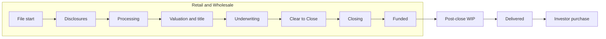
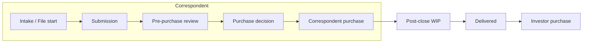

# Scope and taxonomy

## Overview

Operations is loan manufacturing: the work that takes a [Loan file](../CONTEXT.md) from [File start](../CONTEXT.md) through [Investor purchase](../CONTEXT.md). This subject area is multi-channel. [Channel](../CONTEXT.md) is a required slice on every enterprise dashboard.

This document sets the boundary, the subcategory map, who uses the reporting, and where Operations hands off to other subject areas.

Assumptions used throughout the pack (replace when Operations leadership supplies local names and policy):

- Product set is conventional, FHA, VA, USDA, and jumbo; purchase and refinance. HELOC, construction, and reverse appear only as product-dimension values plus a short “if offered” process note.
- [Cycle time](../CONTEXT.md) is **business days** on the company ops calendar unless the metric names a TRID clock. Initial LE send uses **TRID general business days** (creditor-open days). CD waiting period uses **TRID specific business days** (Saturdays count; Sundays and federal holidays do not). See [research sources](14-research-sources.md).
- Primary grain is the Loan file. Orders (appraisal, title, insurance) and QC findings are event/order grain. Capacity is employee-day grain.
- [Pipeline](../CONTEXT.md) and aging are [As-of](../CONTEXT.md) snapshots. Funded, purchased, and delivered counts are [Event-dated](../CONTEXT.md).
- Targets labeled `ASSUMED SLA` are not company policy.
- LOS is the system of record for the file and [Milestone](../CONTEXT.md). Vendor portals hold appraisal and title orders. Delivery lives in the LOS investor screen or a shipping system.

Source-system mapping to real tables is a follow-on data discovery job.

## In scope

- Retail, Wholesale, and Correspondent manufacturing.
- File setup and disclosures (Retail/Wholesale) and Correspondent intake.
- Processing, valuation, title/escrow, insurance and MI, underwriting, conditions, Clear to Close, closing and funding (Retail/Wholesale).
- Correspondent pre-purchase review, purchase, and TPO conditions.
- Post-closing, trailing documents, investor delivery, and investor purchase advice.
- Manufacturing quality: pre-funding QC, Correspondent pre-purchase QC, post-close QC, defects, and Kickouts.
- Vendor scorecards, capacity, queues, and pipeline control.

## Out of scope

| Subject area | Why it is out | What Operations still sees |
|--------------|---------------|----------------------------|
| Sales / lead intake | Different funnel, different owners | File start is the handoff, not leads, CPL, or ROM |
| Capital Markets / lock desk | Secondary marketing and lock economics | [Lock status](../CONTEXT.md), expiration, and lock-before-CTC risk as dimensions and dependencies |
| Servicing | Boarding and after boarding | First-payment date and MERS as post-close completeness, not servicing KPIs |
| Independent audit QC | Separate Quality organization | Manufacturing quality only |
| Finance P&L | Revenue, gain-on-sale, cost to manufacture in dollars | Optional Vendor cost per order if Finance shares it |
| HRIS | People systems | Headcount/FTE as a capacity dimension source |

## Channels

**Retail.** The company originates with the borrower and manufactures through [Funded](../CONTEXT.md). Operations owns borrower collection, disclosures, appraisal order, title order, underwriting, CTC, closing, and funding.

**Wholesale.** A [Broker](../CONTEXT.md) originates. Operations is lender fulfillment: registration, underwriting, conditions (split with the Broker), valuation and title (broker-ordered or lender-ordered), closing coordination, and funding.

**Correspondent.** A [TPO](../CONTEXT.md) originates *and closes*. Operations is intake → pre-purchase review → [Correspondent purchase](../CONTEXT.md) → trailing documents → [Delivered](../CONTEXT.md). Appraisal, title, and borrower closing already happened. Do not describe Correspondent as another Retail channel. Do not call Correspondent purchase “funding.”

## Lifecycles

Retail and Wholesale manufacture an open loan. Correspondent buys a closed loan. The two clocks must not be mixed in one unlabeled KPI.

## Subcategories

| ID | Subcategory | Typical owner | Retail / Wholesale | Correspondent |
|----|-------------|----------------|--------------------|---------------|
| P01 | Disclosure and file setup | Disclosure desk / setup | TRID LE, intent to proceed, redisclosure, eSign, file start | Intake of TPO file; eligibility and package completeness — TRID already occurred at the TPO |
| P02 | Processing | Processor / team lead | Document collection, AUS, credit, VOE/VOI/VOA, HOA/condo, milestone chase | Package completeness versus seller; conditions to TPO; not borrower-facing processing |
| P03 | Appraisal and valuation | Appraisal desk | Order, waiver, inspection, report, review, ROV, second appraisal | Review of seller appraisal or transfer; rarely a new order |
| P04 | Title, escrow, and curative | Title desk / closer | Order, commitment, curative, payoffs, CD collaboration, HOA estoppel | Review of existing title/closing package; curative before purchase |
| P05 | Insurance and MI | Processor / MI desk | HOI, flood, master policy, MI order/cert | Confirm coverage and MI on the purchased loan |
| P06 | Underwriting | Underwriter | Initial decision, overlays, exceptions, MI UW, suspense | Pre-purchase UW / eligibility review |
| P07 | Conditions and CTC | Processor + UW | PTD/PTF conditions, CTC, rework | Conditions to purchase |
| P08 | Closing coordination and funding | Closer / funding | Schedule, docs out, signing, funding conditions, wire, fund | Purchase wire lives in P09, not here |
| P09 | Correspondent intake and pre-purchase | Correspondent ops | Not applicable | TPO eligibility, registration, submission, pre-purchase QC, purchase decision |
| P10 | Post-closing and trailing documents | Post-close | Original note, recorded security instrument, final title, trailing conditions | Trailing documents from the TPO after purchase |
| P11 | Investor delivery | Shipping / delivery | Stack, ULDD, deliver, purchase advice, investor suspense | Same after purchase; may aggregate |
| P12 | Manufacturing quality | QC (ops) | Pre-fund QC, post-close QC, defects | Pre-purchase QC, post-purchase QC, TPO defect scoring |
| P13 | Vendor management | Ops vendor management | AMC, appraisers, title, credit, flood, tax | TPO scorecard is counterpart quality, not Vendor; third-party re-orders use Vendor metrics |
| P14 | Capacity, productivity, and queues | Ops leadership | Staffing, units per FTE, queue depth | Same, plus TPO/submission queue |
| P15 | Pipeline control | Ops leadership | Cross-cutting WIP, aging, stuck, fund forecast | Purchase forecast and delivery forecast |

Channel is a required dimension on every enterprise view. Define each metric once; slice by Channel. Do not maintain separate Retail-only and Wholesale-only formulas for the same idea.

## Personas

| Persona | Primary decision | Home dashboard |
|---------|------------------|----------------|
| COO / Ops VP | Are cycle time, pull-through, and delivery healthy versus last week and versus SLA? | [D01 Ops Command Center](dashboards/D01-ops-command-center.md) |
| Processing, UW, closing, post-close managers | Where is my queue, who is waiting, which teams are off SLA? | D03, D06, D07, D09 |
| Appraisal / title desks | Which vendors and states are slow or high-revision? | D04, D05, D12 |
| Correspondent ops | Which TPOs are high-defect or slow to clear purchase conditions? | [D08](dashboards/D08-correspondent-operations.md) |
| Capacity planner | Do we have enough processors, underwriters, and closers for this week’s arrivals? | [D13](dashboards/D13-capacity-and-productivity.md) |
| Delivery / shipping | What is not sold, aging in suspense, or kicked out? | [D10](dashboards/D10-investor-delivery.md) |
| BI / analytics | What is the canonical metric name, grain, and direction? | [Metric catalog](04-metric-catalog.md) |

The LOS remains the system of action for loan-level worklists. This pack may specify a stuck-file export; it does not specify a servicing-style queue application.

## Dashboard family

[D01](dashboards/D01-ops-command-center.md) is the only enterprise home. [D02](dashboards/D02-pipeline-and-aging.md) is the default drill from any volume or aging KPI. Channel is a global filter.

| ID | Dashboard | Genre |
|----|-----------|-------|
| D01 | [Ops Command Center](dashboards/D01-ops-command-center.md) | static |
| D02 | [Pipeline and aging](dashboards/D02-pipeline-and-aging.md) | analytic |
| D03 | [Processing](dashboards/D03-processing.md) | analytic |
| D04 | [Appraisal and valuation](dashboards/D04-appraisal-and-valuation.md) | analytic |
| D05 | [Title, escrow, and closing coordination](dashboards/D05-title-escrow-closing-coord.md) | analytic |
| D06 | [Underwriting and conditions](dashboards/D06-underwriting-and-conditions.md) | analytic |
| D07 | [Closing and funding](dashboards/D07-closing-and-funding.md) | analytic |
| D08 | [Correspondent operations](dashboards/D08-correspondent-operations.md) | analytic |
| D09 | [Post-closing and trailing documents](dashboards/D09-post-closing-and-trailing-docs.md) | analytic |
| D10 | [Investor delivery](dashboards/D10-investor-delivery.md) | analytic |
| D11 | [Manufacturing quality](dashboards/D11-manufacturing-quality.md) | analytic |
| D12 | [Vendor performance](dashboards/D12-vendor-performance.md) | analytic |
| D13 | [Capacity and productivity](dashboards/D13-capacity-and-productivity.md) | analytic |
| D14 | [Disclosures and setup](dashboards/D14-disclosures-and-setup.md) | analytic |

## Adjacent subject areas and handoffs

- **Sales → Operations** at File start (application taken or Wholesale registration). Lead, spend, and ROM stay in Sales.
- **Operations ↔ Capital Markets** on lock, extension, and investor commitment. Operations consumes Lock status; it does not own lock desk turn time or secondary economics.
- **Operations → Servicing** at boarding after Funded or Correspondent purchase, once the servicing package is complete. Boarding SLAs that servicing owns are not Operations metrics.
- **Operations → independent Quality** when a file is sampled for audit QC. Audit defect rates are not Manufacturing quality unless leadership explicitly dual-reports them with a qualifier.

## Reporting principles

1. Never mix Funded, Correspondent purchase, and Investor purchase in one unlabeled “funded” number. Command Center may show **Funded + Correspondent purchased units** as a named combined manufacturing-complete KPI.
2. Report Cycle time as p50 and p90, not average alone.
3. Cohort Pull-through by start month (or lock month, or submission month). Rolling 30/90 is allowed only when the dashboard names the window.
4. As-of Pipeline and event-dated Funded are different questions; label the time basis on every KPI.
5. Waiting-on party is a first-class slice for aging. A file that is “old” because the borrower has not sent documents is not the same as an internal queue problem.
