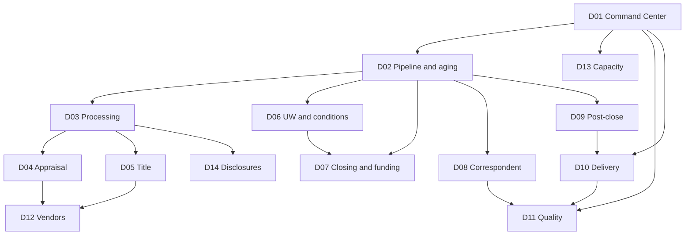

# Dashboard inventory

## Overview

Fourteen dashboards. Clickable layouts are grouped by **department / subcategory**: [wireframe kit](wireframes/index.html) · [map](wireframes/by-department.md). [D01](dashboards/D01-ops-command-center.md) is the only enterprise home. [D02](dashboards/D02-pipeline-and-aging.md) is the default drill from any volume or aging KPI. Channel is a global filter on every view.

Genre: D01 is `static` (exec glance). All others are `analytic` (filter, compare, drill). Layout is stratified: headline KPIs, comparison row, detail.

The LOS is the system of action for loan-level work. BI may offer a stuck-file export from D02; it does not replace the LOS queue.

Cadence unless a spec says otherwise: **daily** refresh of the prior-day close plus an **As-of snapshot at 6:00 a.m.** ops calendar. Intraday is a follow-on if the LOS can support it.

## Family

| ID | Dashboard | Audience | Primary question | Grain | Default Channel |
|----|-----------|----------|------------------|-------|-----------------|
| D01 | [Ops Command Center](dashboards/D01-ops-command-center.md) | COO / Ops VP | On-time, on-capacity, converting Pipeline to funds/purchases/deliveries? | Enterprise | All |
| D02 | [Pipeline and aging](dashboards/D02-pipeline-and-aging.md) | Ops managers | Where is WIP, how old, who are we waiting on, what completes in 7/14/30? | Loan file As-of | All |
| D03 | [Processing](dashboards/D03-processing.md) | Processing managers | Completeness, turn, queue, waiting-on | Loan file | All |
| D04 | [Appraisal and valuation](dashboards/D04-appraisal-and-valuation.md) | Appraisal desk | Order-to-report, waivers, ROV, Vendor on-time | Order + file | All |
| D05 | [Title, escrow, and closing coordination](dashboards/D05-title-escrow-closing-coord.md) | Title desk / closing mgrs | Commitment, curative, CD/schedule | Order + file | All |
| D06 | [Underwriting and conditions](dashboards/D06-underwriting-and-conditions.md) | UW / conditions | UW turn, Suspense, conditions, CTC, rework | Loan file + condition | All |
| D07 | [Closing and funding](dashboards/D07-closing-and-funding.md) | Closing/funding | CTC-to-fund, docs, signing, funding fails | Loan file | Retail + Wholesale |
| D08 | [Correspondent operations](dashboards/D08-correspondent-operations.md) | Correspondent ops | Submissions, purchase cycle, TPO scorecard | Loan file | Correspondent |
| D09 | [Post-closing and trailing documents](dashboards/D09-post-closing-and-trailing-docs.md) | Post-close | Trailing WIP, doc type aging, ship-ready | Loan file | All |
| D10 | [Investor delivery](dashboards/D10-investor-delivery.md) | Shipping / delivery | Delivered vs Investor-purchased, suspense, Kickouts | Loan file | All |
| D11 | [Manufacturing quality](dashboards/D11-manufacturing-quality.md) | QC / Ops risk | Defects, Kickouts, rework, TPO defects | Review + file | All |
| D12 | [Vendor performance](dashboards/D12-vendor-performance.md) | Vendor management | On-time, cycle, revisions, concentration | Order | All |
| D13 | [Capacity and productivity](dashboards/D13-capacity-and-productivity.md) | Ops leadership | Units/FTE, queue/FTE, arrivals vs completions | Role-day | All |
| D14 | [Disclosures and setup](dashboards/D14-disclosures-and-setup.md) | Disclosure desk | LE timing (TRID general business days), redisclosure, File start | Loan file | Retail + Wholesale |

## Drill map

Volume/aging KPIs on D01 drill to D02 with filters preserved (Channel, product, team). Cycle-time KPIs drill to the desk dashboard that owns the clock. Kickout drills to D10 then D11.

## Global filters

On every dashboard: Channel, date range, product program, fulfillment team.

D07 defaults Channel to Retail + Wholesale (Correspondent off). D08 defaults to Correspondent. D14 defaults to Retail + Wholesale.

Preserve filters when drilling.

## Comparison standard

Every headline KPI shows: current period, prior period (WoW), versus ASSUMED SLA when one exists, unit, and freshness (As-of time or “event-dated through prior business day”).

Do not use red/green on up-is-context metrics (Pipeline units, orders placed).
