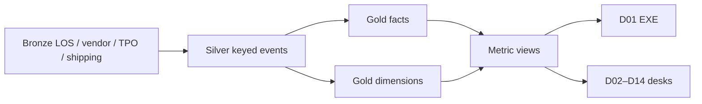

# Gold layer data model — Operations

## Overview

Recommended **gold** (consumption) model for every metric, dimension, dashboard, and phase in this pack. It is a **conformed dimensional model** (Kimball-style facts + dimensions) sitting under a medallion architecture. Dashboards and metric views read **only gold**. They never query LOS bronze.

Naming (replace catalog when the platform is named):

```text
<catalog>.ops_gold.dim_*
<catalog>.ops_gold.fact_*
<catalog>.ops_gold.br_*     -- bridges
<catalog>.ops_gold.mv_*     -- metric views / semantic layer
```

Silver holds cleaned, keyed events (`loan_id`, timestamps, raw codes mapped). Gold holds business grains, calendars, and measures that match the [metric catalog](04-metric-catalog.md).

This is a **recommendation**, not deployed DDL. Source-system mapping remains a follow-on job.

## Design rules (binding)

1. **One grain per fact.** Do not put Pipeline (As-of) and Funded (event) on the same table without a `time_basis` discriminator — use two facts.
2. **Channel is on every fact row** (degenerate or FK). Correspondent rows never increment Funded measures.
3. **Unavailable ≠ 0.** If the start or stop timestamp for a clock is null, omit the cycle row; the metric view returns null, not zero.
4. **p50/p90 are query-time measures** on `fact_loan_cycle.business_days`, not stored averages.
5. **Completing assignee** on event/cycle facts; **current assignee** on snapshot facts.
6. **No PII in gold** beyond loan number (and optional assignee employee ID). No SSN, no borrower name.
7. **Three calendars**, not one: ops business day, TRID general (creditor-open), TRID specific (Sat yes, Sun/federal holiday no).
8. Sales, lock price, servicing, and audit QC stay out of `ops_gold`.



## What lives where

| Layer | Contents | Not |
|-------|----------|-----|
| Bronze | Raw LOS, AMC, title, TPO portal, wire, shipping, roster | Business names |
| Silver | Deduped events, `loan_nk`, UTC + ops-local timestamps, code maps to MS-/WAIT-/FAL-/KIK-/E-* | Dashboard measures |
| Gold | Dims + facts below, cycle days already counted on the right calendar | LOS worklists |
| Metric views | Catalog IDs as measure names (`Funded units`, `Start to fund p50`) | Second definitions |

---

## Conformed dimensions

All type-1 unless noted. Keys are surrogate `*_sk` plus a durable natural key.

| Table | Grain | Natural key | Attributes (minimum) | SCD |
|-------|-------|-------------|----------------------|-----|
| `dim_date` | Day | `date_id` (yyyymmdd) | calendar_date, year, month, week, **is_ops_business_day**, **is_trid_general_bd**, **is_trid_specific_bd**, ops_holiday_flag, federal_holiday_flag, creditor_open_flag | Type 1; rebuild when holiday calendar changes |
| `dim_channel` | Channel | `Retail` / `Wholesale` / `Correspondent` | channel_code, label | Type 1 |
| `dim_milestone` | Milestone | MS-01…MS-13 | name, pipeline_flag (Y for Pipeline, N for post-close/delivery), age_sla_bd, stuck_after_bd, desk_code | Type 1 |
| `dim_waiting_on` | Code | WAIT-BOR/TPO/VEN/INT | label, actor_class | Type 1 |
| `dim_event_type` | Event | E-* | name, time_basis (event), money_event_flag (Funded / Corr purchase / investor purchase — mutually exclusive) | Type 1 |
| `dim_product` | Program | Conv/FHA/VA/USDA/Jumbo/Non-QM/Other | mi_typically_required_flag | Type 1 |
| `dim_purpose` | Purpose | Purchase, R/T refi, cash-out, streamline | | Type 1 |
| `dim_occupancy` | Occupancy | Primary / second / investment | | Type 1 |
| `dim_property_type` | Type | site-built, condo, … | | Type 1 |
| `dim_geography` | Property state | state_code | state_name, recording_delay_band (optional) | Type 1 |
| `dim_team` | Fulfillment team | team_nk | center, pod, manager_sk | Type 2 if teams reorg |
| `dim_party` | Person or company | party_nk | party_type (`employee`,`lo`,`broker`,`tpo`,`vendor`,`mi_company`,`investor`), name, active_flag | Type 2 for name/TPO legal entity |
| `dim_role` | Manufacturing role | processor, underwriter, closer, post_closer, corr_analyst, disclosure | | Type 1 |
| `dim_investor` | Investor | investor_nk | gse_flag, ginniemae_flag | Type 1 |
| `dim_commitment` | Commitment/pool | commitment_nk | investor_sk, issue_month | Type 2 |
| `dim_vendor` | Panel member | vendor_nk | vendor_type (AMC, title, flood, credit, tax, QC), conformed_name | Type 2 |
| `dim_order_type` | Order type | appraisal, title, flood, credit, tax, MI | | Type 1 |
| `dim_appraisal_path` | Path | company, broker, transfer, waived, seller | | Type 1 |
| `dim_closing_type` | Closing | wet, hybrid, eclose | | Type 1 |
| `dim_lock_status` | Status | locked, expired, not_locked, float | | Type 1 |
| `dim_aus` | AUS rec | Approve/Eligible, Refer, … | | Type 1 |
| `dim_income_type` | Income | W2, self-employed, other | | Type 1 |
| `dim_fallout_reason` | FAL-* | withdrawn, denied, rejected, expired, duplicate, incomplete | | Type 1 |
| `dim_kickout_reason` | KIK-* | trailing, collateral, credit, title, data, tpo, mi, other | | Type 1 |
| `dim_severity` | QC | critical, major, minor | headline_flag (critical = Y) | Type 1 |
| `dim_qc_type` | Review type | prefund, prepurchase, postclose | manufacturing_flag (Y); audit is **not** in this dim | Type 1 |
| `dim_condition_class` | Class | PTD, PTF, PTP | | Type 1 |
| `dim_trailer_type` | TRL-* | note, security, title, mi, other | | Type 1 |
| `dim_band` | Band set | amount / LTV / FICO | band_code, sort_order | Type 1 |
| `dim_corr_authority` | Corr only | delegated, non_delegated | | Type 1 |

**`dim_loan`** (current file attributes, Type 1 plus Type 2 history optional):

| Column | Notes |
|--------|--------|
| `loan_sk`, `loan_nk` (LOS file id) | Durable |
| `channel_sk` | Immutable after File start (correct if mis-keyed in silver) |
| `product_sk`, `purpose_sk`, `occupancy_sk`, `property_type_sk`, `geo_sk` | |
| `corr_authority_sk` | Null unless Correspondent |
| `amount_band_sk`, `ltv_band_sk`, `fico_band_sk` | Bands, not raw FICO |
| `mi_required_flag` | Drives M-CYC-16A denominator |

Do **not** put current milestone on `dim_loan`. Milestone is snapshot/event, not a slowly changing “who the loan is.”

### Calendar (critical)

`dim_date` must expose three flags so cycle SQL never uses the wrong clock:

| Flag | Used by |
|------|---------|
| `is_ops_business_day` | All M-CYC-* except M-CYC-04 and CD wait |
| `is_trid_general_bd` | M-CYC-04, M-REG-01 (creditor-open; Saturday only if offices open) |
| `is_trid_specific_bd` | CD waiting period on D07 (Sat yes; Sun + federal holidays no) |

Store `ops_business_day_seq` (running integer of ops business days) so cycle days = `seq(stop) - seq(start)` with no holiday join at query time.

---

## Facts (gold grains)

### 1. `fact_loan_event` — atomic manufacturing events

**Grain:** one row per `loan_nk` + `event_type` occurrence (first UW decision is one row forever).

| Column | Purpose |
|--------|---------|
| `loan_sk`, `event_type_sk`, `event_ts_ops`, `event_date_sk` | |
| `channel_sk` | Degenerate safety |
| `completing_party_sk`, `team_sk`, `role_sk` | Completing assignee |
| `loan_amount` | Populated on Funded / Corr purchase only |
| `event_count` | Always 1 |
| `is_first_occurrence` | Y for E-UW-FIRST, first CTC, first Funded |

**Serves:** M-VOL-01/02/04/05/05C/06–12/16, M-FAL-04 (fallout event), M-QLT-14/15, capacity completions.

**Integrity:** at most one Funded, one Corr purchase, one investor purchase per loan. Check constraint / DQ test: `money_event_flag` types are exclusive.

### 2. `fact_loan_cycle` — completed clocks only

**Grain:** one row per loan (or order/condition — see those facts) per cycle type when **both** endpoints exist.

| Column | Purpose |
|--------|---------|
| `loan_sk`, `cycle_code` (M-CYC-01 …) | |
| `start_event_type_sk`, `stop_event_type_sk` | |
| `start_ts`, `stop_ts`, `stop_date_sk` | Time basis = stop event date |
| `days_ops_bd`, `days_trid_general`, `days_trid_specific`, `days_calendar` | Fill **only** the column that cycle uses; others null |
| `channel_sk`, `team_sk`, `completing_party_sk` | |

**Serves:** all M-CYC-* at loan grain, M-REG-01 (flag `days_trid_general > 3`).

Omit in-flight files. In-flight age is snapshot, not this table.

Loan-grain cycles: 01–06, 07F, 10–18, 16, 16A. Order-grain cycles live on `fact_order`. Condition-grain on `fact_condition`.

### 3. `fact_loan_snapshot_daily` — As-of WIP

**Grain:** one row per **open** loan per `as_of_date` (6:00 a.m. ops calendar). Open = in Pipeline **or** Post-close WIP **or** Delivered-not-purchased.

| Column | Purpose |
|--------|---------|
| `as_of_date_sk`, `as_of_ts` | |
| `loan_sk`, `channel_sk` | |
| `milestone_sk` | Current MS-* |
| `waiting_on_sk` | Null = data-quality; do not default to internal |
| `lock_status_sk`, `lock_end_date_sk` | |
| `current_processor_sk`, `current_uw_sk`, `current_closer_sk`, `current_postcloser_sk`, `team_sk` | Current assignee |
| `age_in_milestone_ops_bd` | |
| `age_since_fund_or_purchase_bd` | Post-close |
| `age_since_delivered_bd` | MS-13 |
| `sla_breach_flag`, `stuck_flag` | From dim_milestone thresholds |
| `ctc_flag`, `scheduled_flag` | M-AGE-07 |
| `lock_expires_before_ctc_flag` | M-AGE-06 |
| `pipeline_flag`, `postclose_wip_flag`, `delivered_not_purchased_flag` | Mutually exclusive buckets |
| `expected_fund_7d_flag` / `14d` / `30d` | M-FST-* (no haircut) |

**Serves:** M-VOL-03/13/14, M-AGE-01–09, M-FST-01–03, M-QLT-12 (join trailers).

Closed/fallen-out loans **drop off** the next snapshot (keep history of past as-of dates for trend).

### 4. `fact_order` — third-party orders

**Grain:** one order (`order_nk`).

| Column | Purpose |
|--------|---------|
| `order_sk`, `loan_sk`, `order_type_sk`, `vendor_sk`, `appraisal_path_sk` | |
| `placed_ts`, `received_ts`, `completed_ts`, `reviewed_ts` | |
| `days_ops_bd_placed_to_received` | M-CYC-08 / 09 |
| `on_time_flag` | vs ASSUMED SLA |
| `revision_count`, `rov_flag` | M-QLT-05, M-VEN-04 |
| `channel_sk`, `geo_sk` | |
| `cost_amount` | M-VEN-05; null until Finance join |

**Filter:** appraisal path `waived` and Corr `seller` with no new order **excluded** from M-CYC-08.

**Serves:** M-CYC-08/08A/09/09A, M-VEN-01–06, M-VOL-15 (waiver is a loan event **or** a zero-order path row — prefer `fact_loan_event` E-APPR-WAIVE for the rate numerator).

### 5. `fact_condition`

**Grain:** one condition on a loan.

| Column | Purpose |
|--------|---------|
| `condition_sk`, `loan_sk`, `condition_class_sk` | PTD/PTF/PTP |
| `issued_ts`, `cleared_ts`, `days_ops_bd` | M-CYC-07 |
| `cleared_party_sk`, `channel_sk`, `team_sk` | |

**Serves:** M-CYC-07, M-QLT-01 (count issued / files decisioned).

### 6. `fact_qc_review` and `fact_qc_finding`

**Review grain:** one manufacturing QC review (`qc_type` in {prefund, prepurchase, postclose} only).

| Review columns | Purpose |
|----------------|---------|
| `review_sk`, `loan_sk`, `qc_type_sk`, `reviewer_sk` | |
| `started_ts`, `completed_ts` | |
| `file_fail_critical_flag` | Headline file-fail |
| `sample_eligible_flag` | Coverage denominator |

**Finding grain:** one confirmed defect.

| Finding columns | Purpose |
|-----------------|---------|
| `finding_sk`, `review_sk`, `severity_sk`, `theme_code` | |
| `overturned_flag` | Exclude from confirmed file-fail if Y |

**Serves:** M-QLT-07/08/09/13. Independent audit reviews **do not land here**.

### 7. `fact_kickout`

**Grain:** one Kickout (or investor suspense lasting > 1 ops bd).

| Column | Purpose |
|--------|---------|
| `kickout_sk`, `loan_sk`, `investor_sk`, `reason_sk` | |
| `delivered_ts`, `kickout_ts`, `cured_ts` | |
| `channel_sk` | |

**Serves:** M-QLT-10/11. Not Fallout.

File-level Kickout rate: distinct loans with ≥1 kickout / distinct loans Delivered in the cohort (redelivery does not double the denominator).

### 8. `fact_trailer`

**Grain:** one required trailer per loan (product × investor checklist).

| Column | Purpose |
|--------|---------|
| `loan_sk`, `trailer_type_sk` | |
| `required_flag`, `received_ts` | |
| `days_after_fund_or_purchase` at as-of | Join snapshot for M-QLT-12 |

If the checklist is generic (not product×investor), set `checklist_quality_flag = 'generic'` and footnote M-QLT-12.

### 9. `fact_capacity_role_day`

**Grain:** role + team + date.

| Column | Purpose |
|--------|---------|
| `date_sk`, `role_sk`, `team_sk` | |
| `productive_fte` | Roster; PTO excluded when known |
| `arrivals`, `completions` | Role-specific events (see pack P14) |
| `queue_depth` | From morning snapshot |
| `units_per_fte`, `queue_per_fte`, `completions_minus_arrivals` | May be view not stored |

**Serves:** M-CAP-01–06. Do not use payroll headcount.

### 10. `fact_waiting_span` (optional, for M-CYC-15)

**Grain:** loan + waiting-on code + span.

| Column | Purpose |
|--------|---------|
| `loan_sk`, `waiting_on_sk`, `milestone_sk` | |
| `span_start_ts`, `span_end_ts`, `days_ops_bd` | Queue time = WAIT-INT spans |

If Waiting-on history is not captured, **hide** M-CYC-15 (unavailable).

### 11. `fact_loan_cohort` (derived, daily or monthly)

**Grain:** loan (one row once File start or Submission exists).

| Column | Purpose |
|--------|---------|
| `loan_sk`, `channel_sk` | |
| `start_month`, `lock_month`, `submission_month` | Cohort keys |
| `funded_flag`, `corr_purchased_flag`, `fallout_sk` | Mutually exclusive with in-flight |
| `in_pipeline_flag` | For identity recon R8 |

**Serves:** M-FAL-01–07. Identity: starts = in-pipeline + fallout + funded/purchased (per Channel).

---

## Bridges

| Table | Grain | Why |
|-------|-------|-----|
| `br_loan_party` | loan + party + role + effective dates | LO, Broker, TPO, current vs originating processor |
| `br_loan_investor` | loan + investor + commitment as-of | Delivery facts |

---

## Metric → fact map

| Metric IDs | Gold object | Measure (business) |
|------------|-------------|--------------------|
| M-VOL-01 | `fact_loan_event` where E-START | COUNT |
| M-VOL-02 | event E-APP, Channel in (R,W) | COUNT |
| M-VOL-03 | snapshot `lock_status = locked` | COUNT |
| M-VOL-04 | event E-UW-FIRST | COUNT |
| M-VOL-05 | event E-CTC | COUNT |
| M-VOL-05C | event E-PUR-APPR | COUNT |
| M-VOL-06/07 | event E-FUNDED, Channel in (R,W) | COUNT / SUM amount |
| M-VOL-08 | event E-SUB | COUNT |
| M-VOL-09/10 | event E-PURCHASED | COUNT / SUM amount |
| M-VOL-11 | event E-DELIVERED | COUNT |
| M-VOL-12 | event E-INV-PURCH | COUNT |
| M-VOL-13 | snapshot `pipeline_flag` | COUNT |
| M-VOL-14 | snapshot `postclose_wip_flag` | COUNT |
| M-VOL-15 | E-APPR-WAIVE / valuation-decisioned | RATE |
| M-VOL-16 | M-VOL-06 + M-VOL-09 (metric view, not a stored fact) | SUM of two measures |
| M-CYC-01–06, 07F, 10–18, 16, 16A | `fact_loan_cycle` | percentile_cont(0.5/0.9) of the filled days column |
| M-CYC-07 | `fact_condition.days_ops_bd` | p50/p90 |
| M-CYC-08/09 | `fact_order` | p50/p90 |
| M-CYC-15 | `fact_waiting_span` WAIT-INT | SUM days |
| M-REG-01 | `fact_loan_cycle` M-CYC-04 | share `days_trid_general > 3` |
| M-AGE-* | `fact_loan_snapshot_daily` | COUNT / p50 age / flags |
| M-FST-* | snapshot expected_* flags | COUNT |
| M-FAL-01–07 | `fact_loan_cohort` | RATE by cohort month |
| M-QLT-01 | `fact_condition` | COUNT / decisioned files |
| M-QLT-02 | E-UW-FIRST outcome = Suspense | RATE |
| M-QLT-03 | milestone-return events in silver → gold flag on loan | RATE |
| M-QLT-04 | event E-REDISC ≥1 / starts | RATE |
| M-QLT-05/06 | `fact_order` | RATE |
| M-QLT-07–09,13 | `fact_qc_review` | file-fail / reviewed |
| M-QLT-10/11 | `fact_kickout` | RATE / mix |
| M-QLT-12 | `fact_trailer` ∩ snapshot age ≥ N | RATE |
| M-QLT-14/15 | events E-CTC-REV, E-FUND-FAIL | RATE |
| M-CAP-* | `fact_capacity_role_day` | as defined |
| M-VEN-* | `fact_order` | COUNT / p50 / on-time % / share |

---

## Metric views (semantic layer)

Do **not** hang every measure off one star. Six views match time basis and grain. Names are catalog labels.

| View | Source fact | Grain / filter | Example measures |
|------|-------------|----------------|------------------|
| `mv_ops_flow` | `fact_loan_event` | Event date | Files started, Funded units, Funded volume, Corr purchased units, Delivered, Investor purchased, CTC, Submissions |
| `mv_ops_cycle` | `fact_loan_cycle` | Stop date; completed only | Start to fund p50/p90, Sub→purchase p50/p90, LE turn p50, UW turn p50 |
| `mv_ops_wip` | `fact_loan_snapshot_daily` | As-of date | Pipeline units, Post-close WIP, SLA-breach %, Stuck files, Waiting-on mix, expected 7d |
| `mv_ops_pullthrough` | `fact_loan_cohort` | Cohort month | Start-to-fund PT, Sub-to-purchase PT, Fallout rate |
| `mv_ops_vendor` | `fact_order` | Completed date | On-time %, cycle p90, revision %, concentration |
| `mv_ops_quality` | reviews + kickouts | Review/kickout date | Pre-fund file-fail, pre-purchase file-fail, Kickout rate |
| `mv_ops_capacity` | `fact_capacity_role_day` | Date + role | Units/FTE, queue/FTE, completions − arrivals |

**D01 Funded + purchased** is `MEASURE(Funded units) + MEASURE(Correspondent purchased units)` inside `mv_ops_flow`, labeled exactly **Funded + purchased units**. Channel still slices.

Joins in YAML: `dim_date`, `dim_channel`, `dim_product`, `dim_team`, `dim_milestone` (WIP only), `dim_party` as TPO/Vendor as applicable.

Genie / AI/BI should bind to these views, not to facts directly.

---

## Dashboard → gold

| Dashboard | Primary view | Secondary |
|-----------|--------------|-----------|
| D01 EXE | `mv_ops_flow` + `mv_ops_wip` + `mv_ops_cycle` (two clocks) + `mv_ops_pullthrough` + `mv_ops_quality` (kickout) + `mv_ops_capacity` | Never loan-level |
| D02 P15 | `mv_ops_wip` | stuck export from snapshot + `loan_nk` |
| D03–D07, D14 | cycle + wip filtered to desk | |
| D08 | flow (Corr) + pullthrough + quality prepurchase | |
| D09 | wip post-close + `fact_trailer` | |
| D10 | flow delivery + `fact_kickout` + wip MS-13 | |
| D11 | `mv_ops_quality` | |
| D12 | `mv_ops_vendor` | |
| D13 | `mv_ops_capacity` | |

Stuck-file export columns: `loan_nk`, Channel, milestone, age_bd, waiting_on, current assignee. No SSN.

---

## Refresh

| Object | Cadence | Notes |
|--------|---------|-------|
| `dim_date` | Annual + when holidays change | Must precede cycle loads |
| `fact_loan_event` / cycle / order / condition | Daily after prior business day close | Event-dated through prior bd |
| `fact_loan_snapshot_daily` | **06:00 ops local** | One partition per as_of_date |
| `fact_capacity_role_day` | Daily after roster + snapshot | |
| Metric views | On query; optional materialize EXE every hour after snapshot | |

Late-arriving vendor timestamps: restate cycle rows for the last 14 days. Do not rewrite Funded.

---

## Data-quality tests (gold)

| Test | Fail if |
|------|---------|
| Money exclusive | Loan has both E-FUNDED and E-PURCHASED |
| Channel vs event | E-FUNDED with Channel = Correspondent |
| Snapshot buckets | pipeline + postclose + delivered_not_purchased > 1 on a row |
| Waiting-on | null share > 20% of snapshot (banner, do not impute) |
| Cycle completeness | stop_ts < start_ts or days_* negative |
| Cohort identity R8 | starts ≠ in-flight + fallout + complete, by Channel and start_month |
| QC type | qc_type not in manufacturing set |
| Waiver vs cycle | appraisal cycle row with path = waived |

---

## What not to model in `ops_gold`

| Temptation | Put it |
|------------|--------|
| Lead / CPL / ROM | Sales gold |
| Lock price, note rate, gain-on-sale | Capital Markets gold |
| Warehouse dwell $ | Treasury (Ops owns ship-ready → Delivered days only) |
| Delinquency | Servicing gold |
| Independent audit QC | Quality gold (`qc_type = audit` never in `fact_qc_review`) |
| LOS worklist / comments | Stay in LOS |
| One wide “loan_daily_kpi” table with 80 measures | Breaks grain; use metric views |

---

## Build order

1. `dim_date` (three calendars) + `dim_channel` + `dim_milestone` + `dim_event_type` + reason dims.  
2. `dim_loan` + `dim_party` + `dim_team`.  
3. `fact_loan_event` (enables volume and D01 flow).  
4. `fact_loan_snapshot_daily` (enables D01/D02 WIP).  
5. `fact_loan_cycle` + `fact_loan_cohort` (cycle + pull-through).  
6. `fact_order`, `fact_condition` (desks D03–D07, D12, D14).  
7. `fact_trailer`, `fact_kickout` (D09–D11).  
8. `fact_qc_review` / finding (D11).  
9. `fact_capacity_role_day` (D13; last — needs roster).  
10. Metric views in the same order as [phasing](08-phasing-and-open-questions.md) (EXE + pipeline first).

Until Q3 (File start definition) is answered, do not freeze `E-START` mapping in silver.

## Relationship to this pack

| Pack artifact | Gold object |
|---------------|-------------|
| Glossary / Channel rules | `dim_*` labels and constraints |
| Event dictionary | `dim_event_type` + `fact_loan_event` |
| Metric catalog | `mv_*` measure names and grains |
| Shared dimensions | conformed `dim_*` |
| Pipeline phases / roles | snapshot current assignee + completing party on events |
| Dashboards D01–D14 | metric views only |
| ASSUMED SLA | attributes on `dim_milestone` until Q1 replaces them |
